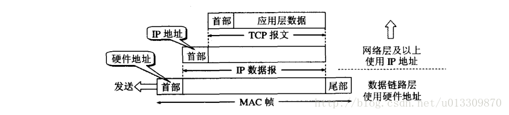
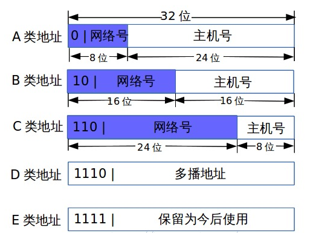
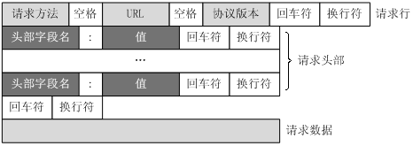
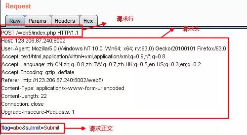
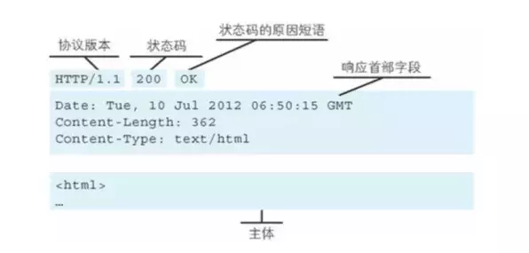
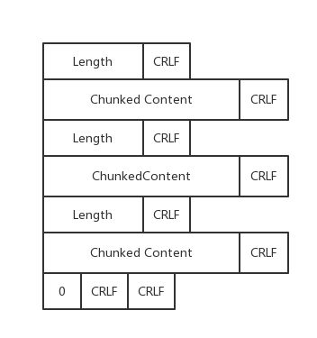
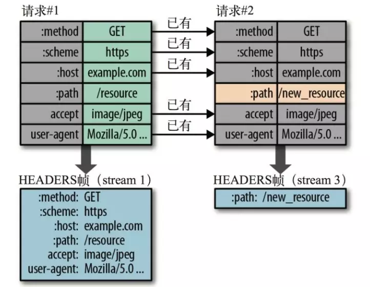
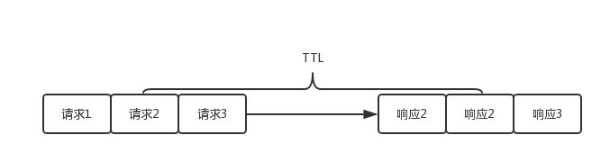

## Net面试资料

#### OSI七层模型：

物理层Ethernet、数据链路层ARP协议、网络层IP、传输层TCP/UDP、会话层RPC、表示层、应用层HTTP/HTTPS。

#### TCP/IP四层模型：

网络接口层、网际层IP、传输层、应用层。五层模型是把网络接口层拆成物理层和数据链路层。

- 物理层：激活、维持、关闭通信端点之间的机械特性、电气特性、功能特性以及过程特性。该层为上层协议提供了一个传输数据的物理媒体。物理层的任务就是**透明地传送比特流**。
- 数据链路层：数据链路层在不可靠的物理介质上提供可靠的传输。该层的作用包括：**物理地址寻址**、把数据**封装成帧**、流量控制、数据的检错、重发等。（MAC帧）
- 网络层：网络层负责对子网间的数据包进行**路由选择**。此外，网络层还可以实现拥塞控制、**网际互连**等功能。（ARP地址解析协议和IP）（IP包）
- 传输层：提供端到端的**可靠**报文传递和**错误恢复**（段Segment），任务是**负责向两个主机中进程之间的通信提供服务**。由于一个主机可同时运行多个进程，因此运输层具有复用和分用的功能。复用是指多个应用层进程可同时使用运输层的服务，分用是指运输层把收到的信息分别交付给应用层中的相应进程。（TCP段）
- 应用层：为操作系统或网络应用进程提供访问网络服务的接口。


H2数据链路层、H3 IP、H4 TCP/UDP H5 HTTP

### 数据链路层

#### **MAC地址**: 

MAC地址叫 物理地址、硬件地址或链路地址。长**48bit**，由网络设备制造商生产时写在硬件内部，所有设备都有个唯一确定的MAC地址，世界上任意一个拥有48位MAC地址的网卡都有唯一的标识。**为什么要用到MAC地址？**这是由组网方式决定的，如今比较流行的接入Internet的方式 是把**主机**通过**局域网**组织在一起，然后再通过**交换机**和 Internet相连接。由于IP只是逻辑上标识，任何人都随意修改，因此不能用来标识用户；而 MAC地址则不然，它是固化在网卡里面的。从理论上讲，除非盗来硬件（网卡），否则是没有办法冒名顶替的。

### 网络层

#### **ARP地址解析协议**

其基本功能为透过目标设备的IP地址，查询目标设备的MAC地址，以保证通信的顺利进行。它是IPv4中网络层必不可少的协议，不过在IPv6中已不再适用，并被邻居发现协议（NDP）所替代。



在TCP/IP协议中，网络层和传输层只关心目标主机的IP地址。导致数据链路层在接到上层ip协议提供的ip包中只有目的主机的ip地址，需要根据目的主机的ip地址获取其MAC地址，这就是ARP协议干的事。

如何获取，先查自己本地的ARP高速缓存，查找有无主机B的IP地址。没有，则

（1）ARP进程在本局域网上**广播**发送一个ARP请求分组如下：


（2）本局域网上所有的主机上运行的ARP进程都收到此ARP请求分组。

（3）主机B在ARP分组中见到自己的IP地址就向A发送ARP响应分组，并写入自己的硬件地址，相应分组是普通的单播。

（4）主机A收到主机B的ARP响应分组后，就在其ARP高速缓存中写入主机B的IP地址到硬件地址的映射。

（5）另外，当发送主机和目的主机不在同一个局域网中时，即便知道目的主机的MAC地址，两者也不能直接通信，必须经过路由转发才可以。所以此时，发送主机通过ARP协议获得的将不是目的主机的真实MAC地址，而是一台可以通往局域网外的路由器的MAC地址。于是此后发送主机发往目的主机的所有帧，都将发往该路由器，通过它向外发送。这种情况称为委托ARP或ARP代理（ARP Proxy）。

#### **IP报文包格式**

固定部分一共20字节，标识是唯一的，唯一标识主机发送的每一份数据报，通常每发送一份报文值其标识++。生存时间TTL：可以通过的路由器数目。IP包的校验和仅校验IP头部字段，TCP校验和校验TCP头部字段和数据体。如果长度超过了**MTU**，则要进行分片，根据IP头部的格式，有一个16位的标识，分片的时候会把这个标识复制到所有的分片中去，也就是说同一个IP的分片，他们的标识是一样的；然后3bit标志中有一位是表示是否最后一片，除了最后一片为0，其它片这个标识位都为1


#### **IP协议作用**

跨越多种数据链路传输数据包、提供路由和寻址功能

#### **IP协议特点**

**不可靠**：并不保证IP数据报能成功地到达目的地。如果发生某种错误，如某个路由器暂时用完了缓冲区，IP有一个简单的错误处理算法：丢弃该数据报，然后发送ICMP消息报给信源端。**无连接**：IP并不维护任何关于后续数据报的状态消息，每个连接都是独立的。这也说明，IP数据报可以不按发送顺序接收。

#### **IP分类 **

https://blog.csdn.net/sinat_22840937/article/details/77411450



A类地址：以0开头，第一个字节范围：1~126（1.0.0.1 - 126.255.255.255）；

B类地址：以10开头，第一个字节范围：128~191（128.0.0.0 - 191.255.255.254）；  

C类地址：以110开头，第一个字节范围：192~223（192.0.0.1 - 223.255.255.254）；  

D类地址：以1110开头，第一个字节范围为224~239；

#### **子网和子网掩码**

http://dingdingblog.com/article/17

划分子网的方法是从主机号借用若干个位作为子网号subnet-id，而主机号host-id 也就相应减少了若干个位。于是两级IP地址在本单位内部就变为三级IP地址：网络号、子网号和主机号。

IP地址 ::= {<网络号>, <子网号>, <主机号>}

子网对外部路由器来说隐藏了内部网络组织的细节，在外部看来，不同子网的主机仍属于同一个网络。凡是从其他网络发送给本单位某个主机的IP数据报，仍然是根据IP数据报的目的网络号net-id，先找到连接在本单位网络上的路由器。然后此路由器在收到 IP 数据报后，再按目的网络号 net-id 和子网号 subnet-id 找到目的子网。最后就将 IP 数据报直接交付目的主机。

网络号 net-id 和子网号 subnet-id全设为1的IP地址为子网掩码，标识同一个网关，32bit构成，掩码中有几个1就代码几位网络标识，标识同一个网关，其他为主机标识，255.255.255.0和255.255.255.1是同一个子网。假如掩码前24位为1，就代表前24位都为网络标识，用 IP 地址标识就是255.255.255.0，后面的0代表主机标识，理论上有256台主机可连接。

子网掩码与IP地址按位与运算可以得到网关；子网掩码取反后与IP地址按位与运算可以得到主机号。

3个特殊的IP地址

- **255.255.255.255**
    该IP地址指的是**受限广播地址**。受限广播地址与一般广播地址（直接广播地址）的区别在于，受限广播地址之只能用于本地网络，路由器不会转发以受限广播地址为目的地址的分组；一般广播地址既可在本地广播，也可跨网段广播。例如：主机192.168.1.1/30上的直接广播数据包后，另外一个网段192.168.1.5/30也能收到该数据报；若发送受限广播数据报，则不能收到。
- **0.0.0.0**
    常用于寻找自己的IP地址，例如在我们的RARP，BOOTP和DHCP协议中，若某个未知IP地址的无盘机想要知道自己的IP地址，它就以255.255.255.255为目的地址，向本地范围（具体而言是被各个路由器屏蔽的范围内）的服务器发送IP请求分组。
- **127.0.0.1**
    127.0.0.0/8被用作回环地址，回环地址表示**本机的地址**，常用于对本机的测试，用的最多的是127.0.0.1。

#### **路由控制**

- 仅有 IP 地址还不足以将数据包发送到对端，还需指明路由器或主机。保存这种信息的就是路由控制表。
- 路由控制表中记录着地址与下一步要发送至路由器的地址。在发送 IP 包时，先确定 IP 包首部目标地址，然后在表中找到与该地址具有相同网络地址的记录，根据记录将 IP 包转发给相应的下一个路由器。

#### **路由器与交换机**

交换机主要工作在数据链路层（第二层），路由器工作在网络层（第三层）。交换机转发所依据的对象时：MAC地址。（物理地址），路由转发所依据的对象是：IP地址。（网络地址）

#### **NAT**

#### **IP寻址过程**

https://zhuanlan.zhihu.com/p/32302687

### 传输层

#### **传输层多路复用和分用**

将运输层报文段中的数据交付到正确的套接字的工作称为多路分解(demultiplexing),在源主机当中从不同的套接字中收集数据块，并为每一个数据块封装上首部信息(用于分解)从而生成报文段，然后将此报文段传递到网络层。所有的这些工作称为多路复用(multiplexing)。https://www.cnblogs.com/hithongming/p/9379397.html

#### **传输层和网络层的区别**

网络层负责ip数据报的产生以及ip数据包在逻辑网络上的路由转发，寻址是主机级别的。传输层提供端到端通信服务层次,提供可靠及非可靠连接，寻址是进程级的。网络层负责分组、路由和转发；传输层负责端口寻址、差错控制、拥塞控制等。https://blog.csdn.net/jinzhao1993/article/details/53354086

#### **UDP协议的特点**

无连接、面向报文、单播多播广播、头部开销小、无差错恢复拥塞控制、到达目的地是无序的、不可靠、但是速度快。https://cloud.tencent.com/developer/article/1405940 https://jaminzhang.github.io/network/The-Difference-Between-TCP-And-UDP-Protocol/

#### **UDP协议格式**

16位源端口、16位目的端口、16位报文长度、16位校验和，总共8字节的首部，外加数据。

#### **广播与多播**

多播也叫组播，传输是基于UDP完成的，把目的地址改成了多播地址。向网络传递一个多播数据包时，路由器将复制该数据包并传递到多个主机，多播的传输需要借助路由器完成（可跨网段），正是由于这样的特性，大大节省了网络流量，减少了占用带宽，同时也减少了发送端的重复无用的工作。

广播和多播很相似，是一次性向网络内的所有主机发送数据，但只能在局域网内传播，而不能跨网传播。也是基于UDP套接字的。

#### **TCP协议的特点**

面向连接、面向字节流、只能点对点、头部长20个字节、可以进行差错恢复和拥塞控制、到达目的后会对乱序的包重排序、可靠交付、比较慢。

#### **TCP协议格式**

16位源端口、16位目的端口、32位序列号(SEQ)、32位确认序号(ACK)、数据偏移(4位)|保留(6位)|六个状态位(URG\ACK\PSH\RST\SYN\FIN)、16位窗口大小、16位校验和、16位紧急指针、32位选项和填充


#### **TCP三次握手**

请求建立时SYN=1,ACK=0；回应建立是SYN=1,ACK=1; 正式建立时SYN=0,ACK=1。client和server的seq每个回合后加1，回应的ack是它收到的seq+1，所以回应建立的ack和client正式建立的seq是一样的。


#### **TCP四次挥手**

**中断连接端可以是Client端，也可以是Server端。**


#### 为什么连接的时候是三次握手，两次握手可以吗？关闭的时候却是四次握手？

连接时需要三次握手而非两次握手是为了防止失效的client连接请求报文段突然又传送到server。此时若server收到这个client端的失效请求并返回ack就算建立连接的话，由于client已不再回应，造成连接空等，耗费资源。

关闭连接时，当Server端收到FIN报文时，很可能并不会立即关闭SOCKET，所以只能先回复一个ACK报文，告诉Client端，"你发的FIN报文我收到了"。只有等到我Server端所有的报文都发送完了，我才能发送FIN报文，因此不能一起发送。故需要四步握手。

#### 为什么TIME_WAIT状态需要经过2MSL(最大报文段生存时间)才能返回到CLOSE状态？

虽然按道理，四个报文都发送完毕，我们可以直接进入CLOSE状态了，但是我们必须假设网络是不可靠的，有可以最后一个ACK丢失。这时当server端超过2MSL没收到ACK就会超时重传FIN，经过一1个MSL到达client端，这时client刚好等待2MSL，可以防止ACK报文丢失。另外 

1.如果关闭了，ACK又丢失了，server会重发FIN，但是一直接收不到ACK，Server就会以为是连接错误把问题报告给高层。这样的情况虽然不会造成数据丢失，但是却导致TCP协议不符合可靠连接的要求。

2.如果Client直接CLOSED，然后又再向Server发起一个新连接，新连接与刚关闭的连接的端口号有可能是相同的。假设新连接和已经关闭的老连接端口号是一样的，如果前一次连接的某些数据仍然滞留在网络中，这些延迟数据在建立新连接之后才到达Server，由于新连接和老连接的端口号是一样的，又因为TCP协议判断不同连接的依据是socket pair，于是，TCP协议就认为那个延迟的数据是属于新连接的，这样就和真正的新连接的数据包发生混淆了。

#### TCP的流量控制和拥塞控制

 https://zhuanlan.zhihu.com/p/37379780

> 流量控制：利用滑动窗口协议实现，滑动窗口协议既保证了分组无差错、有序接收，也实现了流量控制。
>
> 拥塞控制：（ 1 ）慢开始，从1开始翻倍、拥塞避免，让拥塞窗口缓慢增长，每次+1（ 2 ）快重传，要求接收方在收到一个失序的报文段后就立即发出重复确认、快恢复，当发送方连续收到三个重复确认时，就执行“乘法减小”算法，把ssthresh门限减半，此时不执行慢开始算法，而是将cwnd设置为ssthresh减半后的值，然后执行拥塞避免算法，使cwnd缓慢增大。

#### TCP协议的可靠传输如何保证

> 1.确认和重传机制。
>
> 2.TCP报文头部校验和，用于检验报文是否损坏。
>
> 3.数据的合理分片和排序。tcp会按最大传输单元(MTU)合理分片，接收方会缓存未按序到达的数据，重新排序后交给应用层。
>
> 4.流量控制。
>
> 5.拥塞控制。
>
> 6.停止等待协议。指发送完一个分组就停止发送,等待对方的确认,只有对方确认过,才发送下一个分组。
>
> **连续等待协议、连续ARQ协议、回退n帧协议和滑动窗口协议** https://blog.csdn.net/yangbodong22011/article/details/48473183       https://sexywp.com/introduction-of-arq.htm       https://www.jianshu.com/p/07bd39becbfd

> 停止等待 就是指发送完一个分组就停止发送，等待对方的确认，只有对方确认过，才发送下一个分组。
>
> 连续ARQ协议：当发送站点发送完一个数据帧后，不是停下来等待应答帧，而是可以**连续再发送若干个数据帧**。如果在此过程中又收到了接收端发来的应答帧，那么还可以接着发送数据帧。由于减少了等待时间，整个通信的吞吐量就提高了。
>
> 回退n帧协议：在后退N帧式ARQ中，发送方不需要在收到上一帧的ACK后才能开始发送下一帧，而是**可以连续发送帧**。当接受方检测出失序的信息帧后，要求发送方重发最后一个正确接受的信息帧之后的所有未确认的帧；或者当发送方发送了N个帧后，若发现该N个帧的前一个帧在计时器超时后仍未返回其确认信息，则该帧被判为出错或丢失，此时发送方就不得不又重传该出错帧及随后的N个帧。**换句话说，接受帧只允许按顺序接受帧。**
>
> 滑动窗口的一个特点：**接收方通过告知发送方自己的窗口大小**，从而控制发送方的发送速度，从而达到防止发送方发送速度过快而导致自己被淹没的目的。
>
> 对ACK的再认识，ack通常被理解为收到数据后给出的一个确认ACK，ACK包含两个非常重要的信息：
> **一是期望接收到的下一字节的序号n**，该n代表接收方已经接收到了前n-1字节数据，此时如果接收方收到第n+1字节数据而不是第n字节数据，接收方是不会发送序号为n+2的ACK的。举个例子，假如接收端收到1-1024字节，它会发送一个确认号为1025的ACK,但是接下来收到的是2049-3072，它是不会发送确认号为3072的ACK,而依旧发送1025的ACK。
>
> **二是当前的窗口大小m，如此发送方在接收到ACK包含的这两个数据后就可以计算出还可以发送多少字节的数据给对方，假定当前发送方已发送到第x字节，则可以发送的字节数就是y=m-(x-n).这就是滑动窗口控制流量的基本原理**
>
> **重点：发送方根据收到ACK当中的期望收到的下一个字节的序号n以及窗口m，还有当前已经发送的字节序号x，算出还可以发送的字节数。**

### 应用层

#### HTTP工作流程

> 1.地址解析：协议类型、主机名，走DNS，先问本地host，再查局域网dns，一个个层级往上、端口号、请求文件名：如index.html、请求参数：如?name=tom&age=18
>
> 查dns：查www.fanyi.baidu.com，先查本机hosts文件，再查本机dns缓存，没有就去问本地域名服务器。本地域名服务器没有，则去问根域名服务器.，根域名服务器返回顶级域名服务器.com.的ip，再去问.com.顶级域名服务器，顶级域名服务器返回二级域名服务器baidu.com.的ip，再去问baidu.com.，依次类推。
>
> 2.封装HTTP请求 3.封装TCP包，然后三次握手建立连接  （如果需要，还会进行TLS握手）4.客户端正式发送请求命令 5.服务端响应 6.客户端解析http响应包 7.过了Connection-alive后关闭连接

#### URL格式

[http://www.aspxfans.com:8080/news/index.asp?boardID=5&ID=24618&page=1#name](https://link.jianshu.com/?t=http://www.aspxfans.com:8080/news/index.asp?boardID=5&ID=24618&page=1#name)

1.协议部分 http:    2. 域名部分 www.aspxfans.com  3. 端口部分 8080如果缺省将采用默认值

4.虚拟目录部分：从域名后的第一个“/”开始到最后一个“/”为止，非必须 news

5.文件名部分：从域名后的最后一个“/”开始到“？”为止，如果没有“?”,则是从域名后的最后一个“/”开始到“#”为止，是文件部分，如果没有“？”和“#”，那么从域名后的最后一个“/”开始到结束，都是文件名部分 index.asp

6.参数部分：从“？”开始到“#”为止之间的部分为参数部分，又称搜索部分、查询部分 “boardID=5&ID=24618&page=1”

7.锚部分：从“#”开始到最后，都是锚部分  name

#### HTTP有哪些方法

- HTTP1.0定义了三种请求方法： GET, POST 和 HEAD方法

- HTTP1.1新增了五种请求方法：OPTIONS, PUT, DELETE, TRACE 和 CONNECT

- GET: 通常用于请求服务器发送某些资源

    HEAD: 请求资源的头部信息, 并且这些头部与 HTTP GET 方法请求时返回的一致. 该请求方法的一个使用场景是在下载一个大文件前先获取其大小再决定是否要下载, 以此可以节约带宽资源

    OPTIONS: 用于获取目的资源所支持的通信选项

    POST: 发送数据给服务器

    PUT: 用于新增资源或者使用请求中的有效负载替换目标资源的表现形式

    DELETE: 用于删除指定的资源

    PATCH: 用于对资源进行部分修改

    CONNECT: HTTP/1.1协议中预留给能够将连接改为管道方式的代理服务器

    TRACE: 回显服务器收到的请求，主要用于测试或诊断

#### GET和POST有什么区别？

数据传输方式不同：GET请求通过URL传输数据，而POST的数据通过请求体传输。

安全性不同：POST的数据因为在请求主体内，所以有一定的安全性保证，而GET的数据在URL中，通过历史记录，缓存很容易查到数据信息。

数据类型不同：GET只允许 ASCII 字符，而POST无限制

GET无害： 刷新、后退等浏览器操作GET请求是无害的，POST可能重复提交表单

特性不同：GET是安全（这里的安全是指只读特性，就是使用这个方法不会引起服务器状态变化）且幂等（幂等的概念是指同一个请求方法执行多次和仅执行一次的效果完全相同），而POST是非安全非幂等

#### PUT和POST都是给服务器发送新增资源，有什么区别？

PUT 和POST方法的区别是,PUT方法是幂等的：连续调用一次或者多次的效果相同（无副作用），而POST方法是非幂等的。

除此之外还有一个区别，通常情况下，PUT的URI指向是具体单一资源，而POST可以指向资源集合。

举个例子，我们在开发一个博客系统，当我们要创建一篇文章的时候往往用`POST https://www.jianshu.com/articles`，这个请求的语义是，在articles的资源集合下创建一篇新的文章，如果我们多次提交这个请求会创建多个文章，这是非幂等的。

而`PUT https://www.jianshu.com/articles/820357430`的语义是更新对应文章下的资源（比如修改作者名称等），这个URI指向的就是单一资源，而且是幂等的，比如你把『刘德华』修改成『蔡徐坤』，提交多少次都是修改成『蔡徐坤』

『POST表示创建资源，PUT表示更新资源』这种说法是错误的，两个都能创建资源，根本区别就在于幂等性

HTTP request请求行: 请求方法字段、URL字段、HTTP协议版本字段；请求头部；空行；请求体: post put等请求携带的数据



如

```
GET /562f25980001b1b106000338.jpg HTTP/1.1
Host    img.mukewang.com
User-Agent  Mozilla/5.0 (Windows NT 10.0; WOW64) AppleWebKit/537.36 (KHTML, like Gecko) Chrome/51.0.2704.106 Safari/537.36
Accept  image/webp,image/*,*/*;q=0.8
Referer http://www.imooc.com/
Accept-Encoding gzip, deflate, sdch
Accept-Language zh-CN,zh;q=0.8
```

and



#### HTTP response

响应行:  由协议版本，状态码和状态码的原因短语组成，例如`HTTP/1.1 200 OK`；响应头: 响应部首组成；响应体: 服务器响应的数据



#### 常见HTTP首部字段

a、通用首部字段（请求报文与响应报文都会使用的首部字段）
Date：创建报文时间
Connection：连接的管理
Cache-Control：缓存的控制
Transfer-Encoding：报文主体的传输编码方式
b、请求首部字段（请求报文会使用的首部字段）
Host：请求资源所在服务器
Accept：可处理的媒体类型
Accept-Charset：可接收的字符集
Accept-Encoding：可接受的内容编码
Accept-Language：可接受的自然语言
c、响应首部字段（响应报文会使用的首部字段）
Accept-Ranges：可接受的字节范围
Location：令客户端重新定向到的URI
Server：HTTP服务器的安装信息
d、实体首部字段（请求报文与响应报文的的实体部分使用的首部字段）
Allow：资源可支持的HTTP方法
Content-Type：实体主类的类型
Content-Encoding：实体主体适用的编码方式
Content-Language：实体主体的自然语言
Content-Length：实体主体的的字节数
Content-Range：实体主体的位置范围，一般用于发出部分请求时使用

#### HTTP常见状态码

200：请求被正常处理
204：请求被受理但没有资源可以返回
206：客户端只是请求资源的一部分，服务器只对请求的部分资源执行GET方法，相应报文中通过Content-Range指定范围的资源。
301：永久性重定向
302：临时重定向
303：与302状态码有相似功能，只是它希望客户端在请求一个URI的时候，能通过GET方法重定向到另一个URI上
304：发送附带条件的请求时，条件不满足时返回，与重定向无关
307：临时重定向，与302类似，只是强制要求使用POST方法
400：请求报文语法有误，服务器无法识别
401：请求需要认证
403：请求的对应资源禁止被访问
404：服务器无法找到对应资源
500：服务器内部错误
503：服务器正忙

#### HTTP中的keep-alive

在HTTP/1.0中，每次http请求都要创建一个连接，而创建连接的过程需要消耗资源和时间。为了减少消耗缩短响应时间，后来在HTTP/1.1中引入了重用连接的机制。就是在http请求头中加入Connection: keep-alive来告诉对方这个请求响应完成后不要马上关闭。一般服务器都会配置一个KeepAlive Timeout参数和KeepAlive Requests参数限制单个连接持续时长和最多服务的请求次数。

优点：

- 较少的CPU和内存的使用（由于同时打开的连接的减少了）
- 允许请求和应答的HTTP管线化
- 降低拥塞控制 （TCP连接减少了）
- 减少了后续请求的延迟（无需再进行握手）
- 报告错误无需关闭TCP连接

#### 什么是分块传送？

当浏览器向服务器请求一个资源时，这个资源是一个动态资源，服务器无法提前预知资源的大小，这个时候就可以使用分块传输。服务器先生成一个chunk，发送这个chunk，再生成一个chunk，再发送一个chunk，直到全部资源传送完成。分块传送需要在请求头增加一个特殊的键值对transfer-encoding: chunked，那么消息体的内容便是分块传送的。chunked传输格式如图所示，由一段一段的分块组合而成，每个块由一个长度行和一个分块体组成，最后一个分块长度为0表示结束。



#### 二进制分帧

HTTP/2中一个消息分为多个二进制帧，是其数据通信的最小单位。HTTP/2 采用二进制格式传输数据，而非 HTTP 1.x 的文本格式，二进制协议解析起来更高效。

#### 首部压缩

HTTP/1.x会在请求和响应中中重复地携带不常改变的、冗长的头部数据，给网络带来额外的负担。你可以理解为只发送差异数据，而不是全部发送，从而减少头部的信息量

- HTTP/2在客户端和服务器端使用“首部表”来跟踪和存储之前发送的k-v对，对于相同的数据，不再通过每次请求和响应发送
- 首部表在HTTP/2的连接存续期内始终存在，由客户端和服务器共同渐进地更新
- 每个新的首部k-v对要么被追加到当前表的末尾，要么替换表中之前的值



#### 服务端推送

服务端可以在发送页面HTML时主动推送其它资源，而不用等到浏览器解析到相应位置，发起请求再响应。例如服务端可以主动把JS和CSS文件推送给客户端，而不需要客户端解析HTML时再发送这些请求。服务端可以主动推送，客户端也有权利选择是否接收。如果服务端推送的资源已经被浏览器缓存过，浏览器可以通过发送RST_STREAM帧来拒收。主动推送也遵守同源策略，服务器不会随便推送第三方资源给客户端。

#### 多路复用

HTTP 1.x 中，如果想并发多个请求，必须使用多个 TCP 链接，且浏览器为了控制资源，还会对单个域名有 6-8个的TCP链接请求限制。

HTTP/2中 同域名下所有通信都在单个TCP连接上完成，单个连接可以承载任意数量的双向数据流，数据流以消息的形式发送，而消息又由一个或多个帧组成，多个帧之间可以乱序发送，因为原本对消息进行拆分时已经加上了序号，收到乱序的帧后根据序号重新组织回原来的消息。

#### 什么叫Pipeline管线化？

HTTP1.0不支持管线化，同一个连接处理请求的顺序是逐个应答模式，处理一个请求就需要耗费一个TTL，也就是客户端到服务器的往返时间，处理N个请求就是N个TTL时长。当页面的请求非常多时，页面加载速度就会非常缓慢。


从HTTP1.1开始要求服务器支持管线化，可以同时将多个请求发送到服务器，然后逐个读取响应。这个管线化和Redis的管线化原理是一样的，响应的顺序必须和请求的顺序保持一致。



#### 如何理解HTTP协议的无状态性？

HTTP协议的无状态性是指服务器的协议层无需为不同的请求之间建立任何相关关系，它特指的是协议层的无状态性。但是这并不代表建立在HTTP协议之上的应用程序就无法维持状态。应用层可以通过会话Session来跟踪用户请求之间的相关性，服务器会为每个会话对象绑定一个唯一的session_ID，浏览器可以将会话ID记录在本地缓存LocalStorage或者Cookie，在后续的请求都带上这个session_ID，服务器就可以为每个请求找到相应的session状态。

#### HTTP/1.1相比HTTP/1.0优化

- 默认持久连接节省通信量，只要客户端服务端任意一端没有明确提出断 - 管线化，客户端可以同时发出多个HTTP请求，而不用一个个等待响应
- 断点续传 （实际上就是利用HTTP消息头使用分块传输编码，将实体主体分块传输）

#### HTTP/2对比HTTP/1.X的优化

- 二进制分帧
- 首部压缩
- 流量控制
- 多路复用
- 服务器推送

#### HTTP的缺点与HTTPS

a、通信使用明文不加密，内容可能被窃听
b、不验证通信方身份，可能遭到伪装
c、无法验证报文完整性，可能被篡改
HTTPS就是HTTP加上加密处理（一般是SSL安全通信线路）+认证+完整性保护

#### HTTPS如何保证安全

概念：对称加密 & 非对称加密

对称加密即 通信的双方都使用同一个秘钥进行加解密，比如特务接头的暗号，就属于对称加密。缺点就是无法解决首次把秘钥发给对方的问题，很容易被hacker拦截秘钥。

非对称加密即 用私钥加密的数据，只有对应的公钥才能解密，用公钥加密的数据只有对应的私钥才能解密。因为通信双方的手里都有一套自己的密钥对（私钥+公钥）,通信之前双方会先把自己的公钥都先发给对方。然后对方再拿着这个公钥来加密数据响应给对方,等到到了对方那里,对方再用自己的私钥进行解密。缺点就是速度慢。

将两种方式结合。将对称加密的密钥使用非对称加密的公钥进行加密，然后发送出去，接收方使用私钥进行解密得到对称加密的密钥，然后双方可以使用对称加密来进行沟通。但同时需要一个安全的第三方认证证书CA来证明身份，防止中间人攻击。

然后用到数字签名，就是用CA自带的HASH算法对证书的内容进行HASH得到一个摘要，再用CA的私钥加密，最终组成数字签名。数字签名用于认证CA没有被篡改。

#### TLS握手过程

