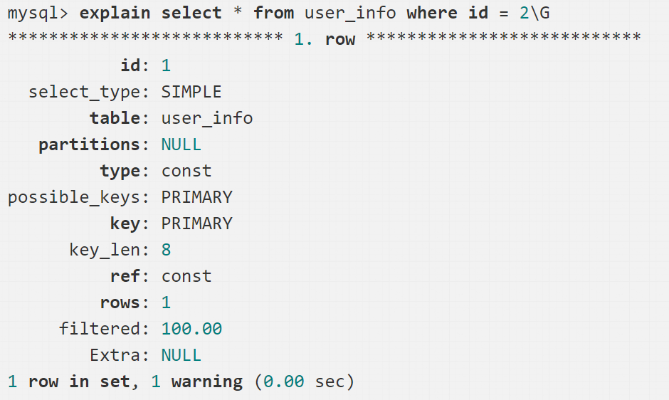

## 数据库（MySQL）

### 概念

#### 数据三范式

> 1NF：所有字段值都是不可分解的原子值。【联系人】（姓名，性别，电话），一个联系人有家庭电话和公司电话，那么这种表结构设计就没有达到 1NF
>
> 2NF：有主键，其他字段完全依赖于主键，不能部分依赖于主键。eg:订单明细表【OrderDetail】（OrderID，ProductID，UnitPrice，Discount，Quantity，ProductName），Discount（折扣），Quantity（数量）完全依赖（取决）于主键（OderID，ProductID），而 UnitPrice，ProductName 只依赖于 ProductID，不符合2NF
>
> 3NF：无传递依赖(非主键列 A 依赖于非主键列 B，非主键列 B 依赖于主键的情况)

#### 什么是存储过程？有哪些优缺点

> 一组为了完成特定功能的SQL 语句集，经编译后存储在数据库。中用户通过指定存储过程的名字并给出参数（如果该存储过程带有参数）来执行它。优点：减少重复劳动、执行速度更快、减少网络通信量。缺点：场景单一，移植性差。
>

#### 什么是触发器？

https://zhuanlan.zhihu.com/p/60234138

> 触发器是一个特殊的存储过程，不同的是存储过程要CALL来调用，而触发器不需要使用CALL ，也不需要手工启动，只要当一个预定义的事件发生的时候，就会被MYSQL自动调用。

#### MySQL几大存储引擎区别

> 主要区分MyISAM和InnoDB
>
> MyISAM：默认表级锁、不支持事务、支持fulltext索引、普通读写快、不适合于高并发大负载的场景
>
> InnoDB：默认行级锁，但是只是使用索引检索才用，否则变表级锁、支持事务、支持外键、支持mvcc、以前不支持fulltext但现在支持了，普通读写比MyISAM慢，但由于支持事务所以适合在高并发场景下用

### 事务、隔离级、锁

http://ningg.top/category/#mysql-ref

#### 数据库事务

https://www.zhihu.com/question/30272728

> 四大特性：ACID（Atomicity、Isolation、Durability、Consistency）
>
> 原子性如何保证？全部做完才提交，中间有失败直接rollback到事务开始之前的状态，通过redo和undo日志实现
>
> redo: 成功提交但未写入硬盘；undo：执行了一部分但尚未提交
>
> 隔离性如何保证？对可能被其他事务访问的资源加锁，事务提交后再释放，或者进行MVCC控制，使之看不到
>
> 持久性：已提交的事务序列化到硬盘。未提交的事务回滚。
>
> 最基本的是一致性，前面三个都是为了保证它而存在的

#### bin log、redo log、undo log区别

> bin log是逻辑日志，属于Server层日志，可以提供给别的引擎使用，记录某个语句的原始逻辑，一开始设计的目的就不是为了支持原库崩溃恢复，而是用来搭建主从架构进行同步的。redo log则是物理日志，InnoDB特有，只能在内部使用，不能共享，为数据库的前滚操作和两阶段提交提供支持。redo log的两阶段提交是为了保持redo log和bin log的逻辑一致。redo log prepare成功，bin log成功，则提交事务；redo log prepare成功，bin log失败，则回滚事务。二者出现不一致时，优先保证redo log上的操作，先原库崩溃恢复，再处理从库。简单地说，redo log是一种预写日志，当有一条记录需要更新的时候，InnoDB会先把记录写到redo log，并更新内存，InnoDB会在适当的时候例如系统空闲，将这个操作记录到磁盘里面，最终的数据落盘，指的是把内存中的数据页覆盖磁盘上的数据页，这个过程与redo log无关。bin log则是记录成功运行了哪些事务。
>
> 区分redo log和bin log http://zhongmingmao.me/2019/01/15/mysql-redolog-binlog/
>
> https://www.cnblogs.com/f-ck-need-u/archive/2018/05/08/9010872.html
>
> undo log也是一种逻辑日志，用来回滚行记录到某个版本

#### MySQL多版本并发控制(MVCC)的具体机制

https://blog.csdn.net/SnailMann/article/details/88388829

[MySQL InnoDB MVCC 机制的原理及实现](https://zhuanlan.zhihu.com/p/64576887)   [乐观锁和 MVCC 的区别](https://www.zhihu.com/question/27876575)  [MySQL 技术内幕：事务隔离级别和MVCC](http://ningg.top/inside-mysql-transaction-and-mvcc/)

> 处理读写冲突的手段，目的在于提高数据库高并发场景下的吞吐性能，属于一种乐观锁的实现机制（两种：一种版本号，一种是时间戳）。
>
> 1. `MySQL` 中 `InnoDB` 引擎支持 `MVCC`
> 2. 应对高并发事务, `MVCC` 比单纯的加行锁更有效, 开销更小
> 3. `MVCC` 在读已提交`（Read Committed）`和可重复读`（Repeatable Read）`隔离级别下起作用：为什么？在 `RU` 隔离级别下，直接读取版本的最新记录就 OK，对于 `SERIALIZABLE` 隔离级别，则是通过加锁互斥来访问数据，因此不需要 `MVCC` 的帮助
> 4. `MVCC` 既可以基于**乐观锁**又可以基于**悲观锁**来实现，和乐观锁的区别是，乐观锁解决的是读与读的冲突，mvcc解决的是读写冲突。

#### 事务的隔离级别

> 并发事务产生的问题：
>
> > 1.第一类丢失更新：A事务撤销时，把已经提交的B事务的更新数据覆盖了
> >
> > 2.第二类丢失更新：A事务提交时，把已经提交的B事务的更新数据覆盖了
> >
> > 3.脏读：A事务读到B事务里未提交更新的数据
> >
> > 4.不可重复读：A读到B未提交的某数据一次，后来B修改了又提交了，A再读，发现不一样
> >
> > 5.幻读：A读到B的数据时没发现这个数据，后来B增/删了这个数据，且提交了，A又读，发现数据个数都不一样了
>
> 通过事务的隔离级别来解决这些问题。隔离性分为四个级别：从宽到严：
>
> > 读未提交（Read Uncommitted）一个事务在执行过程中可以看到其他事务**没有提交的新插入**的记录，而且还能看到其他事务**没有提交的对已有记录的更新**。避免了 1
> >
> > 读已提交（Read Committed） 大多数数据库默认的隔离级别，一个事务在执行过程中可以看到其他事务已经提交的新插入的记录，而且还能看到其他事务**已经提交**的**对已有记录的更新**。避免了1、3
> >
> > 可重复读（Repeatable-Read) MySQL所默认的级别，对涉及的数据加锁，一个事务在执行过程中可以看到其他事务**已经提交**的**新插入**的记录，但是不能看到其他事务对已有记录的更新。避免了1、2、3、4，实际上MySQL在RR隔离级下，通过**next-key locking**策略也避免了幻读。
> >
> > 串行化（serializable）一个事务在执行过程中**完全看不到其他事务**对数据库所做的更新，当两个事务同时操作数据库中相同数据时，如果第一个事务已经在访问该数据，第二个事务只能停下来等待，必须等到第一个事务结束后才能恢复运行。避免了1、2、3、4、5
>
> 大多数关系数据库默认使用Read committed的隔离级别，Mysql InnoDB默认使用Read repeatable的隔离级别，这和Mysql replication 机制使用Statement日志格式有关。各数据库隔离级别的实现也是有差别的，例如Oracle支持Read committed 和Serializable两种隔离级别，另外可以通过使用读快照在Read committed级别上禁止不可重复读问题；MySQL默认采用RR隔离级别，SQL标准是要求RR解决不可重复读的问题，但是因为MySQL采用了gap lock，所以实际上MySQL的RR隔离级别也解决了幻读的问题，也就是Mysql InnoDB在Read repeatable级别上使用next-key locking 策略来避免幻读现象的产生。
>
> https://juejin.im/post/5b90cbf4e51d450e84776d27

#### 怎么实现事物的这些隔离级别

> 主要方法有两种：加读写锁 或 使用一致性快照读，即MVCC（Multiversion Concurrency Control）。
>
> 具体的：
>
> 实现可序列化要求在选定对象上加上**读锁和写锁**，保持直到事务结束后才能释放。因为在where子句描述一个范围后会加上**“范围锁(range-locks)”**，所以能避免幻读。
>
> 可重复读保证了同一个事务中**多次读取同样的记录**的结果是一致的。对`选定对象`的**读锁(read locks)和写锁(write locks)**一直保持到事务结束，但不要求**“范围锁(range-locks)”**，因此可能会发生“幻读(phantom reads)”。

#### MySQL锁机制

[MySQL锁总结](https://zhuanlan.zhihu.com/p/29150809)

> 功能划分：共享锁与排他锁：共享锁（读锁）其他事务可以读，但不能写。排他锁（写锁） 其他事务不能读，也不能写。
>
> 粒度划分：MySQL 不同的存储引擎支持不同的锁机制，所有的存储引擎都以自己的方式显现了锁机制，服务器层完全不了解存储引擎中的锁实现：
>
> - MyISAM 和 MEMORY 存储引擎采用的是表级锁（table-level locking）
> - BDB 存储引擎采用的是页面锁（page-level locking），但也支持表级锁
> - InnoDB 存储引擎既支持行级锁（row-level locking），也支持表级锁，但默认情况下是采用行级锁。InnoDB 行锁是通过**给索引上的索引项加锁**来实现的，这种行锁实现特点意味着：只有**通过索引条件检索**数据，InnoDB 才使用行级锁，否则，InnoDB 将使用表锁！
>
> 默认情况下，表锁和行锁都是自动获得的， 不需要额外的命令。但是在有的情况下， 用户需要明确地进行锁表或者进行事务的控制， 以便确保整个事务的完整性，这样就需要使用事务控制和锁定语句来完成。
>
> 不同粒度锁的比较：
>
> > 表级锁：开销小，加锁快，吃内存；不会出现死锁；锁定粒度大，发生锁冲突的概率最高，并发度最低，适合于以查询为主，并发用户少，只有少量按索引条件更新数据的应用，如Web 应用。
> >
> > 行级锁：开销大，加锁慢；会出现死锁；锁定粒度最小，发生锁冲突的概率最低，并发度最高，更适合于有大量按索引条件并发更新少量不同数据，同时又有并发查询的应用，如一些OLTP系统。
> >
> > 页面锁：开销和加锁时间界于表锁和行锁之间；会出现死锁；锁定粒度界于表锁和行锁之间，并发度一般。
> >
> >  锁冲突和死锁不是一个概念，锁冲突会按顺序执行，死锁是指两个或两个以上的进程在执行过程中,因争夺资源而造成的一种互相等待的现象,若无外力作用,它们都将无法推进下去。
>
> 特殊：InnoDB的间隙锁。当我们用范围条件而不是相等条件检索数据，并请求共享或排他锁时，InnoDB会给**符合条件的已有数据**记录的索引项**加锁**；对于键值**在条件范围内但并不存在**的记录，叫做“间隙（GAP)”，InnoDB也会**对这个“间隙”加锁**，这种锁机制就是所谓的间隙锁（Next-Key锁）。很显然，在使用范围条件检索并锁定记录时，InnoDB这种加锁机制会阻塞符合条件范围内键值的并发插入，这往往会造成严重的锁等待。**使用InnoDB间隙锁的目的**：**防止幻读**，以满足相关隔离级别的要求，**满足恢复和复制**的需要：MySQL 通过 binlog录入执行成功的 INSERT、UPDATE、DELETE 等更新数据的 SQL 语句，并由此实现 MySQL 数据库的恢复和主从复制。MySQL 的恢复机制（复制其实就是在 Slave Mysql 不断做基于 binlog的恢复）有以下特点：
>
> 一是 MySQL 的恢复是 SQL 语句级的，也就是重新执行 binlog中的 SQL 语句。
>
> 二是 MySQL 的 binlog是按照事务提交的先后顺序记录的， 恢复也是按这个顺序进行的。
>
> 由此可见，MySQL 的恢复机制要求：在一个事务未提交前，其他并发事务不能插入满足其锁定条件的任何记录，也就是不允许出现幻读。

#### MySQL有哪些日志

> 使用事务日志，存储引擎在修改表的数据时只需要修改其内存拷贝，再把该修改行为记录到持久在硬盘上的事务日志中，而不用每次都将修改的数据本身持久到磁盘。事务日志采用的是追加的方式，因此写日志的操作是磁盘上一小块区域内的顺序I/O，而不像随机I/O需要在磁盘的多个地方移动磁头，所以采用事务日志的方式相对来说要快得多。事务日志持久以后，内存中被修改的数据在后台可以慢慢地刷回到磁盘。目前大多数存储引擎都是这样实现的，我们通常称之为预写式日志(WAL)，修改数据需要写两次磁盘。如果数据的修改已经记录到事务日志并持久化，但数据本身还没有写回磁盘，此时系统崩溃，存储引擎在重启时能够自动恢复这部分修改的数据。
>
> MySQL InnoDB中跟数据持久性、一致性有关的日志，有以下几种：
>
> - Bin Log: 是MySQL服务层产生的日志，常用来进行**数据恢复、数据库复制**，常见的MySQL主从架构，就是采用slave同步master的binlog实现的
> - Redo Log: 记录了数据操作在物理层面的修改，mysql中使用了大量缓存，修改操作时会直接修改内存，而不是立刻修改磁盘，事务进行中时会不断的产生redo log，在事务提交时进行一次flush操作，保存到磁盘中。当数据库或主机失效重启时，会根据redo log进行数据的恢复，如果redo log中有事务提交，则进行事务提交修改数据。
> - Undo Log: 除了记录redo log外，当进行数据修改时还会记录undo log，undo log用于数据的撤回操作，它记录了修改的反向操作，比如，插入对应删除，修改对应修改为原来的数据，通过undo log可以实现事务回滚，并且可以根据undo log回溯到某个特定的版本的数据，实现MVCC

### 索引原理和优化

[MySQL索引总结](https://zhuanlan.zhihu.com/p/29118331)      [MySQL索引背后的数据结构及算法原理](https://blog.codinglabs.org/articles/theory-of-mysql-index.html)       [MySQL 索引原理及设计](https://icell.io/how-mysql-index-works/)

#### MySQL索引原理

> 为何使用B+树：硬盘访问速度慢、IO次数决定性能。磁盘预读性原理，B+树一个节点可以设置为一个页大小，降低io次数。
>
> B树每个节点可以有多个子树，M 阶 B 树表示该树每个节点最多有 M 个子树，每个**中间节点**有 k-1 个关键字（可以理解为数据）和 k 个子树（ k 介于阶数 M 和 M/2 之间，M/2 向上取整），所有叶子节点都在同一层，并且叶子节点只有关键字，指向孩子的指针为 null。
>
> B+树节点的子树数和关键字数相同（B 树是关键字数比子树数少一）；中间节点不包含实际数据，节点的关键字表示的是子树中的最大值，在子树中同样含有这个数据；所有数据都存放在叶子节点；叶子节点之间链表相连。
>
> B+树优点：
>
> 1. 层级更低，IO 次数更少
> 2. 每次都需要查询到叶子节点，查询性能稳定
> 3. 叶子节点形成有序链表，范围查询方便
>
> MyISAM引擎使用B+Tree作为索引结构，叶节点的data域存放的是**数据记录的地址**。
>
> 
>
> 虽然InnoDB也使用B+Tree作为索引结构，但第一个重大区别是InnoDB的数据文件本身就是索引文件。这棵树的叶节点data域保存了**完整的数据记录**。这个索引的key是数据表的主键，因此InnoDB表数据文件本身就是主键索引。
>
> 

#### 索引的分类

> 从数据结构角度分：B+树索引、hash索引（只能等值查询）、FULLTEXT索引（现在MyISAM和InnoDB引擎都支持了）、R-Tree索引（用于对GIS数据类型创建SPATIAL索引）
>
> 注意：fulltext索引用于**查找文本中的关键词**，而不是直接比较是否相等。查找条件使用 **MATCH AGAINST**，而不是普通的 WHERE。全文索引使用**倒排索引**实现，它记录着**关键词到其所在文档的映射**，用于替代效率较低的LIKE模糊匹配操作，而且可以通过多字段组合的全文索引一次性全模糊匹配多个字段
>
> 从物理存储角度分：聚簇索引、非聚簇索引，InndoDB中，聚簇索引的叶子节点存放了整行数据
>
> 从逻辑角度分：主键索引、普通索引、组合索引、唯一索引和非唯一索引
>
> 普通索引：最基本的索引，没有任何限制，是我们大多数情况下使用到的索引。
>
> 唯一索引：与普通索引类型，不同的是唯一索引的列值必须唯一，但允许为空值。
>
> 全文索引：全文索引（FULLTEXT）仅可以适用于MyISAM引擎的数据表；作用于CHAR、VARCHAR、TEXT数据类型的列。
>
> 组合索引：将几个列作为一条索引进行检索，使用最左匹配原则。

#### 聚簇索引与非聚簇索引的区别

聚簇索引的叶子节点就是数据节点，而非聚簇索引的叶子节点仍然是索引节点，只不过有指向对应数据块的指针。

#### InnoDB怎么实现聚簇索引

> https://cloud.tencent.com/developer/news/325885

#### 索引的优缺点分析

> 优点：
>
> - 索引大大减小了服务器需要扫描的数据量
> - 索引可以帮助服务器避免排序和临时表
> - 索引可以将随机IO变成顺序IO
> - 索引对于InnoDB（对索引支持行级锁）非常重要，因为它可以让查询锁更少的元组。
>
> 缺点：
>
> - 虽然索引大大提高了查询速度，同时却会降低更新表的速度，如对表进行INSERT、UPDATE和DELETE。因为更新表时，MySQL不仅要保存数据，还要保存索引文件。
> - 建立索引会占用磁盘空间的索引文件。一般情况这个问题不太严重，但如果你在一个大表上创建了多种组合索引，索引文件的会膨胀很快。
> - 如果某个数据列包含许多重复的内容，为它建立索引就没有太大的实际效果。
> - 对于非常小的表，大部分情况下简单的全表扫描更高效；

#### 建立索引的原则

> 1，最左前缀匹配原则。MySQL会一直向右匹配直到遇到范围查询（>,<,BETWEEN,LIKE）就停止匹配，范围查询后的索引就失效了
>
> 2，等于（=）和in 可以乱序。比如，a = 1 AND b = 2 AND c = 3 建立（a,b,c）索引可以任意顺序
>
> 3，尽量选择区分度高的列作为索引
>
> 4，索引列不能参与计算，尽量保持列“干净”
>
> 5，尽可能的扩展索引，不要新建立索引。比如表中已经有了a的索引，现在要加（a,b）的索引，那么只需要修改原来的索引即可
>
> 6，单个多列组合索引和多个单列索引的检索查询效果不同，因为在执行SQL时，MySQL只能使用一个索引，会从多个单列索引中选择一个限制最为严格的索引
>
> 7，频繁查询的可以建索引、频繁修改的别建索引
>
> 8，LIKE子句以通配符%开头，将会索引失效全表扫描
>
> 9，无效符号比如说!=、<>这些，也会索引失效全表扫描
>
> 10，索引不会包含有NULL值的列，只要列中包含有NULL值，都将不会被包含在索引中，组合索引中只要有一列有NULL值，那么这一列对于此条组合索引就是无效的
>
> 11，where子句中已经使用了索引的话，那么ORDER BY中的列是不会使用索引的，还是因为MySQL一次只能使用一个索引，另外where子句中用or进行条件连接，也会全表扫描

#### 何时需要使用索引？何时无需使用索引？

> 何时使用索引：1. 对一个键码使用>, >=, =, <, <=, IF NULL和BETWEEN；2. 当使用不以通配符开始的LIKE模糊查询；3.在进行联结时从另一个表中提取行时；4. 找出指定索引的MAX()或MIN()值；5. 一个键码的前缀使用ORDER BY或GROUP BY
>
> 何时不使用索引：如果MySQL能估计出它将可能比扫描整张表还要快时，则不使用索引。比如只用了非聚簇索引不用聚簇索引，会先从非聚簇索引树上找到聚簇索引再去通过聚簇索引找，很慢。以及使用通配符开头的LIKE模糊查询、搜索一个索引而在另一个索引上做ORDER BY。

#### 组合索引的运用机制

#### 对全文索引的了解

#### Explain命令

在select前加上一个explain就可以看到输出的一些信息。

各列的含义如下:

- id: SELECT 查询的标识符. 每个 SELECT 都会自动分配一个唯一的标识符.
- select_type: SELECT 查询的类型.
- table: 查询的是哪个表
- partitions: 匹配的分区
- type: join 类型
- possible_keys: 此次查询中可能选用的索引
- key: 此次查询中确切使用到的索引.
- key_len: 表示查询优化器使用了索引的字节数. 这个字段可以评估组合索引是否完全被使用, 或只有最左部分字段被使用到.
- ref: 哪个字段或常数与 key 一起被使用
- rows: 显示此查询一共扫描了多少行. 这个是一个估计值.
- filtered: 表示此查询条件所过滤的数据的百分比
- extra: 额外的信息

`select_type` 表示了查询的类型, 它的常用取值有:

- SIMPLE, 表示此查询不包含 UNION 查询或子查询
- PRIMARY, 表示此查询是最外层的查询
- UNION, 表示此查询是 UNION 的第二或随后的查询
- DEPENDENT UNION, UNION 中的第二个或后面的查询语句, 取决于外面的查询
- UNION RESULT, UNION 的结果
- SUBQUERY, 子查询中的第一个 SELECT
- DEPENDENT SUBQUERY: 子查询中的第一个 SELECT, 取决于外面的查询. 即子查询依赖于外层查询的结果.

`type` 字段比较重要, 它提供了判断查询是否高效的重要依据依据. 通过 `type` 字段, 我们判断此次查询是 `全表扫描` 还是 `索引扫描` 等。

- `system`: 表中只有一条数据. 这个类型是特殊的 `const` 类型.
- `const`: 针对主键或唯一索引的等值查询扫描, 最多只返回一行数据. const 查询速度非常快, 因为它仅仅读取一次即可. 使用了主键索引,  `type` 就是 `const` 类型的.
- `eq_ref`: 此类型通常出现在多表的 join 查询, 表示对于前表的每一个结果, 都只能匹配到后表的一行结果. 并且查询的比较操作通常是 `=`, 查询效率较高. 
- `ref`: 此类型通常出现在多表的 join 查询, 针对于非唯一或非主键索引, 或者是使用了 `最左前缀` 规则索引的查询.
- `range`: 表示使用索引范围查询, 通过索引字段范围获取表中部分数据记录. 这个类型通常出现在 =, <>, >, >=, <, <=, IS NULL, <=>, BETWEEN, IN() 操作中.
- `index`: 表示全索引扫描(full index scan), 和 ALL 类型类似, 只不过 ALL 类型是全表扫描, 而 index 类型则仅仅扫描所有的索引, 而不扫描数据. `index` 类型通常出现在: 所要查询的数据直接在索引树中就可以获取到, 而不需要扫描数据. 当是这种情况时, Extra 字段 会显示 `Using index`.
- `ALL`: 表示全表扫描, 这个类型的查询是性能最差的查询之一. 

通常来说, 不同的 type 类型的性能关系如下:
`ALL < index < range ~ index_merge < ref < eq_ref < const < system`

### 多表查询

#### MySQL有哪些表连接？

> 交叉连接，内连接，外连接，自连接。
>
> 交叉连接A表m条，B表n条，那就会cross join出mn条。
>
> 内连接，加入A中有k条id和B中k条id是对应的，那A inner join B on A.id=B.id就只有k条记录，但如果不加这个相等条件，那inner join结果和cross join没啥不同。
>
> 左连接：A left join B，说明A在B左侧，以A为准，查出m条，与B相同主键的补齐、没有的列补null
>
> 右连接：A right join B，说明A在B右侧，以B为准，查出n条，与A相同主键的补齐，没有的补null

MySQL join

#### 数据库中为什么不推荐使用外键约束

https://www.cnblogs.com/rjzheng/p/9907304.html

#### 分页

#### 分表

#### 分库

### 主从架构

#### MySQL主从同步

> 1. slave服务器执行start slave，意味着开启主从复制开关。
> 2. 然后slave服务器开启io线程，请求连接master服务器、并请求从指定的binlog上的指定位置之后获取日志内容。（日志文件名和位置就是在配置主从复制任务时执行`change master`命令时指定的）
> 3. master服务器接受slave服务器的连接请求，并把slave请求的日志文件上某一位置之后的日志内容发送过去。此外，返回信息中还要此次返回binlog内容后，master服务器上新产生的binlog的文件名和开始位置点，好让下一次slave请求主从复制时，实则是从这次结束后的位置点开始复制。
> 4. slave服务器接收到了master发来的binlog内容，追加写回到自己的relay log中，并将新的 binlog 文件名和位置记录到 `master-info` 文件中，下次主从复制就能发回master获取新的更新复制了。
> 5. slave服务器的 SQL 线程实时地检测relay log中的追加更新，及时的把这些更新解析成SQL语句并执行，应用完毕后清理应用过的relay log。

#### MySQL主从时延

https://www.cnblogs.com/cnmenglang/p/6393769.html 主库操作可以并发，而从库从relay log中读取dml ddl操作并执行的Slave_SQL_Running线程是单线程的，性能有限，此外还有就是可能与slave的大型query语句产生了锁等待。

