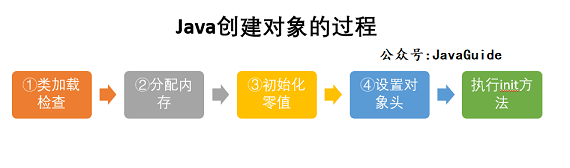
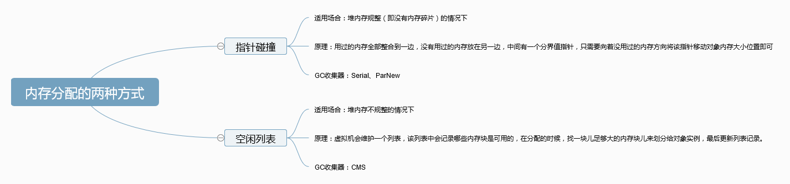

## JVM

[Java虚拟机](https://github.com/CyC2018/CS-Notes/blob/master/notes/Java%20%E8%99%9A%E6%8B%9F%E6%9C%BA.md)

[JVM内存模型](https://github.com/Snailclimb/JavaGuide/blob/master/docs/java/jvm/Java内存区域.md)

[JVM垃圾回收](https://github.com/Snailclimb/JavaGuide/blob/master/docs/java/jvm/JVM垃圾回收.md)

[类文件结构](https://github.com/Snailclimb/JavaGuide/blob/master/docs/java/jvm/%E7%B1%BB%E6%96%87%E4%BB%B6%E7%BB%93%E6%9E%84.md)

[类加载过程](https://github.com/Snailclimb/JavaGuide/blob/master/docs/java/jvm/%E7%B1%BB%E5%8A%A0%E8%BD%BD%E8%BF%87%E7%A8%8B.md)

[类加载器](https://github.com/Snailclimb/JavaGuide/blob/master/docs/java/jvm/%E7%B1%BB%E5%8A%A0%E8%BD%BD%E5%99%A8.md)

#### Java虚拟机内存模型特点和作用

- **程序计数器**：当前线程正在执行的字节码的行号指示器，实现代码的流程控制，线程切换标记运行位置，线程私有，不会OOM，生命周期随线程
- **Java虚拟机栈**：为java方法创栈帧，存局部变量表、操作数栈、方法出口信息等，会有StackOverflow错误。注意区分StackOverflow和outofmemory，一个是栈太深，一个是内存空间不够
- **本地方法区**：和Java虚拟机栈类似，不过只服务于本地方法
- **堆**：堆是用来存放对象的内存空间，**几乎所有**的对象都存储在堆中，JVM启动时创建，垃圾回收的主要场所
- **方法区**：存储**已被虚拟机加载的类元信息**、常量、静态变量、即时编译器编译后的代码等数据
- **常量池**：

#### 为什么jdk1.8把堆内的方法区移除，在直接内存中增设了元空间

永久代的内存有个特点，就是它们的生命周期往往较长，因此虚拟机可能会忽略这部分的垃圾回收，容易造成OOM错误，移出去可以避免这个问题。而且JVM将会在IO操作上具有更高的性能（DirectByteBuffer），因为它直接作用于本地系统的IO操作，因为**避免了在 Java 堆和 Native 堆之间来回复制数据**。

- 从数据流的角度，非直接内存是下面这样的作用链：内核 --> 直接内存 --> 非直接内存 --> 直接内存 --> 内核
- 而直接内存是：本地IO --> 直接内存 --> 本地IO

#### Class文件结构

#### **类加载过程**    

加载：通过类全名获取二进制字节流，将字节流所代表的静态存储结构转换为方法区的运行时数据结构，在内存中生成一个代表该类的 Class 对象,作为方法区这些数据的访问入口

验证：检验合法性

准备：**为类变量分配内存并设置类变量初始0值**，如果static final类型，直接赋给定值

解析：符号引用替换成直接引用

初始化：执行类构造器 `<clinit> ()`方法， `<clinit>（）` 方法是带锁线程安全，所以在多线程环境下进行类初始化的话可能会引起死锁，并且这种死锁很难被发现。激活类的静态变量的初始化Java代码和静态Java代码块。

#### **类初始化的时机**    

new、读取一个静态字段、调用类静态方法、被反射调用、初始化子类时父类也得初始化、当虚拟机启动时，用户需要定义一个要执行的主类 (包含 main 方法的那个类)

#### 对象创建过程  

1. 检查常量池中是否有即将要创建的这个对象所属的类的符号引用。没有说明该类为定义，抛ClassNotFoundException，有则下一步
2. 检查这个符号引用所代表的类是否已经被JVM加载。若该类还没有被加载，就找该类的class文件，并加载进方法区(元空间)，若该类已经被JVM加载，则准备为对象分配内存
3. 根据方法区中该类的元信息确定该类所需的内存大小，JVM在一个类被加载进方法区的时候就知道该类生产的每一个对象所需要的内存大小。为对象分配空间的任务等同于把一块确定大小的内存从 Java 堆中划分出来。分配内存有**“指针碰撞”** 和 **“空闲列表”** 两种

内存分配并发问题(JVM创建对象是线程安全的)：**虚拟机采用 CAS 配上失败重试的方式保证更新操作的原子性。**TLAB： 为每一个线程预先在 Eden 区分配一块儿内存，JVM 在给线程中的对象分配内存时，首先在 TLAB 分配，当对象大于 TLAB 中的剩余内存或 TLAB 的内存已用尽时，再采用上述的 CAS 进行内存分配

4. 内存分配完成后，虚拟机需要将分配到的内存空间都初始化为零值（不包括对象头），这一步操作保证了对象的实例字段在 Java 代码中可以不赋初始值就直接使用，程序能访问到这些字段的数据类型所对应的零值
5. 设置对象头中的信息（MarkWord+KlassWord）例如这个对象是哪个类的实例、如何才能找到类的元数据信息、对象的哈希码、对象的 GC 分代年龄等信息。 **这些信息存放在对象头中。** 另外，根据虚拟机当前运行状态的不同，如是否启用偏向锁等，对象头会有不同的设置方式。
6. 调用对象的构造函数进行初始化

#### 对象内存分配策略

对象优先分配在Eden区；大对象直接进入老年代；长期存活的对象进入老年代；如果在 Survivor 中相同年龄所有对象大小的总和大于 Survivor 空间的一半，则年龄大于或等于该年龄的对象可以直接进入老年代

#### 对象访问过程

目前主流的访问方式有**①使用句柄**和**②直接指针**两种

#### 对象的内存布局

#### 如何判断一个对象是否死亡

1.引用计数法、2.可达性分析

所有正在运行的线程的栈上的引用变量，所有的全局变量，所有ClassLoader，所有系统类加载器加载的Class都是GC roots

软引用：如果内存空间足够，垃圾回收器就不会回收它，如果内存空间不足了，就会回收这些对象的内存。只要垃圾回收器没有回收它，该对象就可以被程序使用。软引用可用来实现内存敏感的高速缓存。

弱引用：只具有弱引用的对象拥有更短暂的生命周期。在垃圾回收器线程扫描它所管辖的内存区域的过程中，一旦发现了只具有弱引用的对象，不管当前内存空间足够与否，都会回收它的内存。

虚引用：**虚引用主要用来跟踪对象被垃圾回收的活动**。

注：既然JVM有Full GC，为什么还会出现OutOfMemoryError？对于强引用，当内存空间不足，Java虚拟机宁愿抛出OutOfMemoryError错误，使程序异常终止，也不会靠随意回收具有强引用的对象来解决内存不足问题。full gc主要针对的是驻扎在老年代的软引用

#### **垃圾收集算法**  

标记-清楚：内存碎片 

标记整理：不吹产生碎片，但需大量移动对象，效率低

复制算法：空间利用率不高，得有空间担保。现在的商业虚拟机都采用这种收集算法回收新生代，但是并不是划分为大小相等的两块，而是一块较大的 Eden 空间和两块较小的 Survivor 空间，每次使用 Eden 和其中一块 Survivor。在回收时，将 Eden 和 Survivor 中还存活着的对象全部复制到另一块 Survivor 上，最后清理 Eden 和使用过的那一块 Survivor。HotSpot 虚拟机的 Eden 和 Survivor 大小比例默认为 8:1，保证了内存的利用率达到 90%。如果每次回收有多于 10% 的对象存活，那么一块 Survivor 就不够用了，此时需要依赖于老年代进行空间分配担保，也就是借用老年代的空间存储放不下的对象。

分代收集：新生代复制算法；老年代标记清楚或标记整理。复制算法利用某一个survivor区，和老年代做空间担保，每gc一次年龄+1，年龄到阈值直接进入老年代，survivor放不下也进入老年代，survivor中同年龄总体积和大于survivor区一半也都进入老年代。

#### **分配担保机制**

1. 在发生 Minor GC 之前，虚拟机先检查老年代最大可用的连续空间是否大于新生代所有对象总空间，如果条件成立的话，那么 Minor GC 可以确认是安全的（可以在新生代使用复制算法）。
2. 如果不成立的话虚拟机会查看 HandlePromotionFailure 的值是否允许担保失败，如果允许那么就会继续检查老年代最大可用的连续空间是否大于历次晋升到老年代对象的平均大小，如果大于，将尝试着进行一次 Minor GC；
3. 如果小于，或者 HandlePromotionFailure 的值不允许冒险，那么就要进行一次 Full GC。

#### **何时出发minor gc，何时触发full gc**

总的而言，GC的触发有两种：程序调用System.gc时可以触发、系统自身来决定GC触发的时机。

当Eden区满时，触发Minor GC；

触发Full gc：调用Syste.gc()；老年代空间不足了；Eden区快满了，准备进行minor gc时发现空间分配担保失败；jdk7以前永久代空间不足；CMS GC过程中触发了 Concurrent Mode Failure 

#### **垃圾收集器的比较**

除了 CMS 和 G1 之外，其它垃圾收集器都是以串行的方式执行。

#### CMS

（Concurrent Mark Sweep），Mark Sweep 指的是标记 - 清除算法，**以获取最短回收停顿时间为目标的收集器**。分为以下四个流程：

- 初始标记：仅仅只是标记一下 GC Roots 能直接关联到的对象，速度很快，需要停顿。
- 并发标记：进行 GC Roots Tracing 的过程，它在整个回收过程中耗时最长，不需要停顿。
- 重新标记：为了修正并发标记期间因用户程序继续运作而导致标记产生变动的那一部分对象的标记记录，需要停顿。
- 并发清除：不需要停顿。

在整个过程中耗时最长的并发标记和并发清除过程中，收集器线程都可以与用户线程一起工作，不需要进行停顿。具有以下缺点：

- 吞吐量低：低停顿时间是以牺牲吞吐量为代价的，导致 CPU 利用率不够高。
- 无法处理浮动垃圾，可能出现 Concurrent Mode Failure。浮动垃圾是指并发清除阶段由于用户线程继续运行而产生的垃圾，这部分垃圾只能到下一次 GC 时才能进行回收。由于浮动垃圾的存在，因此需要预留出一部分内存，意味着 CMS 收集不能像其它收集器那样等待老年代快满的时候再回收。如果预留的内存不够存放浮动垃圾，就会出现 Concurrent Mode Failure，这时虚拟机将临时启用 Serial Old 来替代 CMS。
- 标记 - 清除算法导致的空间碎片，往往出现老年代空间剩余，但无法找到足够大连续空间来分配当前对象，不得不提前触发一次 Full GC。

#### G1

（Garbage-First），它是一款面向服务端应用的垃圾收集器，在多 CPU 和大内存的场景下有很好的性能。HotSpot 开发团队赋予它的使命是未来可以替换掉 CMS 收集器。堆被分为新生代和老年代，其它收集器进行收集的范围都是整个新生代或者老年代，而 G1 可以直接对新生代和老年代一起回收。G1 把堆划分成多个大小相等的独立区域（Region），新生代和老年代不再物理隔离。

通过引入 Region 的概念，从而将原来的一整块内存空间划分成多个的小空间，使得每个小空间可以单独进行垃圾回收。这种划分方法带来了很大的灵活性，使得可预测的停顿时间模型成为可能。通过记录每个 Region 垃圾回收时间以及回收所获得的空间（这两个值是通过过去回收的经验获得），并维护一个优先列表，每次根据允许的收集时间，优先回收价值最大的 Region。每个 Region 都有一个 Remembered Set，用来记录该 Region 对象的引用对象所在的 Region。通过使用 Remembered Set，在做可达性分析的时候就可以避免全堆扫描。

如果不计算维护 Remembered Set 的操作，G1 收集器的运作大致可划分为以下几个步骤：

- 初始标记
- 并发标记
- 最终标记：为了修正在并发标记期间因用户程序继续运作而导致标记产生变动的那一部分标记记录，虚拟机将这段时间对象变化记录在线程的 Remembered Set Logs 里面，最终标记阶段需要把 Remembered Set Logs 的数据合并到 Remembered Set 中。这阶段需要停顿线程，但是可并行执行。
- 筛选回收：首先对各个 Region 中的回收价值和成本进行排序，根据用户所期望的 GC 停顿时间来制定回收计划。此阶段其实也可以做到与用户程序一起并发执行，但是因为只回收一部分 Region，时间是用户可控制的，而且停顿用户线程将大幅度提高收集效率。

具备如下特点：

- 空间整合：整体来看是基于“标记 - 整理”算法实现的收集器，从局部（两个 Region 之间）上来看是基于“复制”算法实现的，这意味着运行期间不会产生内存空间碎片。
- 可预测的停顿：能让使用者明确指定在一个长度为 M 毫秒的时间片段内，消耗在 GC 上的时间不得超过 N 毫秒。

#### **CMS的特点，适用场景**

**最短回收停顿时间**、但吞吐量低，适合客户端

#### **G1的特点，适用场景**   

跨越老年代，新生代，**以极高概率满足 GC 停顿时间要求的同时,还具备高吞吐量性能特征.**

#### 

#### **双亲委派模型以及好处，如何破坏双亲委托模型，如何实现一个类加载器**

#### **ClassLoader.loadClass()与Class.forName()的区别**

 https://my.oschina.net/gpzhang/blog/486743

后者在类加载后必须进行类的初始化，执行类的竞态代码块和构造方法，前者不初始化。

#### **OOM 出现的有哪些场景？为什么会发生？**

出现在四个位置，线程虚拟机栈、堆、运行时常量池、元空间，只有程序计数器不会OOM

#### **JVM命令行参数**

-Xms：初始堆大小，默认值为物理内存的1/64(<1GB)，默认(MinHeapFreeRatio参数可以调整)空余堆内存小于40%时，JVM就会增大堆直到-Xmx的最大限制

-Xmx：最大堆大小，默认值为物理内存的1/4(<1GB)，默认(MaxHeapFreeRatio参数可以调整)空余堆内存大于70%时，JVM会减少堆直到 -Xms的最小限制

-Xmn：年轻代大小(1.4or lator)，此处的大小是（eden + 2 survivor space)，与jmap -heap中显示的New gen是不同的。 

-Xss: 每个线程的堆栈大小,JDK5.0以后每个线程堆栈大小为1M,以前每个线程堆栈大小为256K.

-XX:PermSize：设置持久代(perm gen)初始值，默认值为物理内存的1/64

-XX:MaxPermSize：设置持久代最大值，默认为物理内存的1/4

-XX:+PrintGC：输出形式: 

-XX:+PrintGCTimeStamps：打印GC停顿耗时
-XX:+PrintGCApplicationStoppedTime：打印垃圾回收期间程序暂停的时间.-XX:+PrintHeapAtGC：打印GC前后的详细堆栈信息-Xloggc:filename：把相关日志信息记录到文件以便分析.