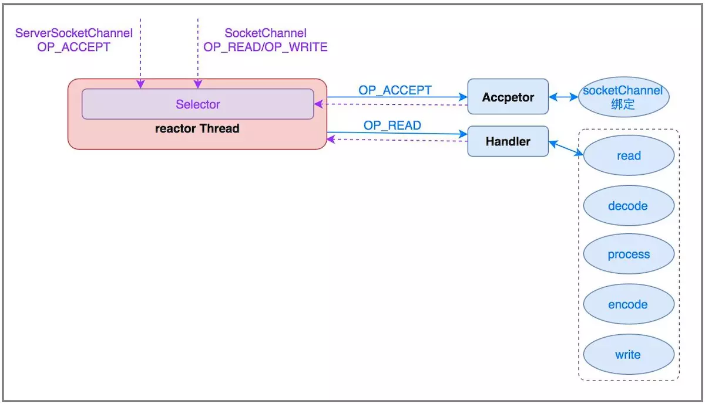
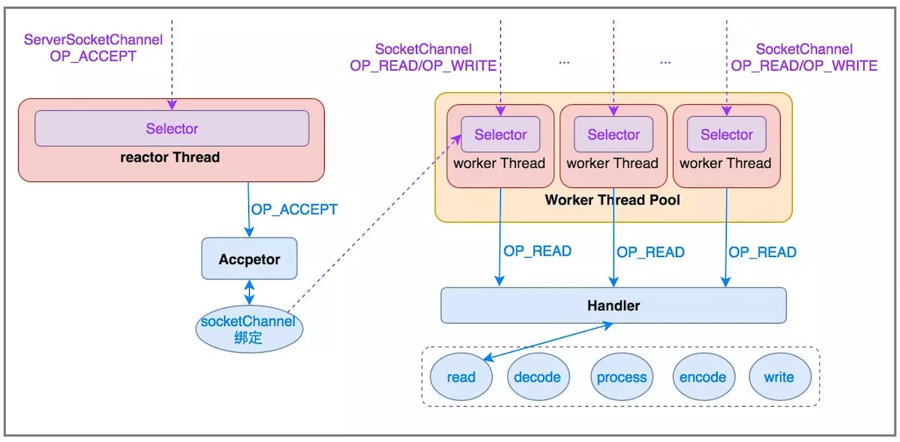
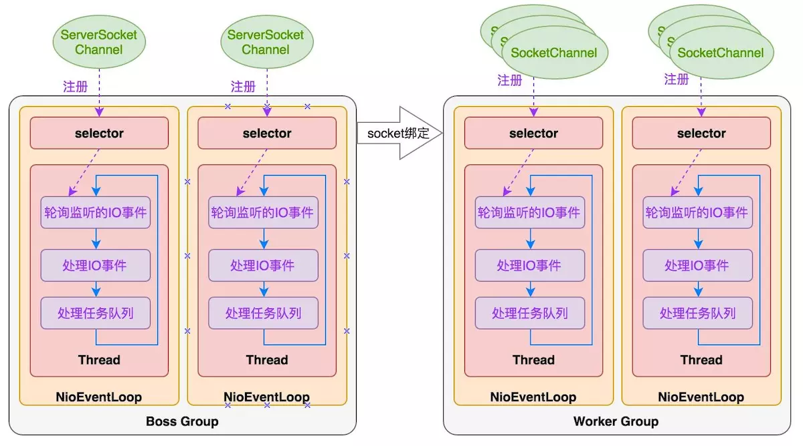
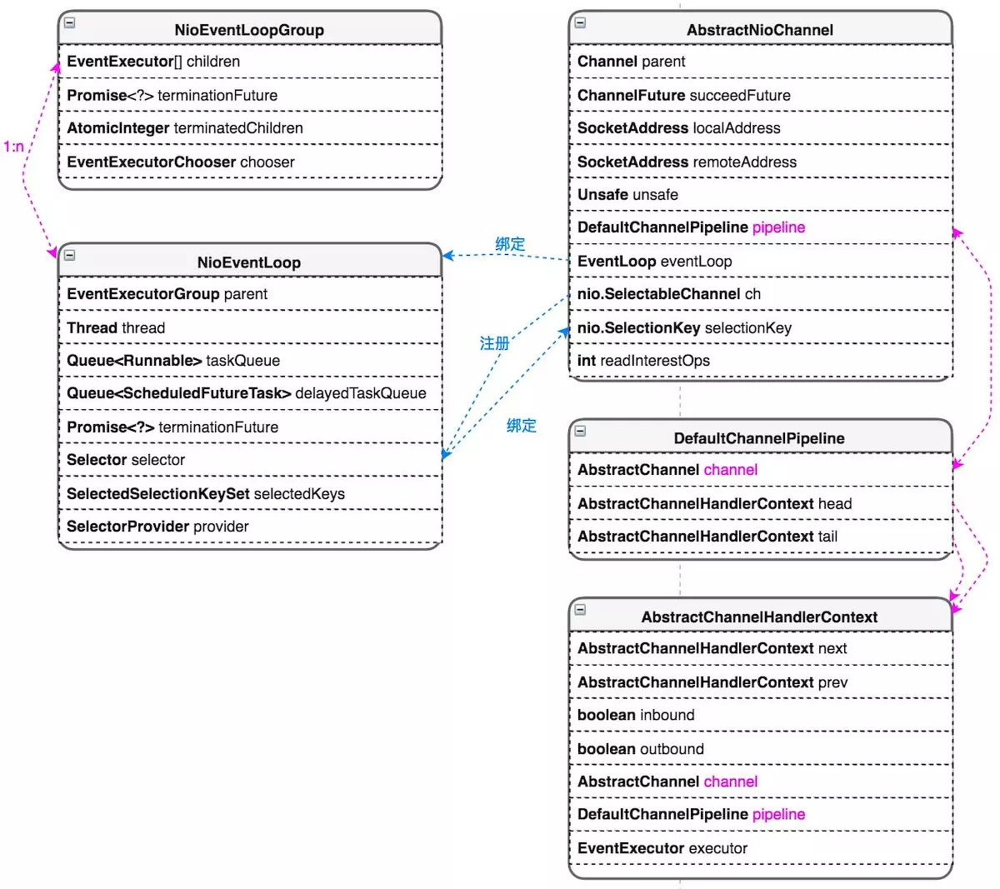
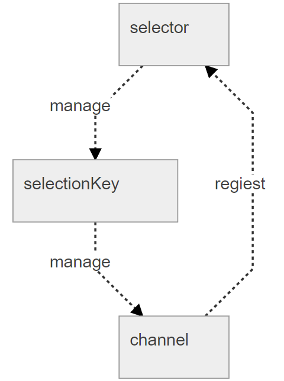
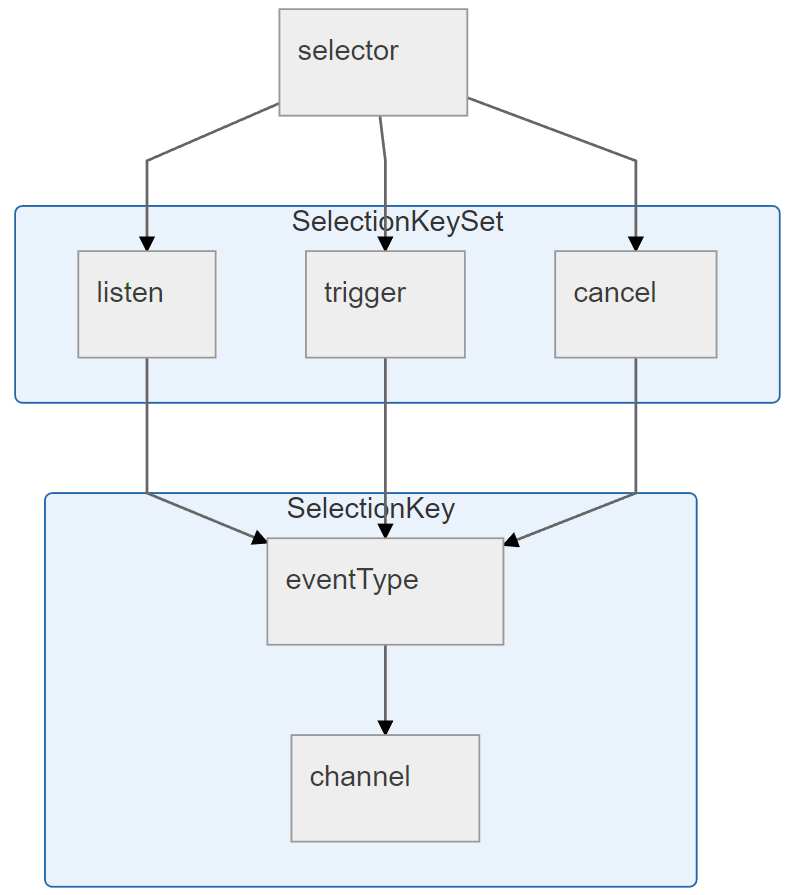
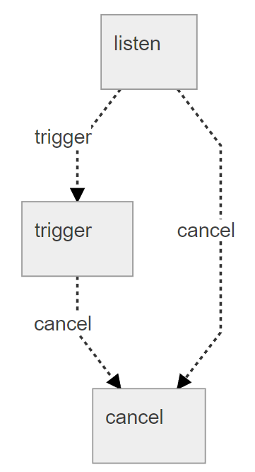

## IO/NIO

#### 零拷贝的过程

BIO：数据准备 阻塞；数据从内核拷贝进进程 阻塞

NIO：数据准备 非阻塞 轮询；数据从内核拷贝进进程 阻塞 ——普通NIO & 多路复用NIO(selector)

AIO：数据准备 非阻塞；数据从内核拷贝进进程 非阻塞 （NIO 2.0引入，服务器实现模式为一个有效请求一个线程，客户端的I/O请求都是由OS先完成了再通知服务器应用去启动线程进行处理）

#### select，poll，epoll区别

select：O(n),仅仅知道有I/O事件发生，不知道是哪个，**无差别轮询**，而且监听的channel有数量限制1024个

poll：O(n)，本质上和select没啥差，不过没有数量限制，原因是它是基于链表来存储的.

epoll：O(1)，事件驱动，把哪个流发生了怎样的I/O事件通知我们，无数量限制

#### NIO中的重要概念

Channel：连接data数据与buffer缓存区的桥梁，一个应用程序和操作系统交互事件、传递内容的渠道

Buffer：用于和NIO Channel进行交互，有写模式和读模式两种

Selector：多路复用器/轮询代理器/事件订阅器，能检测到多个NIO通道，接受多个SocketChannel的注册，同时会返回一个SelectionKey选择键对象，这个键对象标识了通道和选择器之间的注册关系。选择键会记住您关心的通道。它们也会追踪对应的通道是否已经就绪。当您调用一个选择器对象的select( )方法时，相关的键建会被更新，用来检查所有被注册到该选择器的通道。维护一个“已经注册的Channel”的容器，Selector会轮询监听多个通道的事件，直到监听到一个或多个通道的事件就绪。

#### Reactor模型

https://www.jianshu.com/p/38b56531565d

Reactor单线程模型：仅使用一个线程来处理所有的事情，包括客户端的连接和到服务器的连接，以及所有连接产生的读写事件，需要使用异步非阻塞I/O。Handler为具体的处理事件的处理器，而Acceptor为连接的接收者，作为服务端接收来自客户端的链接请求。（单点可靠性、浪费多核cpu、负载瓶颈）

Reactor多线程模型：Acceptor和Handler分离了，Acceptor使用单独的线程来接收请求，做好准备后就交给事件处理的handler来处理，而handler使用了一个WORKER线程池来实现，多个连接对应一个线程，一个连接只会属于一个线程。Acceptor接受连接的性能造成瓶颈。

Reactor主从多线程模型：Acceptor也使用BOSS线程池实现。

#### Netty线程模型与NioEventLoop

https://www.jianshu.com/p/38b56531565d

netty线程模型采用“服务端监听线程” Acceptor和“IO线程”Handler分离的方式，与多线程Reactor模型类似。抽象出NioEventLoop来表示一个不断循环执行处理任务的线程，每个NioEventLoop有一个selector，用于监听绑定在其上的socket链路。

netty采用串行化设计理念，从消息的读取->解码->处理->编码->发送，始终由IO线程NioEventLoop负责，整个流程不会进行线程上下文切换，数据无并发修改风险。一个NioEventLoop聚合一个多路复用器selector，可以处理多个客户端连接。netty只负责提供和管理“IO线程”，其他的业务线程模型由用户自己集成。

NioEventLoop中的Thread线程按照时间轮中的步骤**不断循环执行**：a)在时间片Tirck内执行selector.select()轮询监听IO事件；b)处理监听到的就绪IO事件；c)执行任务队列taskQueue/delayTaskQueue中的非IO任务。

#### NioEventLoop线程执行过程

> 一个NioEventLoopGroup下包含多个NioEventLoop
>
> 每个NioEventLoop中包含有一个Selector，一个taskQueue，一个delayedTaskQueue
>
> 每个NioEventLoop的Selector上可以注册监听多个AbstractNioChannel
>
> 每个AbstractNioChannel只会绑定在唯一的NioEventLoop上
>
> 每个AbstractNioChannel都绑定有一个自己的DefaultChannelPipeline

##### 1、轮询监听的IO事件

**1）netty的轮询注册机制**

netty将AbstractNioChannel内部的jdk类SelectableChannel对象注册到NioEventLoopGroup中的jdk类Selector对象上去，并且将AbstractNioChannel作为SelectableChannel对象的一个attachment附属上。这样在Selector轮询到某个SelectableChannel有IO事件发生时，就可以直接取出IO事件对应的AbstractNioChannel进行后续操作。

**2）循环执行阻塞selector.select(timeoutMIllis)操作直到以下条件产生**

a)轮询到了IO事件（selectedKey != 0）

b)oldWakenUp参数为true

c)任务队列里面有待处理任务（hasTasks()）

d)第一个定时任务即将要被执行（hasScheduledTasks()）

e)用户主动唤醒（wakenUp.get()==true）

**3）解决JDK的NIO epoll bug**

**该bug会导致Selector一直空轮询，最终导致cpu 100%**。

- 正常情况下，`selector.select()`操作是阻塞的，只有被监听的fd有读写操作时，才被唤醒
- 但是，在这个bug中，没有任何fd有读写请求，但是`select()`操作依旧被唤醒
- 很显然，这种情况下，`selectedKeys()`返回的是个空数组
- 然后按照逻辑执行到`while(true)`处，循环执行，导致死循环。

在每次selector.select(timeoutMillis)后，如果没有监听到就绪IO事件，会记录此次select的耗时。如果耗时不足timeoutMillis，说明select操作没有阻塞那么长时间，可能触发了空轮询，进行一次计数。

计数累积超过阈值（默认512）后，开始进行Selector重建：

a)拿到有效的selectionKey集合

b)取消该selectionKey在旧的selector上的事件注册

c)将该selectionKey对应的Channel注册到新的selector上，生成新的selectionKey

d)重新绑定Channel和新的selectionKey的关系

**4）netty优化了sun.nio.ch.SelectorImpl类中的selectedKeys和publicSelectedKeys这两个field的实现**

netty通过反射将这两个filed替换掉，替换后的field采用数组实现。

这样每次在轮询到nio事件的时候，netty只需要O(1)的时间复杂度就能将SelectionKey塞到set中去，而jdk原有field底层使用的hashSet需要O(lgn)的时间复杂度。

##### 2、处理IO事件

**1）对于boss NioEventLoop来说，轮询到的是基本上是连接事件（OP_ACCEPT）：**

a)socketChannel = ch.accept()；

b)将socketChannel绑定到worker NioEventLoop上；

c)socketChannel在worker NioEventLoop上创建register0任务；

d)pipeline.fireChannelReadComplete();

**2）对于worker NioEventLoop来说，轮询到的基本上是IO读写事件（以OP_READ为例）：**

a)ByteBuffer.allocateDirect(capacity)；

b)socketChannel.read(dst);

c)pipeline.fireChannelRead();

d)pipeline.fireChannelReadComplete();

##### 3、处理任务队列

**1）处理用户产生的普通任务**

NioEventLoop中的Queue<Runnable> taskQueue被用来承载用户产生的普通Task。

taskQueue被实现为netty的mpscQueue，即多生产者单消费者队列。netty使用该队列将外部用户线程产生的Task聚集，并在reactor线程内部用单线程的方式串行执行队列中的Task。

当用户在非IO线程调用Channel的各种方法执行Channel相关的操作时，比如channel.write()、channel.flush()等，netty会将相关操作封装成一个Task并放入taskQueue中，保证相关操作在IO线程中串行执行。

**2）处理用户产生的定时任务**

NioEventLoop中的Queue<ScheduledFutureTask<?>> delayedTaskQueue = new PriorityQueue被用来承载用户产生的定时Task。

当用户在非IO线程需要产生定时操作时，netty将用户的定时操作封装成ScheduledFutureTask，即一个netty内部的定时Task，并将定时Task放入delayedTaskQueue中等待对应Channel的IO线程串行执行。

为了解决多线程并发写入delayedTaskQueue的问题，netty将添加ScheduledFutureTask到delayedTaskQueue中的操作封装成普通Task，放入taskQueue中，通过NioEventLoop的IO线程对delayedTaskQueue进行单线程写操作。

**3）处理任务队列的逻辑**

a)将已到期的定时Task从delayedTaskQueue中转移到taskQueue中

b)计算本次循环执行的截止时间

c)循环执行taskQueue中的任务，每隔64个任务检查一下是否已过截止时间，直到taskQueue中任务全部执行完或者超过执行截止时间。

#### Netty的异步是怎么做的？

netty中每次io都是异步，都会返回一个ChannelFuture对象，这个对象实现了Future接口，但是可以通过addListener(GenericFutureListener)来实现操作完成的通知，GenericFutureListener内部的operationComplete实现通知后的业务逻辑代码。sync方法可以这个异步操作变成同步的。

#### Netty的selector是怎么多路复用的

所有的channel到selector注册，产生一个selectionKey，`selector`并不是直接对`channel`进行管理，而是通过创建`selectionKey`对`channel`进行管理。某一channel的某一事件被触发，selector.select得以返回，在轮询到nio事件的时候，netty只需要O(1)的时间复杂度就能将SelectionKey塞到selectedKeys set中去，获得selectedKeys后对selectionKey进行操作获得触发事件和channel，就能进行操作，然后开始eventLoop的下一次循环。

注册时还需要声明`类型`，也就是说生成的`selectionKey`中还有类型的划分。我们`regiest`注册之后，创建的`selectionKey`可以分作三种状态

`listen`：注册监听

`trigger`：监听触发

`cancel`：取消监听

也就是说，`selector`下管理的`selectionKey`分作了三个集合，然后之下是具体的`selectionKey`。

`listen`到`trigger`的变换，是系统自动通知变换的。这种事件通知是底层自动的，我们只需要处理`通知`的元素即可。

#### Netty的BootStrap

设置boss work EventLoopGroup线程组，设置channel类型，往pipeline里添加处理逻辑的handler，设置channel参数什么的，客户端connect，服务端bind