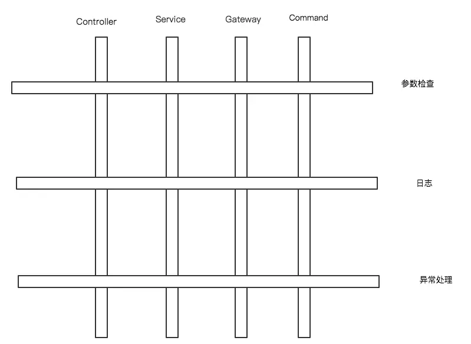
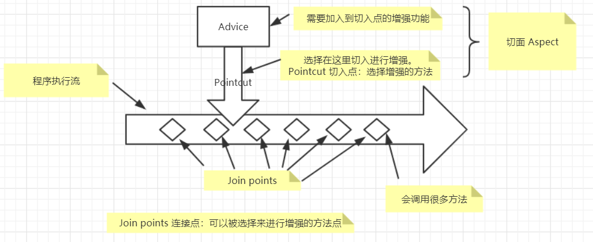
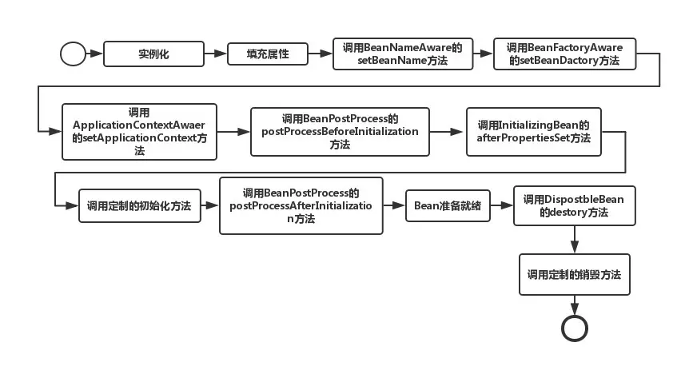

### Spring面试题

#### **什么是Spring框架?** 

一个开源的web框架，核心框架提供了ioc、aop、orm、dao和事务管理功能

#### **Spring都有哪些注解？**

**组件注解**：@Component 表示一个普通的spring Bean类 |  @Repository 标注一个DAO组件类 | @Service：标注一个业务逻辑组件类 | @Controller：标注一个控制器组件类。实质上他们属于同一类注解，用法相同，功能相同，区别在于标识组件的类型。@Component可以代替@Repository、@Service、@Controller，因为这三个注解是被@Component标注的。@Component需要在xml中配置

```xml
<!-- 自动扫描指定包及其子包下的所有Bean类 -->
<context:component-scan base-package="org.springframework.*"/>
```

**装配bean的注解**：@Autowired (属于Spring)、@Resource(属于java.annotation)、 @PostConstruct 和 @PreDestroy 方法 实现初始化之后和销毁bean之前进行的操作。比较：@Resource的作用相当于@Autowired，均可标注在字段或属性的setter方法上。

但@Autowired默认按照类型装配，如果容器中包含多个同一类型的Bean，那么启动容器时会报 找不到指定类型bean 的异常，解决办法是结合**@Qualifier**注解进行限定，指定注入的bean名称。

@Resource默认按名称装配，如果没有指定name属性，并且按照默认的名称仍然找不到依赖对象时，则按类型装配。

**@Component vs @Configuration and @Bean**

```
> Spring帮助我们管理Bean分为两个部分，一个是注册Bean，一个装配Bean。有三种完成方式：自动装配、JavaConfig方式(就是注解)、再就是XML配置。在自动配置的方式中，使用@Component告诉Spring，我是一个bean，你要来管理我，然后使用@AutoWired注解去装配Bean(所谓装配，就是管理对象直接的协作关系)。然后在JavaConfig中，@Configuration其实就是告诉spring，spring容器要怎么配置（怎么去注册bean，怎么去处理bean之间的关系）。@Bean的意思就是，我要获取这个bean的时候，你spring要按照这种方式去帮我获取到这个bean。到了使用xml的方式，也是如此。<bean>标签就是告诉spring怎么获取这个bean，各种<ref>就是手动的配置bean之间的关系。
```

@Bean注解主要用于方法上，有点类似于工厂方法，当使用了@Bean注解，我们可以连续使用多种定义bean时用到的注解，譬如用@Qualifier注解定义工厂方法的名称，用@Scope注解定义该bean的作用域范围，譬如是singleton还是prototype等。

Spring 中新的 Java 配置支持的核心就是@Configuration 注解的类。这些类主要包括 @Bean 注解的方法来为 Spring 的 IoC 容器管理的对象定义实例，配置和初始化逻辑。使用@Configuration 来注解类表示类可以被 Spring 的 IoC 容器所使用，作为 bean 定义的资源。

简单说：一个@Component需要注入某@Configuration中的@Bean工厂方法产生的实例

**事务注解**：在处理dao层或service层的事务操作时，譬如删除失败时的回滚操作。使用**@Transactional** 作为注解，但是需要在配置文件激活

```XML
<!-- 开启注解方式声明事务 -->
<tx:annotation-driven transaction-manager="transactionManager" />
```

#### 列举一些重要的Spring模块？

spring core、spring aop 、spring dao、spring orm、spring mvc

#### spring有哪些注入方式

接口注入、字段注入、setter注入、构造方法注入、注解注入、静态工厂注入、实例工厂等

#### Spring AOP的原理



有些操作需要跨越多个层次，为了避免重复代码，更好地将系统级别的代码抽离出来，去掉与不同层次对象的耦合，就产生了面向AOP。

pointcut即在哪个地方进行切入,它可以指定某一个点，也可以指定多个点，比如类A的methord函数，也可以利用正则表达式指定某一些类的某一些方法。Advice就是在切入点干什么，比如打日志，执行缓存、异常处理什么的。pointcut+advice就是aspect。但到这一地步并不是完整的，因为还不知道如何将切面植入到代码中，解决此问题的技术就是动态代理(JDK & CGLIB)。PointCut 依赖了ClassFilter和MethodMatcher,ClassFilter用来指定特定的类，MethodMatcher 指定特定的函数，正是由于PointCut仅有的两个依赖，它只能实现函数级别的AOP。对于属性、for语句等是无法实现该切点的。



#### Spring AOP 和 AspectJ AOP 有什么区别？

- Spring AOP采用动态代理的方式，在运行期生成代理类来实现AOP，不修改原类的实现(运行时增强)；Aspectj 使用编译期字节码织入(weave)的方式，在编译的时候，直接修改类的字节码，把所定义的切面代码逻辑插入到目标类中(编译增强)。
- Spring AOP可以对其它模块正常编译出的代码起作用，Aspectj 需要对其它模块使用acj重新编译
- 由于动态代理机制，Spring AOP对于直接调用类内部的其它方法无效，无法对定义为final的类生效。Aspectj没有这些限制
- Spring AOP使用XML配置文件的方式定义切入点(PointCut)，Aspectj使用注解方式

#### Spring 中的bean的作用域有哪些

singleton：无状态或者状态不可变的类适合使用单例模式来实现

prototype:每次从容器中调用 Bean 时，都会返回一个新的实例，即相当于执行 new Bean()

(request、session、global-session，只在web-aware Spring ApplicationContext的上下文中有效)

request：每次 http 请求都会创建一个新的 Bean 

session：同一个 http Session 共享一个 Bean，不同的 http Session 使用不同的 Bean

globalSession：同一个全局 Session 共享一个 bean, 用于 Porlet

#### Spring 中的bean生命周期?

 Spring 只帮我们管理单例模式 Bean 的**完整**生命周期，对于 prototype 的 bean ，Spring 在创建好交给使用者之后则不会再管理后续的生命周期。`*Aware` 接口可以用于在初始化 bean 时获得 Spring 中的一些对象，如获取 `Spring 上下文`等。实例化、填充属性、调用一堆*Aware的set方法、初始化然后bean就绪、然后调用destroy销毁。

 

spring bean 容器的生命周期流程如下：

1. Spring 容器根据配置中的 bean 定义中实例化 bean。
2. Spring 使用依赖注入填充所有属性，如 bean 中所定义的配置。
3. 如果 bean 实现 BeanNameAware 接口，则工厂通过传递 bean 的 ID 来调用 setBeanName()。
4. 如果 bean 实现 BeanFactoryAware 接口，工厂通过传递自身的实例来调用 setBeanFactory()。
5. 如果存在与 bean 关联的任何 BeanPreProcessors，则调用 preProcessBeforeInitialization() 方法。
6. 如果为 bean 指定了 init 方法（`<bean>` 的 init-method 属性），那么将调用它。
7. 最后，如果存在与 bean 关联的任何 BeanPostProcessors，则将调用 postProcessAfterInitialization() 方法。
8. 如果 bean 实现 DisposableBean 接口，当 spring 容器关闭时，会调用 destory()。
9. 如果为 bean 指定了 destroy 方法（`<bean>` 的 destroy-method 属性），那么将调用它。

#### Spring IoC

1. 谁控制谁：在传统的开发模式下，我们都是采用直接 new 一个对象的方式来创建对象，也就是说你依赖的对象直接由你自己控制，但是有了 IOC 容器后，则直接由 IoC 容器来控制
2. 控制什么：控制对象的创建与赋值
3. 为何是反转：没有 IoC 的时候我们都是在自己对象中主动去创建被依赖的对象，这是正转。但是有了 IoC 后，所依赖的对象直接由 IoC 容器创建后注入到被注入的对象中，依赖的对象由原来的主动获取变成被动接受，所以是反转。
4. 哪些方面反转了：对象的创建过程和赋值过程被翻转了
5. 优点：方便测试、达到松耦合

#### Spring有哪些IoC容器

BeanFactory (懒加载)\ApplicationContext：ApplicationContext 接口扩展了 BeanFactory 接口。它在 BeanFactory 基础上提供了一些额外的功能，不过是即时加载的。

#### Spring 中的单例 bean 的线程安全问题了解吗？

线程安全这个问题，要从单例与原型Bean分别进行说明。对于原型Bean,每次创建一个新对象，也就是线程之间并不存在Bean共享，自然是不会有线程安全的问题。对于单例Bean,所有线程都共享一个单例实例Bean,因此是存在资源的竞争。如果单例Bean,是一个无状态Bean，也就是线程中的操作不会对Bean的成员执行查询以外的操作，那么这个单例Bean是线程安全的。比如Spring MVC的 Controller、Service、Dao等，这些Bean大多是无状态的，只关注于方法本身。对于有状态的bean，Spring官方提供的bean，一般提供了通过**ThreadLocal**去解决线程安全的方法，比如RequestContextHolder、TransactionSynchronizationManager、LocaleContextHolder等。

#### 说说自己对于Spring MVC了解?

SpringMvc是基于过滤器对servlet进行了封装的一个框架，SpringMvc工作时主要是通过DispatcherServlet管理接收到的请求并进行处理

#### Spring 框架中用到了哪些设计模式？

 使用工厂模式可以通过 `BeanFactory` 或 `ApplicationContext` 创建 bean 对象；(BeanFactory延迟注入，ApplicationContext一次性实例化所有bean)

 某些对象比如线程池、缓存、注册表等只能有一个实例，所以也有单例模式。(为啥spring默认单例：因为减少了新创建对象的消耗、减少gc压力、可以快速从缓存获取到bean。缺点：容易出现线程不安全的问题，因此最好只在spring中创建**无状态**的bean，如果必须有状态，就使用**ThreadLocal**把变量变为**线程私有**的，如果bean的实例变量或类变量需要在多个线程之间共享，那么就只能使用**synchronized**、**lock**、**CAS**等这些实现线程同步的方法了)

 动态代理：AOP的实现过程中就用到了

 模板方法：jdbcTemplate

 适配器模式：将一个接口转换成客户希望的另一个接口，适配器模式使接口不兼容的那些类可以一起工作。Spring AOP 的增强或通知(Advice)使用到了适配器模式，与之相关的接口是`AdvisorAdapter`，Advice 常用的类型有BeforeAdvice、AfterAdvice、AfterReturningAdvice。每个类型Advice（通知）都有对应的拦截器MethodBeforeAdviceInterceptor等。Spring预定义的通知要通过对应的适配器，适配成 `MethodInterceptor`接口(方法拦截器)类型的对象

 装饰者模式

#### 将一个类声明为Spring的 bean 的注解有哪些?

@Component、@Controller、@Service、@Repository、@Bean、@Autowired、@Qualifier、@Resource

#### Spring管理事务的方式有几种？

两种：编码式、声明式事务管理方式，基于AOP技术实现的，实质就是：在方法执行前后进行拦截，然后在目标方法开始之前创建并加入事务，执行完目标方法后根据执行情况提交或回滚事务。声明式事务管理又有两种方式：基于XML配置文件的方式；另一个是在业务方法上进行@Transactional注解，将事务规则应用到业务逻辑中。

Spring事务管理接口：PlatformTransactionManager（平台）事务管理器、TransactionDefinition 事务定义信息(事务隔离级别、传播行为、超时、只读、回滚规则)、TransactionStatus 事务运行状态

Spring并不直接管理事务，而是提供了多种事务管理器 ，他们将事务管理的职责委托给Hibernate或者JTA等持久化机制所提供的相关平台框架的事务来实现。MaBatis：DataSourceTransactionManager

#### Spring事务中的隔离级别有哪几种?

 https://juejin.im/post/5b00c52ef265da0b95276091

TransactionDefinition 接口中定义了五个表示隔离级别的常量：

TransactionDefinition.ISOLATION_DEFAULT 使用后端数据库默认的隔离级别，MySQL RR Oracle RC

TransactionDefinition.ISOLATION_READ_UNCOMMITTED **脏读、幻读、不可重复读**

TransactionDefinition.ISOLATION_READ_COMMITTED **幻读、不可重复读**

TransactionDefinition.ISOLATION_REPEATABLE_READ **幻读**

TransactionDefinition.ISOLATION_SERIALIZABLE 性能差

#### Spring事务中哪几种事务传播行为?

 https://juejin.im/post/5b00c52ef265da0b95276091

当事务方法被另一个事务方法调用时，必须指定事务应该如何传播

#### SpringMVC工作具体流程

 首先是用户发送请求——请求就发送到了DispatcherServlet也就是前端控制器，这个东西是一个Servlet的实现——DispatcherServlet过滤后URL后，进入到了HandleMapping也就是映射处理器——根据URL来匹配我们的控制器Handler (被@Controller注解)——那么此时还需要HandlerAdapter（处理器适配器）来，作用就是要按照HandlerAdapter要求的规则 去执行Handler——经过适配器调用控制器的方法后，就会想前端控制器返回一个ModelView，包含我们需要信息的pojo对象和视图信息——前端控制器DispatcherServlet开始解析视图信息，通过视图解析器（View Resolver），进行视图解析，根据逻辑视图名解析成真正的视图（view）——解析完视图信息后，就把modelview中的model信息传递到我们的view界面上

#### SpringMVC都有哪些注解

 @Controller、@RequestMapping、@ModelAttribute和 @SessionAttributes、@ResponseBody、@Resource和@Autowired、@Component、@Repository