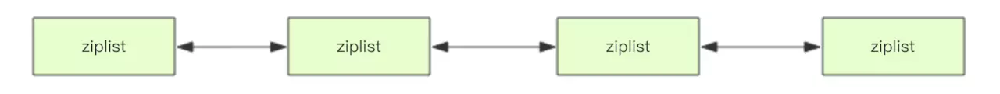
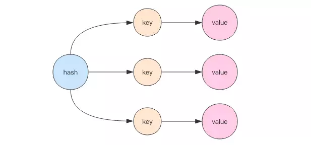
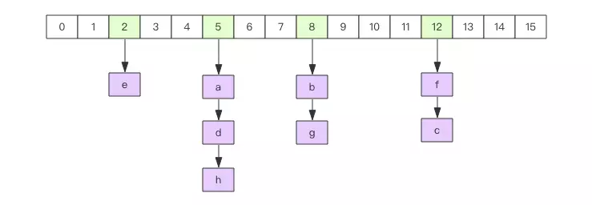
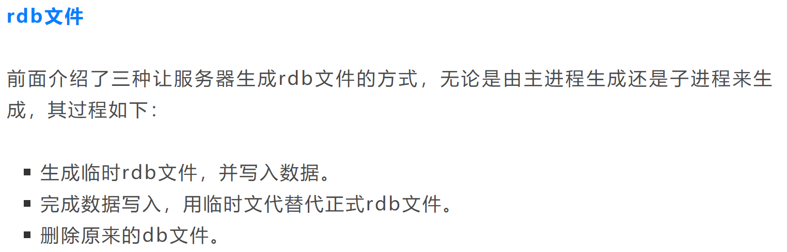
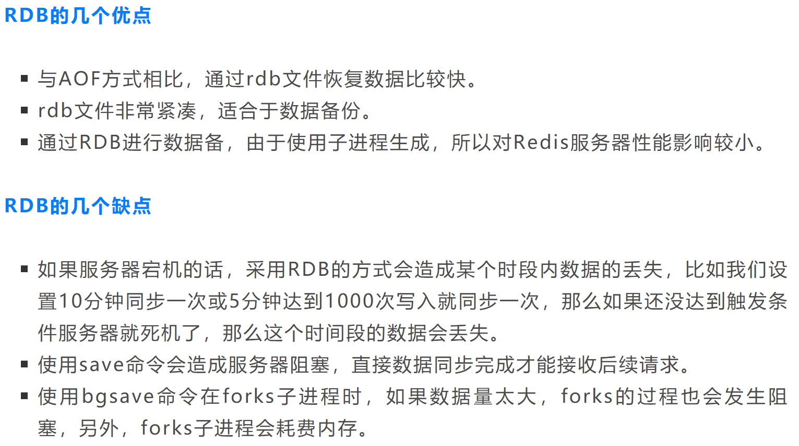
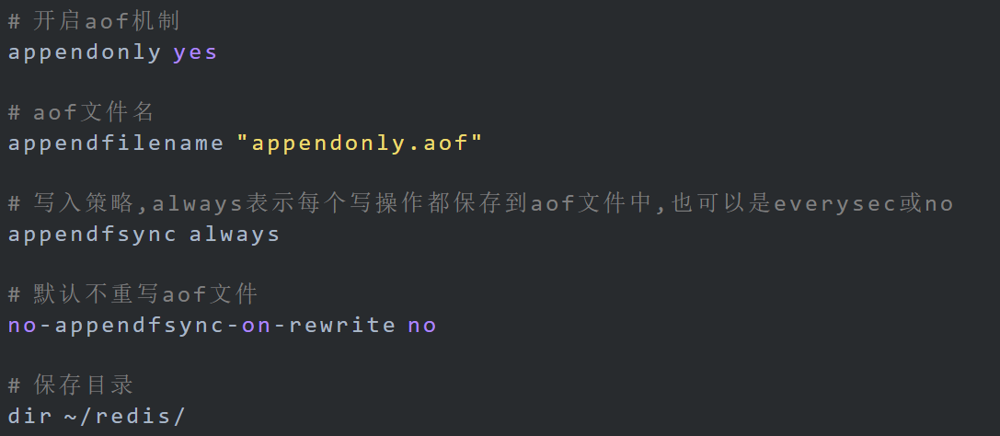
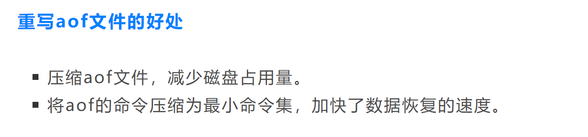
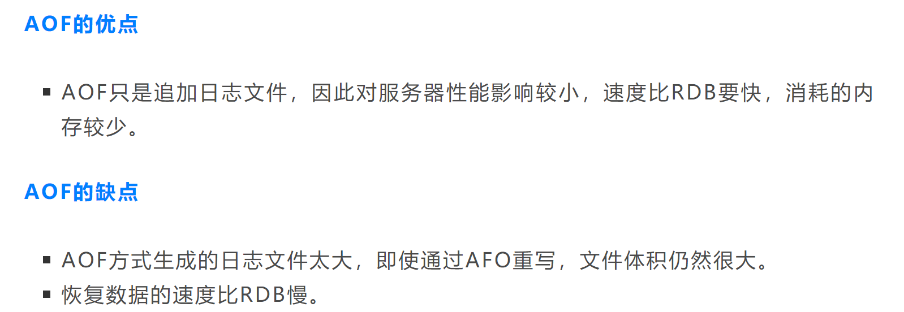
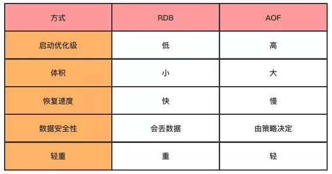

## Redis面试

#### redis数据结构

https://juejin.im/post/5b53ee7e5188251aaa2d2e16

##### **string**

可变的字节数组，是动态字符串，是可以修改的字符串，内部结构实现上类似于Java的ArrayList，采用预分配冗余空间的方式来减少内存的频繁分配。当字符串长度小于1M时，扩容都是加倍现有的空间，如果超过1M，扩容时一次只会多扩1M的空间。需要注意的是字符串最大长度为512M。如果字符串的内容是一个整数，那么还可以将字符串当成计数器来使用。incrby。计数器是有范围的，它不能超过Long.Max，不能低于Long.MIN。

String类型是二进制安全的，可以用来缓存一些静态文件，如图片、视频、css文件等。支持incr操作，可以用作计数器，比如统计网站访问次数等。

##### **list**

列表的存储结构用的是链表而不是数组，而且还是双向链表，随机定位性能较弱，首尾插入删除性能较优。链表元素的位置可以使用负下标。链表可以从表头和表尾追加和移除元素，结合使用rpush/rpop/lpush/lpop四条指令，可以将链表作为队列或堆栈使用，左向右向进行都可以。

在日常应用中，列表常用来作为关注列表、粉丝列表、异步消息队列来使用。

底层存储并不是简单地linkedlist，而是quicklist。首先在列表元素较少的情况下会使用一块**连续的内存**存储，这个结构是**ziplist**，也即是压缩列表。它将所有的元素紧挨着一起存储，分配的是一块连续的内存。当数据量比较多的时候才会改成quicklist。因为普通的链表需要的**附加指针空间太大**，会比较浪费空间。比如这个列表里存的只是int类型的数据，结构上还需要两个额外的指针prev和next。所以Redis将**链表和ziplist结合**起来组成了quicklist。也就是**将多个ziplist使用双向指针串起来**使用。

##### **hash**

和HashMap唯一的区别是数字里存的不是第一个Entry，而是指向第一个entry的指针。扩容对于单线程的redis来说有点吃力，所以Redis采用了渐进式rehash的方案。它会同时保留两个新旧hash结构，在后续的定时任务以及hash结构的读写指令中将旧结构的元素逐渐迁移到新的结构中。这样就可以避免因扩容导致的线程卡顿现象。Redis的hash结构不但有扩容还有缩容，缩容的原理和扩容是一致的。

##### set

内部也使用hash结构，所有的value都指向同一个内部值。用于微博粉丝数，好友共同关注啊这些。

##### zset (sortedset)

可以给每一个元素value赋予一个权重`score`，内部的元素会按照权重score进行排序，可以得到每个元素的名次，还可以通过score的范围来获取元素的列表。zset底层实现使用了两个数据结构，第一个是hash，第二个是跳跃列表，hash的作用就是关联元素value和权重score，保障元素value的唯一性，可以通过元素value找到相应的score值。跳跃列表的目的在于给元素value排序，根据score的范围获取元素列表。

##### bitmap

##### Hyperloglog

##### BloomFilter

##### Geo

#### redis的incr/decr是原子的吗？如何保证？

是原子性的，不光它们是原子性的，Redis所有单个命令的执行都是原子性的，因为Redis是单线程的。当然，在程序中执行多个Redis命令并非是原子性的。

#### Redis持久化机制

[10分钟彻底理解Redis的持久化机制：RDB和AOF](https://mp.weixin.qq.com/s?__biz=MzI4MDYwMDc3MQ==&mid=2247487157&idx=1&sn=9a676a1419e6cb11086d695c47f833d8&chksm=ebb74719dcc0ce0f7dbbd78f66d8576dc87b482a8e28404a8ca5e773b1cac4315fa586e17d6f&scene=0&xtrack=1&key=865e0f1f99f291d1e7e86fc40f6ddc3ec5aef641bcb70245e1e922cbf80d9e12b9e77bf828531ee89e1217f517c3eef2f2b3de12b6c95c18bc7a75ac540a5d85fbce4202c46486e2cb3a0df1ac3680f6&ascene=14&uin=MTE3MTY4MzEyNA%3D%3D&devicetype=Windows+10&version=62060844&lang=zh_CN&pass_ticket=XO2Gb12XOr4CfeqYBWX09BE1wQnsb9R3GKgTi2IlLLEITff9MfY2YH%2FxrvSJn9JY)

##### RDB

RDB是一种快照存储持久化方式，具体就是将Redis某一时刻的内存数据保存到硬盘的文件当中，默认保存的文件名为dump.rdb，Redis服务默认的自动文件备份方式(AOF 没有开启的情况下)，在服务启动时，就会自动从 dump.rdb 文件中去加载数据。

开启：

- 客户端可以通过向Redis服务器发送save（同步）或bgsave（异步）命令让服务器生成rdb文件，或者通过服务器配置文件指定触发RDB条件。

- 当客户端向服务器发送save命令请求进行持久化时，服务器会阻塞save命令之后的其他客户端的请求，直到数据同步完成。如果数据量太大，同步数据会执行很久，而这期间Redis服务器也无法接收其他请求，所以，最好不要在生产环境使用save命令。

- 当客户端发服务发出bgsave命令时，Redis服务器主进程会forks一个子进程来数据同步问题，在将数据保存到rdb文件之后，子进程会退出。但forks子进程是同步的，所以forks子进程时，一样不能接收其他请求，这意味着，如果forks一个子进程花费的时间太久(一般是很快的)，bgsave命令仍然有阻塞其他客户的请求的情况发生。
- 可以在配置文件redis.conf配置

##### AOF

AOF(Append-only file)会记录客户端对服务器的每一次写操作命令，并将这些写操作以Redis协议追加保存到以后缀为aof文件末尾，在Redis服务器重启时，会加载并运行aof文件的命令，以达到恢复数据的目的。

Redis默认不开启AOF持久化方式，我们可以在配置文件中开启并进行更加详细的配置，如下面的redis.conf文件

写入策略有三种：**1. always**：每一步操作都会写入。**2. everysec**：每秒写入一次aof文件。**3. no**：Redis服务器不负责写入aof，而是交由操作系统来处理什么时候写入aof文件。更快，但也是最不安全的选择，不推荐使用。

此外，AOF还有两种重写方式：通过在redis.conf配置文件中的选项no-appendfsync-on-rewrite可以设置是否开启重写，这种方式会在每次fsync时都重写，影响服务器性以，因此默认值为no，不推荐使用。另一种是客户端向服务器发送bgrewriteaof命令，也可以让服务器进行AOF重写。AOF重写方式也是异步操作，即如果要写入aof文件，则Redis主进程会forks一个子进程来处理

RBD VS AOF 

#### Redis是单线程的，为什么性能这么高？

1. 为了保证效率，Redis将数据都缓存在内存中，并周期性的把更新的数据写入磁盘或者把修改操作写入追加的记录文件，在此基础上实现master-slave(主从)同步。注意，开启RDB或AOF持久化是很影响性能的。
2. 数据结构简单，对数据操作也简单，Redis中的数据结构是专门进行设计的。
3. 单线程避免了不必要的上下文切换和竞争条件，也不存在多进程或者多线程导致的切换而消耗 CPU，不用去考虑各种锁的问题，不存在加锁释放锁操作，没有因为可能出现死锁而导致的性能消耗
4. 与外界网络通信使用的是使用多路I/O复用模型

#### Redis事务支持ACID吗

https://cloud.tencent.com/developer/article/1121741

Redis也有一个“事务”的概念，大致含义是：Redis将`MULTI`指令和`EXEC`指令之间的多个指令视作一个事务；一旦Redis看到了`EXEC`就开始执行这一组指令，并保证执行过程中不被打断——除非Redis本身或者所在机器crash掉。如果发生了，就**可能出现只有部分指令被执行**的情况。所以，**Redis事务与ACID事务是完全不同的**。

从根本上说，Redis的事务只做到了Isolation。虽然可以靠持久化机制持久化这一过程中的数据，但这种持久化只在单机情况下有效。多机情况下，Redis是没有一个机制能够将数据修改**同步**sync到其他节点的。在这种限制下，在Redis中实现业务逻辑差不多就只有两种可能：

- 不在意ACID事务——数据丢了没事，改错了也没大关系——>比如缓存，数据丢了没事，从数据库里重新加载就行了
- 基于Redis的接口实现自己的ACID，或者ACID的某种子集——>仔细考虑一下有没有必要

#### Redis可以拿来做消息队列吗

https://cloud.tencent.com/developer/article/1121741

Redis实现了一个List的数据结构。借助它，可以实现出队，入队的功能。实际上很多人早就熟练使用Redis做队列。比如[Sidekiq](https://link.jianshu.com/?t=https%3A%2F%2Fgithub.com%2Fmperham%2Fsidekiq)就是使用Redis作为异步job队列的存储。但是归根到底缓存和队列都是暂时性的数据存储，很多工具都可以做，用不用redis还是得看对这个队列的具体性能要求，如果是可以容忍短时间不可服务，或者数据出错，只需要快，那是可以做的。如果要求准确性一致性，那就得慎重考虑。比如业务事件队列，绝对不能用Redis

#### Redis适合做什么

https://cloud.tencent.com/developer/article/1121741，

- 共享Cache ，不怕丢数据，丢了可以从DB中reload；
- 共享Session ，不怕丢数据，丢了可以重新登录；
- batch job的中间结果。不怕丢数据，丢了重新跑job就可以了；
- 一些简单数据的存储，低频改动，但是会被频繁读取。比如首页推荐的产品列表。但此时必须增加HA的防护，sentinel、cluster或者自定义的机制都可以；
- 一些更加复杂存储的building block，比如分布式锁，此时需要多节点来实现一个简单的quorum

#### 缓存穿透

#### 缓存击穿

#### 缓存雪崩