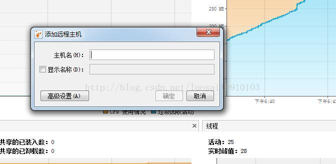

## JVM监控

 **jps**主要用来输出JVM中运行的进程状态信息。jps [-q/m/l/v] [hostid].

```
-q 不输出类名、Jar名和传入main方法的参数
-m 输出传入main方法的参数
-l 输出main类或Jar的全限名
-v 输出传入JVM的参数
```

 **jstack**主要用来查看某个Java进程内的线程堆栈信息。语法格式如下：

```
jstack [option] pid
jstack [option] executable core
jstack [option] [server-id@]remote-hostname-or-ip
```

- -F当’jstack [-l] pid’没有相应的时候强制打印栈信息,如果直接jstack无响应时，用于强制jstack），一般情况不需要使用
- -l长列表. 打印关于锁的附加信息,例如属于java.util.concurrent的ownable synchronizers列表，会使得JVM停顿得长久得多（可能会差很多倍，比如普通的jstack可能几毫秒和一次GC没区别，加了-l 就是近一秒的时间），-l 建议不要用。一般情况不需要使用
- -m打印java和native c/c++框架的所有栈信息.可以打印JVM的堆栈,显示上Native的栈帧，一般应用排查不需要使用
- -h | -help打印帮助信息
- pid 需要被打印配置信息的java进程id,可以用jps查询

 **jmap**（Memory Map）和**jhat**（Java Heap Analysis Tool）

 jmap用来查看堆内存使用状况，一般结合jhat使用。

```
jmap [option] pid
jmap [option] executable core
jmap [option] [server-id@]remote-hostname-or-ip
```

使用jmap -heap pid查看进程堆内存使用情况，包括使用的GC算法、堆配置参数和各代中堆内存使用情况。

使用jmap -histo[:live] pid查看堆内存中的对象数目、大小统计直方图，如果带上live则只统计活对象.

还有一个很常用的情况是：用jmap把进程内存使用情况dump到文件中，再用jhat分析查看。jmap进行dump命令格式如下：

```
jmap -dump:format=b,file=dumpFileName pid
```

   dump出来的文件可以用MAT、VisualVM等工具查看，这里用jhat查看：

```
jhat -port 9998 dumpFileName
```

在浏览器中输入ip和刚刚的端口9998，就可以查看jmap dump出的信息了。注意如果Dump文件太大，可能需要加上-J-Xmx512m这种参数指定最大堆内存，即jhat -J-Xmx512m -port 9998 /tmp/dump.dat。

**jstat** ，JVM统计监测工具，语法格式如下：

```
jstat [ generalOption|outputOptions vmid [interval[s|ms] [count]] ]
```

vmid是Java虚拟机ID，在Linux/Unix系统上一般就是进程ID。interval是采样时间间隔。count是采样数目。比如下面输出的是GC信息，采样时间间隔为250ms，采样数为4：

```
jstat -gc 21711 250 4
```

> S0C、S1C、S0U、S1U：Survivor 0/1区容量（Capacity）和使用量（Used）
> EC、EU：Eden区容量和使用量
> OC、OU：年老代容量和使用量
> PC、PU：永久代容量和使用量
> YGC、YGT：年轻代GC次数和GC耗时
> FGC、FGCT：Full GC次数和Full GC耗时
> GCT：GC总耗时

**hprof**能够展现CPU使用率，统计堆内存使用情况。

```shell
java -agentlib:hprof[=options] ToBeProfiledClass
java -Xrunprof[:options] ToBeProfiledClass
javac -J-agentlib:hprof[=options] ToBeProfiledClass
```

​    完整的命令选项如下：

```shell
Option Name and Value  Description                    Default
---------------------  -----------                    -------
heap=dump|sites|all    heap profiling                 all
cpu=samples|times|old  CPU usage                      off
monitor=y|n            monitor contention             n
format=a|b             text(txt) or binary output     a
file=<file>            write data to file             java.hprof[.txt]
net=<host>:<port>      send data over a socket        off
depth=<size>           stack trace depth              4
interval=<ms>          sample interval in ms          10
cutoff=<value>         output cutoff point            0.0001
lineno=y|n             line number in traces?         y
thread=y|n             thread in traces?              n
doe=y|n                dump on exit?                  y
msa=y|n                Solaris micro state accounting n
force=y|n              force output to <file>         y
verbose=y|n            print messages about dumps     y
```

举例：

```shell
java -agentlib:hprof=cpu=samples,interval=20,depth=3 Hello
```

每隔20毫秒采样CPU消耗信息，堆栈深度为3，生成的profile文件名称是java.hprof.txt，在当前目录。

```shell
javac -J-agentlib:hprof=heap=dump Hello.java
```

虽然在JVM启动参数中加入-Xrunprof:heap=sites参数可以生成CPU/Heap Profile文件，但对JVM性能影响非常大，不建议在线上服务器环境使用。

> [HPROF: 一个Heap/CPU Profiling工具](https://www.cnblogs.com/linhaohong/archive/2012/07/12/2588657.html)
>
> [JVM调优监控工具](https://my.oschina.net/feichexia/blog/196575)

**jconsole**监控java 程序 增加启动参数 

```shell
java  \
-Djava.rmi.server.hostname=主机ip \
-Dcom.sun.management.jmxremote \
-Dcom.sun.management.jmxremote.port=端口号 \
-Dcom.sun.management.jmxremote.authenticate=false \
-Dcom.sun.management.jmxremote.ssl=false \
-jar /root/app/data-test-0.0.1-SNAPSHOT.jar --spring.profiles.active=dev  >nohup 2>&1 &
```

由于启动参数过长，我们可以定义系统环境变量来表示 在/etc/profile 最后一行增加 

```shell
export JAVA_OPTS='-Djava.rmi.server.hostname=本机ip -Dcom.sun.management.jmxremote -Dcom.sun.management.jmxremote.port=端口 -Dcom.sun.management.jmxremote.authenticate=false -Dcom.sun.management.jmxremote.ssl=false'
```

然后 source /etc/profile 使文件生效。启动时我们就可以用  nohup java $JAVA_OPTS -jar /root/app/data-center-0.0.1-SNAPSHOT.jar --spring.profiles.active=dev  >nohup 2>&1 & 这个脚本。 然后可以在别的主机打开jvisualvm后，使用jmx连接时，类似。



jconsole可以以三种方式连接正在运行的JVM：

- **Local：**使用JConsole连接一个正在本地系统运行的JVM，并且执行程序的和运行JConsole的需要是同一个用户。JConsole使用文件系统的授权通过RMI连接器连接到平台的MBean服务器上。这种从本地连接的监控能力只有Sun的JDK具有
- **Remote：**使用下面的URL通过RMI连接器连接到一个JMX代理：*<u>service:jmx:rmi:///jndi/rmi://hostName:portNum/jmxrmi</u>*

- **Advanced:**使用一个特殊的URL连接JMX代理。一般情况使用自己定制的连接器而不是RMI提供的连接器来连接JMX代理，或者是一个使用JDK1.4的实现了JMX和JMX Rmote的应用。