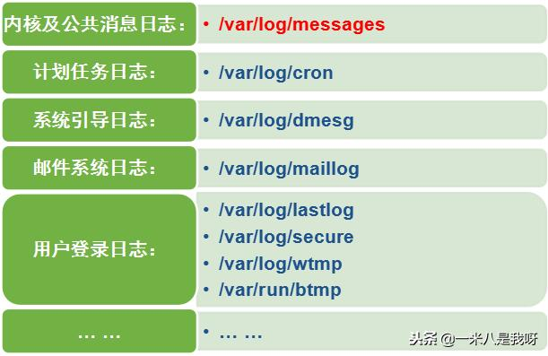

# Linux命令记录

**cat  vim less more tail head ps grep awk sek**

cat -n file 显示行号




**1) 查询当前登录的用户情况——users、who、w**

**2) 查询用户登录的历史记录——last、lastb**


[Linux查看系统进程信息命令总结 （ps/top/pstree）](https://blog.csdn.net/longerzone/article/details/8015941)

**静态查看进程 ps**

ps命令格式：   

    ps -aux     查看系统所有进程
    ps -lA      查看所有系统的数据
    ps axjf     连通部分进程树状态
    
     -A：与-e意思一样，表列出所有进程
    
     -a ：不与terminal有关的进程
    
     -u：有效用户相关的进程
    
      x：通常与a这个参数一起用，可以列出完整信息

输出格式：  l：较仔细列出该pid信息

                   j：工作格式
    
                  -f：做一个更为完整的输出

**top命令格式**

 top [-d | -bnp] 
-d：表示界面刷新时间，单位秒，默认是5秒 
-b：以批次的方式进行top，还有更多的参数可以使用 
    通常会搭配数据重定向来讲批处理的结果输出成为文件 
-n：与-b搭配，意思是需要进行几次top的输出结果 
-p：查看直接进程，后面接进程号 
  ?：显示在top当中可以输入的按键命令 
  P：以cpu使用率来排名 
  M：以内存的使用率来排名 
  N：以PID来排名 
  T：以进程使用CPU时间累加排名 
  k：给予某个PID一个信号 
  r：给予某个PID重新制定一个nice值  q：离开

**pstree [-A|U] [-up] **
-A：各进程间连接用ASCII字符连接 
-U：该进程之间连接用utf8字符连接 
-p：同时显示PID 
-u：同时列出每个进程的所属账号名称 


跟踪进程栈 pstack pid

lsof（list open files）是一个查看当前系统文件的工具。lsof -i:xxxxx(端口号) 查看占用端口号占用情况

ipcs是Linux下显示进程间通信设施状态的工具。可以显示消息队列、共享内存和信号量的信息。

free工具用来查看系统可用内存

xargs 是给命令传递参数的一个过滤器，也是组合多个命令的一个工具。

vmstat 监视内存使用情况vmstat 监视内存使用情况。

vmstat [-V] [-n] [delay [count]]

> - -V表示打印出版本信息；
> - -n表示在周期性循环输出时，输出的头部信息仅显示一次；
> - delay是两次输出之间的延迟时间；
> - count是指按照这个时间间隔统计的次数。

iostat 监视IO，方便查看CPU、网卡、tty设备、磁盘、CD-ROM 等等设备的活动情况, 负载信息。

iostat 参数 时间 次数

> - -C 显示CPU使用情况
> - -d 显示磁盘使用情况
> - -k 以 KB 为单位显示
> - -m 以 M 为单位显示
> - -N 显示磁盘阵列(LVM) 信息
> - -n 显示NFS 使用情况
> - -p[磁盘] 显示磁盘和分区的情况
> - -t 显示终端和CPU的信息
> - -x 显示详细信息
> - -V 显示版本信息

sar是System Activity Reporter（系统活动情况报告）的缩写。最全的性能分析工具


grep查找 sek替换 awk数据流处理


查看磁盘空间利用大小:

```
df -h
```

查看当前目录所占空间大小:

```
du -sh
```

查询正在运行的进程信息

```
$ps -ef
```

查询进程ID（适合只记得部分进程字段）

```
$pgrep 查找进程
```

使用命令pmap，来输出进程内存的状况，可以用来分析线程堆栈；$pmap PID

列出所有端口 (包括监听和未监听的):

netstat -a

列出所有 tcp 端口:

```
netstat -at
```

列出所有有监听的服务状态:

```
netstat -l
```

查看历史命令 history

更改用户权限

```
$chmod userMark(+|-)PermissionsMark
```

userMark取值：

> - u：用户
> - g：组
> - o：其它用户
> - a：所有用户

PermissionsMark取值：

> - r:读
> - w：写
> - x：执行

数字方式直接设置所有权限，相比字母方式，更加简洁方便；

使用三位八进制数字的形式来表示权限，第一位指定属主的权限，第二位指定组权限，第三位指定其他用户的权限，每位通过4(读)、2(写)、1(执行)三种数值的和来确定权限。如6(4+2)代表有读写权，7(4+2+1)有读、写和执行的权限。

例如:

```
$chmod 740 main     将main的用户权限设置为rwxr-----
```

更改文件或目录的拥有者

```
$chown username dirOrFile
```

使用-R选项递归更改该目下所有文件的拥有者:

```
$chown -R weber server/
```

bashrc与profile都用于保存用户的环境信息，bashrc用于交互式non-loginshell，而profile用于交互式login shell。

/etc/profile，/etc/bashrc 是系统全局环境变量设定; ~/.profile，~/.bashrc用户目录下的私有环境变量设定

