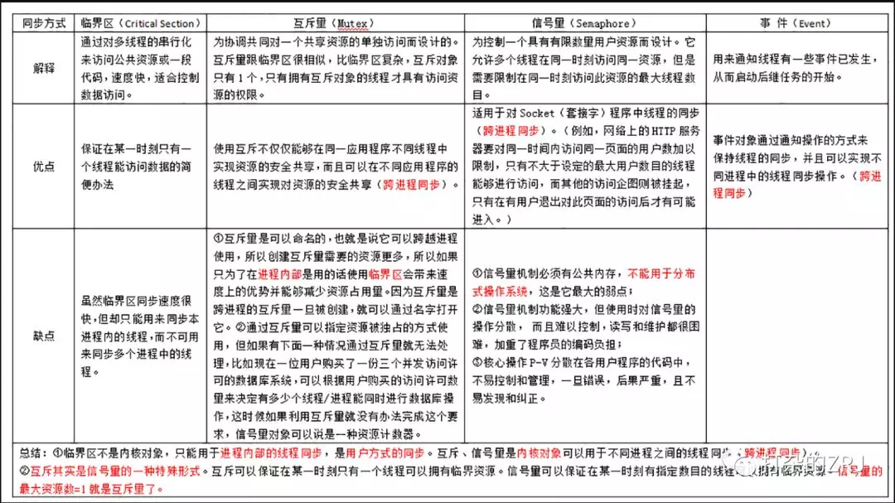

## OS面试题资料

**操作系统的四个特性**。并发，共享，异步，虚拟。

**进程的有哪几种状态**，状态转换图，及导致转换的事件。创建 就绪 运行 阻塞 退出

**进程与线程的区别 **

> 进程是资源（CPU、内存等）分配的基本单位，进程有自己的独立地址空间，每启动一个进程，系统就会为它分配地址空间，建立数据表来维护代码段、堆栈段和数据段，这种操作非常昂贵。它是程序执行时的一个实例，程序运行时系统就会创建一个进程，并为它分配资源，然后把该进程放入进程就绪队列，进程调度器选中它的时候就会为它分配CPU时间，程序开始真正运行。
>
> 线程是程序执行时的最小单位，它是进程的一个执行流，是CPU调度和分派的基本单位，一个进程可以由很多个线程组成，线程间共享进程的所有资源，每个线程有自己的堆栈和局部变量。线程由CPU独立调度执行，在多CPU环境下就允许多个线程同时运行。同样多线程也可以实现并发操作，每个请求分配一个线程来处理。
>
> 线程之间的通信更方便，同一进程下的线程共享全局变量、静态变量等数据，而进程之间的通信需要以通信的方式（IPC)进行。不过如何处理好同步与互斥是编写多线程程序的难点。
>
> 但是多进程程序更健壮，多线程程序只要有一个线程死掉，整个进程也死掉了，而一个进程死掉并不会对另外一个进程造成影响，因为进程有自己独立的地址空间。

**进程通信的几种方式**  https://www.jianshu.com/p/c1015f5ffa74

> 管道/匿名管道(pipe)，实质是一个内核缓冲区，进程以先进先出的方式从缓冲区存取数据，单向、亲缘间的、缓冲区有限。
>
> 有名管道以有名管道的文件形式存在于文件系统中，不存在亲缘关系的进程，只要可以访问该路径，就能够彼此通过有名管道相互通信。
>
> 信号。Linux系统中用于进程间互相通信或者操作的一种机制，信号可以在任何时候发给某一进程，而无需知道该进程的状态。
>
> 消息队列。存放在内核中的消息链表，每个消息队列由消息队列标识符表示。
>
> 共享内存。多个进程可以可以直接读写同一块内存空间，是最快的可用IPC形式。是针对其他通信机制运行效率较低而设计的。
>
> 信号量。一个计数器，用于多进程对共享数据的访问，信号量的意图在于进程间同步。
>
> 套接字。

**进程间同步如何保证？**

> 

**死锁的概念，导致死锁的原因 **多个线程因竞争资源而互相等待自己获取资源，若无外力作用，这些进程都将无法向前推进。原因：资源有限不够用或线程执行顺序不合理。

**死锁的四个必要条件**

> 互斥、不可抢占、请求和保持、循环等待。
>
> 处理死锁的四个方式：预防、破坏死锁的四个条件中的一个或几个。
>
> 避免、银行家算法：如果新开一个线程或者给某线程增配资源可能导致死锁，则拒绝。
>
> 检测、通过资源分配图来检测
>
> 解除、资源剥夺或者中止线程。

**进程调度算法**：https://zhuanlan.zhihu.com/p/61054099

> 先来先服务调度算法（FCFS）就是FIFO
>
> 短作业优先调度算法（SJF） 从后备队列中选择一个或若干个估计运行时间最短的作业
>
> 最短剩余时间优先（SRTN）
>
> 最高响应比优先算法 highest response ratio first (HSRF) 到这儿是批处理系统
>
> 下面是交互式系统：时间片轮转、优先级调度、多级反馈队列

**内存连续分配方式** [内存那点事儿](https://zhuanlan.zhihu.com/p/35147253)   [Linux进程如何使用内存](https://zhuanlan.zhihu.com/p/56930505)   [计算机虚拟内存](https://zhuanlan.zhihu.com/p/61238591)

**页式管理、段式管理、段页式管理、优缺点**

**几种页面置换算法** http://c.biancheng.net/view/1277.html OPT/FIFO/LRU/Clock/LFU

> OPT指不远的将来不使用的页面移出去，纯理想化。FIFO先进先出、LRU最近最久未使用的移除、LFU是最近最少使用被移除，

**虚拟内存**

> 虚拟内存为每个进程提供了一个一致的、私有的地址空间，它让每个进程产生了一种自己在独享主存的错觉（让每个进程以为自己拥有一片连续完整的内存空间）。也就是一个进程使用了内存中一小部分离散的页框、使用了硬盘中离散的页框，通过段页式管理，以为自己独享内存一片连续的逻辑地址。**实现方式**：进程分段、再分页、内存中页表、MMU查询页表进程逻辑地址与物理地址转换、为了提高速度，MMU中有缓存的TLB。