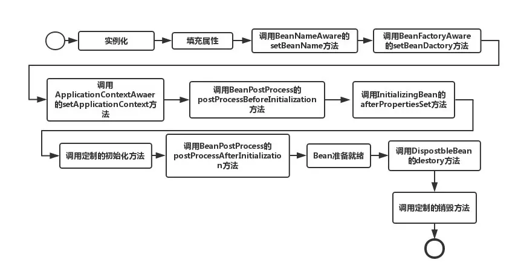

### Spring面试题

[15个经典的Spring面试常见问题](https://zhuanlan.zhihu.com/p/68191247)

> 1. **什么是Spring框架?** 
>
> 一个开源的web框架，核心框架提供了ioc、aop、orm、dao和事务管理功能
>
> 2. **Spring都有哪些注解？**
>
> **组件注解**：@Component 表示一个普通的spring Bean类 |  @Repository 标注一个DAO组件类 | @Service：标注一个业务逻辑组件类 | @Controller：标注一个控制器组件类。实质上他们属于同一类注解，用法相同，功能相同，区别在于标识组件的类型。@Component可以代替@Repository、@Service、@Controller，因为这三个注解是被@Component标注的。@Component需要在xml中配置
>
> ```xml
> <!-- 自动扫描指定包及其子包下的所有Bean类 -->
> <context:component-scan base-package="org.springframework.*"/>
> ```
>
> **装配bean的注解**：@Autowired (属于Spring)、@Resource(属于java.annotation)、 @PostConstruct 和 @PreDestroy 方法 实现初始化之后和销毁bean之前进行的操作。比较：@Resource的作用相当于@Autowired，均可标注在字段或属性的setter方法上。
>
> 但@Autowired默认按照类型装配，如果容器中包含多个同一类型的Bean，那么启动容器时会报 找不到指定类型bean 的异常，解决办法是结合**@Qualifier**注解进行限定，指定注入的bean名称。
>
> @Resource默认按名称装配，如果没有指定name属性，并且按照默认的名称仍然找不到依赖对象时，则按类型装配。
>
> **@Component vs @Configuration and @Bean**
>
>     > Spring帮助我们管理Bean分为两个部分，一个是注册Bean，一个装配Bean。有三种完成方式：自动装配、JavaConfig方式(就是注解)、再就是XML配置。在自动配置的方式中，使用@Component告诉Spring，我是一个bean，你要来管理我，然后使用@AutoWired注解去装配Bean(所谓装配，就是管理对象直接的协作关系)。然后在JavaConfig中，@Configuration其实就是告诉spring，spring容器要怎么配置（怎么去注册bean，怎么去处理bean之间的关系）。@Bean的意思就是，我要获取这个bean的时候，你spring要按照这种方式去帮我获取到这个bean。到了使用xml的方式，也是如此。<bean>标签就是告诉spring怎么获取这个bean，各种<ref>就是手动的配置bean之间的关系。
>
> @Bean注解主要用于方法上，有点类似于工厂方法，当使用了@Bean注解，我们可以连续使用多种定义bean时用到的注解，譬如用@Qualifier注解定义工厂方法的名称，用@Scope注解定义该bean的作用域范围，譬如是singleton还是prototype等。
>
> Spring 中新的 Java 配置支持的核心就是@Configuration 注解的类。这些类主要包括 @Bean 注解的方法来为 Spring 的 IoC 容器管理的对象定义实例，配置和初始化逻辑。使用@Configuration 来注解类表示类可以被 Spring 的 IoC 容器所使用，作为 bean 定义的资源。
>
> 简单说：一个@Component需要注入某@Configuration中的@Bean工厂方法产生的实例
>
> **事务注解**：在处理dao层或service层的事务操作时，譬如删除失败时的回滚操作。使用**@Transactional** 作为注解，但是需要在配置文件激活
>
> ```XML
> <!-- 开启注解方式声明事务 -->
> <tx:annotation-driven transaction-manager="transactionManager" />
> ```
>
> 3. **列举一些重要的Spring模块？**spring core、spring aop 、spring dao、spring orm、spring mvc
>
> 4. **spring有哪些注入方式**
>
>  接口注入、字段注入、setter注入、构造方法注入、注解注入、静态工厂注入、实例工厂等
>
> 5. **Spring AOP的原理**
>
>  
>
>  有些操作需要跨越多个层次，为了避免重复代码，更好地将系统级别的代码抽离出来，去掉与不同层次对象的耦合，就产生了面向AOP。
>
>  pointcut即在哪个地方进行切入,它可以指定某一个点，也可以指定多个点，比如类A的methord函数，也可以利用正则表达式指定某一些类的某一些方法。Advice就是在切入点干什么，比如打日志，执行缓存、异常处理什么的。pointcut+advice就是aspect。但到这一地步并不是完整的，因为还不知道如何将切面植入到代码中，解决此问题的技术就是动态代理(JDK & CGLIB)。PointCut 依赖了ClassFilter和MethodMatcher,ClassFilter用来指定特定的类，MethodMatcher 指定特定的函数，正是由于PointCut仅有的两个依赖，它只能实现函数级别的AOP。对于属性、for语句等是无法实现该切点的。
>
> 6. **Spring AOP 和 AspectJ AOP 有什么区别？**
>     - Spring AOP采用动态代理的方式，在运行期生成代理类来实现AOP，不修改原类的实现(运行时增强)；Aspectj 使用编译期字节码织入(weave)的方式，在编译的时候，直接修改类的字节码，把所定义的切面代码逻辑插入到目标类中(编译增强)。
>     - Spring AOP可以对其它模块正常编译出的代码起作用，Aspectj 需要对其它模块使用acj重新编译
>     - 由于动态代理机制，Spring AOP对于直接调用类内部的其它方法无效，无法对定义为final的类生效。Aspectj没有这些限制
>     - Spring AOP使用XML配置文件的方式定义切入点(PointCut)，Aspectj使用注解方式
>
> 7. **Spring 中的bean的作用域有哪些?** 
>
> singleton：无状态或者状态不可变的类适合使用单例模式来实现
>
> prototype:每次从容器中调用 Bean 时，都会返回一个新的实例，即相当于执行 new Bean()
>
> (request、session、global-session，只在web-aware Spring ApplicationContext的上下文中有效)
>
> request：每次 http 请求都会创建一个新的 Bean 
>
> session：同一个 http Session 共享一个 Bean，不同的 http Session 使用不同的 Bean
>
> globalSession：同一个全局 Session 共享一个 bean, 用于 Porlet
>
> 8. **Spring 中的bean生命周期?**
>
>     Spring 只帮我们管理单例模式 Bean 的**完整**生命周期，对于 prototype 的 bean ，Spring 在创建好交给使用者之后则不会再管理后续的生命周期。`*Aware` 接口可以用于在初始化 bean 时获得 Spring 中的一些对象，如获取 `Spring 上下文`等。实例化、填充属性、调用一堆*Aware的set方法、初始化然后bean就绪、然后调用destroy销毁。
>
>     
>
> 9. **Spring IoC的过程**
>
>     
>
> 10. **Spring 中的单例 bean 的线程安全问题了解吗？**
>
> 线程安全这个问题，要从单例与原型Bean分别进行说明。对于原型Bean,每次创建一个新对象，也就是线程之间并不存在Bean共享，自然是不会有线程安全的问题。对于单例Bean,所有线程都共享一个单例实例Bean,因此是存在资源的竞争。如果单例Bean,是一个无状态Bean，也就是线程中的操作不会对Bean的成员执行查询以外的操作，那么这个单例Bean是线程安全的。比如Spring mvc 的 Controller、Service、Dao等，这些Bean大多是无状态的，只关注于方法本身。对于有状态的bean，Spring官方提供的bean，一般提供了通过**ThreadLocal**去解决线程安全的方法，比如RequestContextHolder、TransactionSynchronizationManager、LocaleContextHolder等。
>
> 10. **说说自己对于Spring MVC了解?**
>
> SpringMvc是基于过滤器对servlet进行了封装的一个框架，SpringMvc工作时主要是通过DispatcherServlet管理接收到的请求并进行处理
>
> 11. **Spring 框架中用到了哪些设计模式？**
>
>     使用工厂模式可以通过 `BeanFactory` 或 `ApplicationContext` 创建 bean 对象；(BeanFactory延迟注入，ApplicationContext一次性实例化所有bean)
>
>     某些对象比如线程池、缓存、注册表等只能有一个实例，所以也有单例模式。(为啥spring默认单例：因为减少了新创建对象的消耗、减少gc压力、可以快速从缓存获取到bean。缺点：容易出现线程不安全的问题，因此最好只在spring中创建**无状态**的bean，如果必须有状态，就使用**ThreadLocal**把变量变为**线程私有**的，如果bean的实例变量或类变量需要在多个线程之间共享，那么就只能使用**synchronized**、**lock**、**CAS**等这些实现线程同步的方法了)
>
>     动态代理：AOP的实现过程中就用到了
>
>     模板方法：jdbcTemplate
>
>     适配器模式：将一个接口转换成客户希望的另一个接口，适配器模式使接口不兼容的那些类可以一起工作。Spring AOP 的增强或通知(Advice)使用到了适配器模式，与之相关的接口是`AdvisorAdapter`，Advice 常用的类型有BeforeAdvice、AfterAdvice、AfterReturningAdvice。每个类型Advice（通知）都有对应的拦截器MethodBeforeAdviceInterceptor等。Spring预定义的通知要通过对应的适配器，适配成 `MethodInterceptor`接口(方法拦截器)类型的对象
>
>     装饰者模式
>
> 12. **将一个类声明为Spring的 bean 的注解有哪些?**
>
> @Component、@Controller、@Service、@Repository、@Bean、@Autowired、@Qualifier、@Resource
>
> 13. **Spring管理事务的方式有几种？**两种：编码式、声明式事务管理方式，基于AOP技术实现的，实质就是：在方法执行前后进行拦截，然后在目标方法开始之前创建并加入事务，执行完目标方法后根据执行情况提交或回滚事务。声明式事务管理又有两种方式：基于XML配置文件的方式；另一个是在业务方法上进行@Transactional注解，将事务规则应用到业务逻辑中。
>
> Spring事务管理接口：PlatformTransactionManager（平台）事务管理器、TransactionDefinition 事务定义信息(事务隔离级别、传播行为、超时、只读、回滚规则)、TransactionStatus 事务运行状态
>
> Spring并不直接管理事务，而是提供了多种事务管理器 ，他们将事务管理的职责委托给Hibernate或者JTA等持久化机制所提供的相关平台框架的事务来实现。MaBatis：DataSourceTransactionManager
>
> 14. **Spring事务中的隔离级别有哪几种?** https://juejin.im/post/5b00c52ef265da0b95276091
>
> TransactionDefinition 接口中定义了五个表示隔离级别的常量：
>
> TransactionDefinition.ISOLATION_DEFAULT 使用后端数据库默认的隔离级别，MySQL RR Oracle RC
>
> TransactionDefinition.ISOLATION_READ_UNCOMMITTED **脏读、幻读、不可重复读**
>
> TransactionDefinition.ISOLATION_READ_COMMITTED **幻读、不可重复读**
>
> TransactionDefinition.ISOLATION_REPEATABLE_READ **幻读**
>
> TransactionDefinition.ISOLATION_SERIALIZABLE 性能差
>
> 15. **Spring事务中哪几种事务传播行为?** https://juejin.im/post/5b00c52ef265da0b95276091
>
> 当事务方法被另一个事务方法调用时，必须指定事务应该如何传播
>
> 16. **SpringMVC工作具体流程**
>
>     首先是用户发送请求——请求就发送到了DispatcherServlet也就是前端控制器，这个东西是一个Servlet的实现——DispatcherServlet过滤后URL后，进入到了HandleMapping也就是映射处理器——根据URL来匹配我们的控制器Handler (被@Controller注解)——那么此时还需要HandlerAdapter（处理器适配器）来，作用就是要按照HandlerAdapter要求的规则 去执行Handler——经过适配器调用控制器的方法后，就会想前端控制器返回一个ModelView，包含我们需要信息的pojo对象和视图信息——前端控制器DispatcherServlet开始解析视图信息，通过视图解析器（View Resolver），进行视图解析，根据逻辑视图名解析成真正的视图（view）——解析完视图信息后，就把modelview中的model信息传递到我们的view界面上
>
> 17. **SpringMVC都有哪些注解**
>
>     @Controller、@RequestMapping、@ModelAttribute和 @SessionAttributes、@ResponseBody、@Resource和@Autowired、@Component、@Repository

[49个Spring经典面试题总结，附带答案! (一)](https://zhuanlan.zhihu.com/p/62905881)     [49个Spring经典面试题总结，附带答案! (二)](https://zhuanlan.zhihu.com/p/62906906)

> 1. 不同版本的 Spring Framework 有哪些主要功能？
>
> 2. 什么是 Spring Framework？
>
> 3. 列举 Spring Framework 的优点。
>
> 4. Spring Framework 有哪些不同的功能？
>
> 5. Spring Framework 中有多少个模块，它们分别是什么？
> 6. 什么是 Spring 配置文件？
> 7. Spring 应用程序有哪些不同组件？
> 8. 使用 Spring 有哪些方式？
> 9. 什么是 Spring IOC 容器？
> 10. 什么是依赖注入？	
> 11. 可以通过多少种方式完成依赖注入？
> 12. 区分构造函数注入和 setter 注入。
> 13. Spring 中有多少种 IOC 容器？
> 14. 区分 BeanFactory 和 ApplicationContext。
> 15. 列举 IoC 的一些好处。
> 16. Spring IoC 的实现机制。
> 17. 什么是 Spring bean？
> 18. Spring 提供了哪些配置方式？
> 19. Spring 支持集中 bean scope？
> 20. Spring bean 容器的生命周期是什么样的？
> 21. 什么是 Spring 的内部 bean？
> 22. 什么是 Spring 装配？
> 23. 自动装配有哪些方式？
> 24. 自动装配有什么局限？
> 25. 你用过哪些重要的 Spring 注解？
> 26. 如何在 Spring 中启动注解装配？
> 27. @Component, @Controller, @Repository, @Service 有何区别？
> 28. @Required 注解有什么用？
> 29. @Autowired 注解有什么用？
> 30. @Qualifier 注解有什么用？
> 31. @RequestMapping 注解有什么用？


**基础篇**

**Spring 概 述**

1. 什 么 是 spring?
2. 使 用 Spring 框 架 的 好 处 是 什 么 ？
3. Spring 由 哪 些 模 块 组 成?
4. 核 心 容 器 （ 应 用 上 下 文) 模 块 。
5. BeanFactory – BeanFactory 实 现 举 例 。
6. XMLBeanFactory
7. 解 释 AOP 模 块
8. 解 释 JDBC 抽 象 和 DAO 模 块 。
9. 解 释 对 象/关 系 映 射 集 成 模 块 。
10. 解 释 WEB 模 块 。
11. Spring 配 置 文 件
12. 什 么 是 Spring IOC 容 器 ？
13. IOC 的 优 点 是 什 么 ？
14. ApplicationContext 通 常 的 实 现 是 什 么?
15. Bean 工 厂 和 Application contexts 有 什 么 区别 ？
16. 一 个 Spring 的 应 用 看 起 来 象 什 么 ？
17. 什 么 是 Spring 的 依 赖 注 入 ？
18. 有 哪 些 不 同 类 型 的 IOC（ 依 赖 注 入 ） 方 式 ？
19. 哪 种 依 赖 注 入 方 式 你 建 议 使 用 ， 构 造 器 注 入 ， 还 是Setter 方 法 注入

**Spring Beans**

1. 什么是spring beans
2. 一 个 Spring Bean 定 义 包 含 什 么 ？
3. 如 何 给 Spring 容 器 提 供 配 置 元 数 据?
4. 你 怎 样 定 义 类 的 作 用 域?
5. 解 释 Spring 支 持 的 几 种 bean 的 作 用 域 。
6. Spring 框 架 中 的 单 例 bean 是 线 程 安 全 的 吗?
7. 解 释 Spring 框 架 中 bean 的 生 命 周 期 。
8. 哪 些 是 重 要 的 bean 生 命 周 期 方 法 ？ 你 能 重 载 它 们吗 ？
9. 什 么 是 Spring 的 内 部 bean？
10. 在 Spring 中 如 何 注 入 一 个 java 集 合 ？

**String 类 型 。**

1. 什 么 是 bean 装 配?
2. 什 么 是 bean 的 自 动 装 配 ？
3. 解 释 不 同 方 式 的 自 动 装 配 。
4. 自 动 装 配 有 哪 些 局 限 性 ?
5. 你 可 以 在 Spring 中 注 入 一 个 null 和 一 个 空 字 符 串吗 ？

**Spring 注 解**

1. 什 么 是 基 于 Java 的 Spring 注 解 配 置? 给 一 些 注 解的 例 子.
2. 什 么 是 基 于 注 解 的 容 器 配 置?
3. 怎 样 开 启 注 解 装 配 ？
4. @Required 注 解
5. @Autowired 注 解
6. @Qualifier 注 解

**Spring 数 据 访 问**

1. 在 Spring 框 架 中 如 何 更 有 效 地 使 用 JDBC?
2. JdbcTemplate
3. Spring 对 DAO 的 支 持
4. 使 用 Spring 通 过 什 么 方 式 访 问 Hibernate?
5. Spring 支 持 的 ORM
6. 如 何 通 过 HibernateDaoSupport 将 Spring 和
7. Spring 支 持 的 事 务 管 理 类 型
8. Spring 框 架 的 事 务 管 理 有 哪 些 优 点 ？
9. 你 更 倾 向 用 那 种 事 务 管 理 类 型 ？

**Spring 面 向 切 面 编 程 （AOP）**

1. 解 释 AOP
2. Aspect 切 面
3. 在 Spring AOP 中 ， 关 注 点 和 横 切 关 注 的 区 别 是 什么 ？
4. 连 接 点
5. 通 知
6. 切 点
7. 什 么 是 引 入?
8. 什 么 是 目 标 对 象?
9. 什 么 是 代 理?
10. 有 几 种 不 同 类 型 的 自 动 代 理 ？
11. 什 么 是 织 入 。 什 么 是 织 入 应 用 的 不 同 点 ？
12. 解 释 基 于 XML Schema 方 式 的 切 面 实 现 。
13. 解 释 基 于 注 解 的 切 面 实 现

**Spring 的 MVC**

1. 什 么 是 Spring 的 MVC 框 架 ？
2. DispatcherServlet
3. WebApplicationContext
4. 什 么 是 Spring MVC 框 架 的 控 制 器 ？
5. @Controller 注 解
6. @RequestMapping 注 解

**高级篇**

1、什么是 Spring 框架？Spring 框架有哪些主要模块？

2、使用 Spring 框架能带来哪些好处？

3、什么是控制反转(IOC)？什么是依赖注入？

4、请解释下 Spring 框架中的 IoC？

5、BeanFactory 和 ApplicationContext 有什么区别？

6、Spring 有几种配置方式？

7、如何用基于 XML 配置的方式配置 Spring？

8、如何用基于 Java 配置的方式配置 Spring？

9、怎样用注解的方式配置 Spring？

10、请解释 Spring Bean 的生命周期？

11、Spring Bean 的作用域之间有什么区别？

12、什么是 Spring inner beans？

13、Spring 框架中的单例 Beans 是线程安全的么？

14、请举例说明如何在 Spring 中注入一个 Java Collection？

15、如何向 Spring Bean 中注入一个 Java.util.Properties？

16、请解释 Spring Bean 的自动装配？

17、请解释自动装配模式的区别？

18、如何开启基于注解的自动装配？

19、请举例解释@Required 注解？

20、请举例解释@Autowired 注解？

21、请举例说明@Qualifier 注解？

22、构造方法注入和设值注入有什么区别？

23、Spring 框架中有哪些不同类型的事件？

24、FileSystemResource 和 ClassPathResource 有何区别？

25、Spring 框架中都用到了哪些设计模式？

**高级篇二**

1.谈谈你对 spring IOC 和 DI 的理解，它们有什么区别？

2.BeanFactory 接口和 ApplicationContext 接口有什么区别 ？

3.spring 配置 bean 实例化有哪些方式？

4.简单的说一下 spring 的生命周期？

5.请介绍一下 Spring 框架中 Bean 的生命周期和作用域

6.Bean 注入属性有哪几种方式？

7.什么是 AOP，AOP 的作用是什么？

8.Spring 的核心类有哪些，各有什么作用？

9.Spring 里面如何配置数据库驱动？

10.Spring 里面 applicationContext.xml 文件能不能改成其他文件名？

11.Spring 里面如何定义 hibernate mapping？

12.Spring 如何处理线程并发问题？

13 .介 绍 一 下 S p r i n g 的 事 物 管 理 事 务 就 是 对 一 系

14.解释一下 Spring AOP 里面的几个名词

15.通知有哪些类型？

[面试官会问关于spring的哪些问题？](https://www.zhihu.com/question/39814046)

[什么才叫懂Spring底层原理，这些面试题你都会吗](https://zhuanlan.zhihu.com/p/38484238)

[Spring系列之DI的原理及手动实现](https://zhuanlan.zhihu.com/p/68686091)

[Spring事务面试考点吐血整理](https://zhuanlan.zhihu.com/p/62457620)


### Mybatis

[面试官都会问的Mybatis面试题，你会这样回答吗？](https://zhuanlan.zhihu.com/p/67828781)

[Java面试---2018年MyBatis常见实用面试题整理](https://zhuanlan.zhihu.com/p/44464109)

> 1. **什么是Mybatis？ ** 
>
> 2. **Mybaits的优点？**
>
> 3. **MyBatis框架的缺点**
>
> 4. **MyBatis框架适用场合**
>
> 5. **MyBatis与Hibernate有哪些不同？**
>
> 6. **什么是SQL注入攻击？** https://www.javazhiyin.com/36051.html
>
>     所谓SQL注入，就是通过把SQL命令插入到Web表单提交或输入域名或页面请求的查询字符串，最终达到欺骗服务器执行恶意的SQL命令。
>
> 7. **#{}和${}的区别是什么？** #{}是**预编译处理**，${}是字符串替换。mybatis在处理#{}时，会将sql中的#{}替换为?号，调用PreparedStatement的set方法来赋值。
>
>     在处理${}时，直接替换为变量的值。
>
>     前者可以有效的防止SQL注入，提高系统安全性。原因在于：预编译机制。**预编译完成之后，SQL的结构已经固定，即便用户输入非法参数，也不会对SQL的结构产生影响，从而避免了潜在的安全风险。**
>
> 8. **当实体类中的属性名和表中的字段名不一样 ，怎么办 ？**
>
> 9. **模糊查询like语句该怎么写?**
>
> 10. **通常一个Xml映射文件，都会写一个Dao接口与之对应，请问，这个Dao接口的工作原理是什么？Dao接口里的方法，参数不同时，方法能重载吗？**
>
> 11. **Mybatis是如何进行分页的？分页插件的原理是什么？**
>
> 12. **Mybatis是如何将sql执行结果封装为目标对象并返回的？都有哪些映射形式？**
>
> 13. **如何执行批量插入?**
>
> 14. **如何获取自动生成的(主)键值?**
>
> 15. **在mapper中如何传递多个参数?**
>
> 16. **Mybatis动态sql有什么用？执行原理？有哪些动态sql？**
>
> 17. **Xml映射文件中，除了常见的select|insert|updae|delete标签之外，还有哪些标签？**
>
> 18. **简述Mybatis的Xml映射文件和Mybatis内部数据结构之间的映射关系？**
>
> 19. **Mybatis的Xml映射文件中，不同的Xml映射文件，id是否可以重复？**
>
> 20. **什么是MyBatis的接口绑定,有什么好处？**
>
> 21. **接口绑定有几种实现方式,分别是怎么实现的?**
>
> 22. **什么情况下用注解绑定,什么情况下用xml绑定？**
>
> 23. **为什么说Mybatis是半自动ORM映射工具？它与全自动的区别在哪里？**
>
> 24. **当实体类中的属性名和表中的字段名不一样，如果将查询的结果封装到指定pojo？**
>
> 25. **一对一、一对多的关联查询 ？**
>
> 26. **MyBatis实现一对一有几种方式?具体怎么操作的？**
>
> 27. **MyBatis实现一对多有几种方式,怎么操作的？**
>
> 28. **Mybatis是否支持延迟加载？如果支持，它的实现原理是什么？**
>
> 29. **Mybatis的一级、二级缓存:**
>
> 30. **使用MyBatis的mapper接口调用时有哪些要求？**
>
> 31. **Mapper编写有哪几种方式？**
>
> 32. **简述Mybatis的插件运行原理，以及如何编写一个插件。**
>
> 33. **Mybatis中如何执行批处理？**
>
> 34. **Mybatis都有哪些Executor执行器？它们之间的区别是什么？**
>
> 35. **Mybatis中如何指定使用哪一种Executor执行器？**
>
> 36. **Mybatis是否可以映射Enum枚举类？**
>
> 37. **如何获取自动生成的(主)键值？**
>
> 38. **resultType resultMap的区别？**
>
> 39. **使用MyBatis的mapper接口调用时有哪些要求？**
>
> 40. **Mybatis比IBatis比较大的几个改进是什么？**
>
> 41. **IBatis和MyBatis在核心处理类分别叫什么？**
>
> 42. **IBatis和MyBatis在细节上的不同有哪些？**

## 1 什么是Mybatis？

> 答：Mybatis是一个orm类型的半自动框架，执行了对JDBC的封装，是一个持久层框架，它可以通过XML文件或者注解来配置原生信息，不在需要去做更多繁琐重复的过程，如创建连接，加载驱动！

### 2 说一下Mybaits的优缺点和使用场合

> 答：
> 优点：基于SQL语句编译，相当灵活，与JDBC相比，减少了50%的代码，很好的与各种数据库兼容，能够与Spring很好的集成，提供映射标签，支持对象关系组件维护！
> 缺点：SQL语句的编写工作量较大，尤其字段多，关联表多时，对开发人员编写SQL语句的功底有一定要求！
> SQL语句依赖于数据库，导致数据库移植性差，不能随意更换数据库！
>
> 适用场合：MyBatis专注于SQL本身，是一个足够灵活的DAO层解决方案，对性能要求很高，或者需求变化较多的项目，如互联网项目！

### 3 #{}和${}的区别是什么？

> 答：#{}：是预编译处理。
> ${}：是字符串替换。
> Mybatis在处理#{}时，
>
> 会将sql中的#{}替换为？号，调用PreparedStatement的set方法来赋值；mybatis在处理${}时，就是将${}替换成变量的值.
> 使用#{}可以有效的防止SQL注入，提高系统的安全性！

### 4 当实体类中的属性名和表中的字段名不一样 ，怎么办 ？

> 答：1.通过在查询的sql语句中定义字段名的别名，让字段名的别名和实体类的属性名一致！
> 2.通过<resultMap>来映射字段名和实体类属性名的一一对应关系！

### 5 通常一个Xml映射文件，都会写一个Dao接口与之对应，请问，这个Dao接口的工作原理是什么？Dao接口里的方法，参数不同时，方法能重载吗？

> 答：Dao接口即MApper接口，接口的全限名，就是映射文件的namespace的值，接口的方法名，就是映射文件中Mapper的Statement的id值，接口方法内的参数，就是传递个sql的参数！因为mapper接口是没有实现类的，所以在调用方法时，需要拿全限定路径名称加上方法名作为key值！
>
> 不能重载

### 6 说一下resultMap和resultType

> 答：resultmap是手动提交，人为提交，resulttype是自动提交
> MyBatis中在查询进行select映射的时候，返回类型可以用resultType，也可以用resultMap，resultType是直接表示返回类型的，而resultMap则是对外部ResultMap的引用，但是resultType跟resultMap不能同时存在。
> 在MyBatis进行查询映射时，其实查询出来的每一个属性都是放在一个对应的Map里面的，其中键是属性名，值则是其对应的值。
> 1.当提供的返回类型属性是resultType时，MyBatis会将Map里面的键值对取出赋给resultType所指定的对象对应的属性。所以其实MyBatis的每一个查询映射的返回类型都是ResultMap，只是当提供的返回类型属性是resultType的时候，MyBatis对自动的给把对应的值赋给resultType所指定对象的属性。
> 2.当提供的返回类型是resultMap时，因为Map不能很好表示领域模型，就需要自己再进一步的把它转化为对应的对象，这常常在复杂查询中很有作用。

### 7 如何在在mapper中如何传递多个参数?

答：多个参数封装成map

> \1. 映射文件的命名空间，SQL片段的ID，就可以调用对应的映射文件的SQL，
> \2. 由于我们的参数超过两个，而方法只有一个Object参数收集，因此我们使用Map集合来装载我们的参数！

### 8 Mybatis动态sql有什么用？执行原理？有哪些动态sql？

> 答：有九种动态sql标签：trim,where,set,foreach,if,choose,when,bind,otherwise
> Mybatis的动态sql可以在xml映射文件内，以标签的形式编写动态sql，执行原理是根据表达式的值，完成逻辑判断并动态拼接sql的功能！

### 9 Xml映射文件中，除了常见的select|insert|updae|delete标签之外，还有哪些标签？

> 答：sql，selectkey，resulMap，parameterMap，include

### 10 Mybatis全局配置文件中有哪些标签?分别代表什么意思?

> 答：
> configuration 配置
> properties 属性:可以加载properties配置文件的信息
> settings 设置：可以设置mybatis的全局属性
> typeAliases 类型命名
> typeHandlers 类型处理器
> objectFactory 对象工厂
> plugins 插件
> environments 环境
> environment 环境变量
> transactionManager 事务管理器
> dataSource 数据源
> mappers 映射器

### 11 Mybatis的Xml映射文件中，不同的Xml映射文件，id是否可以重复？

> 答：看不同情况对待，不同的xml配置文件，如果配置了namespace，那么id重复，如果没有配置namespace，那么id不能重复！

### 12 一对一关联查询使用什么标签?一对多关联查询使用什么标签?

> 答：MyBatis中使用collection标签来解决一对多的关联查询，collection标签可用的属性如下：
> property:指的是集合属性的值.
> ofType:指的是集合中元素的类型.
> column:所对应的外键字段名称.
> select:使用另一个查询封装的结果.
>
> MyBatis中使用association标签来解决一对一的关联查询，association标签可用的属性如下：
> property:对象属性的名称.
> javaType:对象属性的类型.
> column:所对应的外键字段名称.
> select:使用另一个查询封装的结果！

### 13 什么是Mybatis的一级、二级缓存,如何开启?什么样的数据适合缓存?

> 答：一级缓存是基于PerpetualCache的hashmap本地缓存，其存储作用域为Session，当Session flush后，默认打开一级缓存！
> 二级缓存和一级缓存的机制是相同的，默认也是采用PerpetualCache的hashmap本地缓存，不过他的储存作用于在Mapper，而且可自定义存储源，要开启二级缓存，需要使用二级缓存属性类实现Serializable序列化的接口，可在它的映射文件中配置<cache/>
>
> 缓存数据的更新机制，当某一个作用域（一级缓存session/二级缓存namespace）的进行了c/u/d操作后，默认该作用域下所有select中的缓存将被clear

### 14 什么是MyBatis的接口绑定？有哪些实现方式？

> 答：接口绑定就是在mybatis中任意定义接口，然后把接口里面的方法和sql语句绑定，我们直接调用接口方法就可以，这样比起原来sqlsession提供的方法我们可以有更加灵活的选择和设置！
> 有两种实现方式：
> \1. 在接口的方法上面加上@select，@update等注解，里面包含sql语句来绑定
> \2. 通过xml里面写sql语句来绑定，在这种情况下，要指定xml映射文件里面的namespace必须为接口的全路径名，当sql语句比较简单的时候，用注解绑定，当sql语句比较复杂的时候，用xml绑定，一般使用xml绑定的比较多！

### 15 使用MyBatis的mapper接口调用时有哪些要求？

> 答：1.接口实现类继承sqlsessionDaosupport，需要编写mapper接口，mapper接口实现类，mapper.xml文件！
> mapper.xml中的namespace为mapper接口的地址
> mapper接口中的方法名和mapper.xml中的定义的statement的id保持一致
> Spring中定义
> 2.使用mapper扫描器