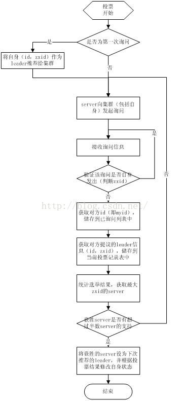

## ZooKeeper

https://www.cnblogs.com/lanqiu5ge/p/9405601.html

https://segmentfault.com/a/1190000014479433

ZooKeeper是一个**分布式**的，开放源码的分布式**应用程序协调服务**，是Google的Chubby一个开源的实现，它是**集群的管理者**，**监视着集群中各个节点的状态根据节点提交的反馈进行下一步合理操作**。客户端的**读请求**可以被集群中的**任意一台机器处理**，如果读请求在节点上注册了监听器，这个监听器也是由所连接的zookeeper机器来处理。对于**写请求**，这些请求会同**时发给其他zookeeper机器并且达成一致后，请求才会返回成功**。因此，随着**zookeeper的集群机器增多，读请求的吞吐会提高但是写请求的吞吐会下降**。有序性是zookeeper中非常重要的一个特性，所有的**更新都是全局有序的**，每个更新都有一个**唯一的时间戳**，这个时间戳称为**zxid（Zookeeper Transaction Id）**。而**读请求只会相对于更新有序**，也就是读请求的返回结果中会带有这个**zookeeper最新的zxid**。

#### **zk可以干什么？**

统一配置管理、统一命名服务、分布式锁、集群管理

#### **zk为什么可以做到？**

- ZooKeeper的数据结构，跟Unix文件系统非常类似，可以看做是一颗**树**，节点叫ZNode，节点有两种，临时的和持久的 Ephemeral/Persistent，分别还有顺序的普通的区别。与文件系统不同的是，这些节点**都可以设置关联的数据**，Zookeeper为了保证高吞吐和低延迟，在内存中维护了这个树状的目录结构，这种特性使得Zookeeper**不能用于存放大量的数据**，每个节点的存放数据上限为**1M**。
- 监听器：监听Znode节点的**数据变化**、监听子节点的**增减变化**。zk客户端向zk服务器注册watcher的同时，会将watcher对象存储在客户端的watchManager。Zk服务器触发watcher事件后，会向客户端发送通知，客户端线程从watchManager中回调watcher执行相应的功能。zk的getData()，getChildren()和exists()方法都可以注册watcher监听，如果没有监听，你就只能不断的轮询查看数据是否发生了改变，而监听则可以避免轮询带来的开销。zookeeper原生API注册Watcher需要反复注册，即Watcher触发之后就需要重新进行注册。
- ACL权限控制

#### zk怎么做到的？

- ABC三个主机的配置相似之处抽出来叫common放到zk节点上，三个主机监听(watch)这个ZNode，Znode数据有更新就会及时响应
- 把需要统一命名的服务放到一个zk节点下，父节点就可以作为他们统一的名字
- 在获取分布式锁的时候在locker节点下创建临时顺序节点，释放锁的时候删除该临时节点。客户端调用createNode方法在locker下创建临时顺序节点，然后调用getChildren(“locker”)来获取locker下面的所有子节点，注意此时不用设置任何Watcher。客户端获取到所有的子节点path之后，如果发现自己创建的节点在所有创建的子节点序号最小，那么就认为该客户端获取到了锁。如果发现自己创建的节点并非locker所有子节点中最小的，说明自己还没有获取到锁，此时客户端需要找到**比自己小的那个节点**，然后对其调用**exist()**方法，同时对其注册事件监听器。之后，让这个被关注的节点删除，则客户端的Watcher会收到相应通知，此时再次判断自己创建的节点是否是locker子节点中序号最小的，如果是则获取到了锁，如果不是则重复以上步骤继续获取到比自己小的一个节点并注册监听。（公平锁实现）https://www.jianshu.com/p/b966e5838ac9 里面有非公平
- 集群管理：被管理server在zk节点下创建临时节点，如果server与zk断联，临时节点将被删除，父节点的子节点将感知这一变化，知道有节点下线了。（选举：选id最小的顺序临时节点）

#### **zk工作核心原理**

Zookeeper 的核心是**原子广播**，这个机制保证了**各个Server之间的同步**。实现这个机制的协议叫做**Zab协议**。Zab协议有两种模式，它们分别是**恢复模式（选主）**election vote 和**广播模式（同步）**log replication。当服务启动或者在领导者崩溃后，Zab就进入了恢复模式，当领导者被选举出来，且大多数Server完成了和 leader的状态同步以后，恢复模式就结束了。状态同步保证了leader和Server具有相同的系统状态。

zab协议做到了以下几点：
（1）集群在半数以下节点宕机的情况下，能正常对外提供服务；
（2）客户端的写请求全部转交给leader来处理，leader需确保写变更能实时同步给所有follower及observer；
（3）leader宕机或整个集群重启时，需要确保那些已经在leader服务器上提交的事务最终被所有服务器都提交，确保丢弃那些只在leader服务器上被提出的事务，并保证集群能快速恢复到故障前的状态。

zab协议和raft协议很相似，都算是paxos的工业界常用实现，和raft的区别是心跳发送方向反过来了吧。

#### **zookeeper是如何保证事务的顺序一致性的？**

zookeeper采用了**递增的事务Id**来标识，所有的proposal（提议）都在被提出的时候加上了zxid，zxid实际上是一个64位的数字，高32位是epoch（时期; 纪元; 世; 新时代）用来标识leader是否发生改变，如果有新的leader产生出来，epoch会自增，**低32位用来递增计数**。当新产生proposal的时候，会依据数据库的两阶段过程，首先会向其他的server发出事务执行请求，如果超过半数的机器都能执行并且能够成功，那么就会开始执行。

顺序一致性是指：针对同一个Follower A提交的写请求request1、request2，某些Follower虽然可能不能在请求提交成功后立即看到（也就是强一致性），但经过自身与Leader之间的同步后，这些Follower在看到这两个请求时，一定是先看到request1，然后再看到request2，两个请求之间不会乱序，即顺序一致性。

Zab做了如下几条保证，来达到ZooKeeper要求的一致性。

(a) Zab要保证同一个leader的发起的事务要按顺序被apply，同时还要保证只有先前的leader的所有事务都被apply之后，新选的leader才能在发起事务。（依靠每次把leader发来的写请求放到阻塞队列里，这样每次收到leader发来的commit请求时，都对比二者的zxid是否一致，不一致则follower退出后重新同步）

(b) 一些已经Skip的消息，需要仍然被Skip。server1作为leader要发送P1、P2、P3，zxid分别为01，02，03，发完P1就挂了，这下server2和server3只完成了P1，然后选举server3成为leader，Sever3发送P2'，zxid为10，完成也挂了，server2里有P1(01)和P2'(10)，这下server1恢复，成为leader，发送P2和P3，由于epoch为0，比P2'的epoch1小，那么这两个之前被丢失的事务不能恢复，直接丢掉。感觉zk不是为高可用设计的，对一致性强调的特别多。

#### **ZooKeeper是如何选主的？**

当leader崩溃或者leader失去大多数的follower，这时zk进入恢复模式，恢复模式需要重新选举出一个新的leader，让所有的Server都恢复到一个正确的状态。Zk的选举算法有两种：一种是基于basic paxos实现的，另外一种是基于fast paxos算法实现的。系统默认的选举算法为**fast paxos**。

1、Zookeeper选主流程(basic paxos)
（1）选举线程由当前Server发起选举的线程担任，其主要功能是对投票结果进行统计，并选出推荐的Server；
（2）选举线程首先向所有Server发起一次询问(包括自己)；
（3）选举线程收到回复后，验证是否是自己发起的询问(验证zxid是否一致)，然后获取对方的id(myid)，并存储到当前询问对象列表中，最后获取对方提议的leader相关信息(id,zxid)，并将这些信息存储到当次选举的投票记录表中；
（4）收到所有Server回复以后，就计算出zxid最大的那个Server，并将这个Server相关信息设置成下一次要投票的Server；
（5）线程将当前zxid最大的Server设置为当前Server要推荐的Leader，如果此时获胜的Server获得n/2 + 1的Server票数，设置当前推荐的leader为获胜的Server，将根据获胜的Server相关信息设置自己的状态，否则，继续这个过程，直到leader被选举出来。 通过流程分析我们可以得出：要使Leader获得多数Server的支持，则Server总数必须是奇数2n+1，且存活的Server的数目不得少于n+1. 每个Server启动后都会重复以上流程。在恢复模式下，如果是刚从崩溃状态恢复的或者刚启动的server还会从磁盘快照中恢复数据和会话信息，zk会记录事务日志并定期进行快照，方便在恢复时进行状态恢复。

2、Zookeeper选主流程(fast paxos)
fast paxos流程是在选举过程中，某Server首先向所有Server提议自己要成为leader，当其它Server收到提议以后，解决epoch和 zxid的冲突，并接受对方的提议，然后向对方发送接受提议完成的消息，重复这个流程，最后一定能选举出Leader。

#### 服务器四种状态

分别是LOOKING、FOLLOWING、LEADING、OBSERVING。

- LOOKING：寻找Leader状态。当服务器处于该状态时，它会认为当前集群中没有Leader，因此需要进入Leader选举状态。
- FOLLOWING：跟随者状态。表明当前服务器角色是Follower。
- LEADING：领导者状态。表明当前服务器角色是Leader。
- OBSERVING：观察者状态。表明当前服务器角色是Observer。