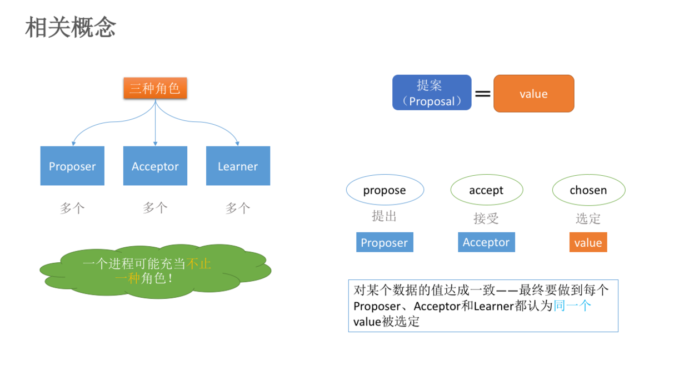
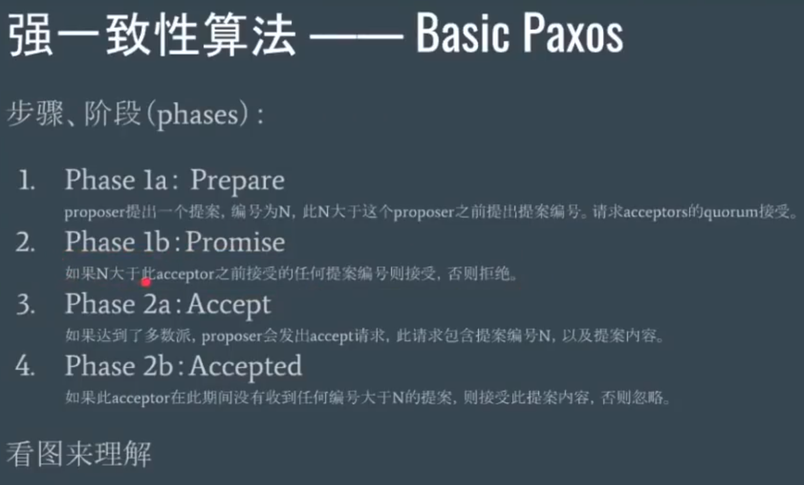
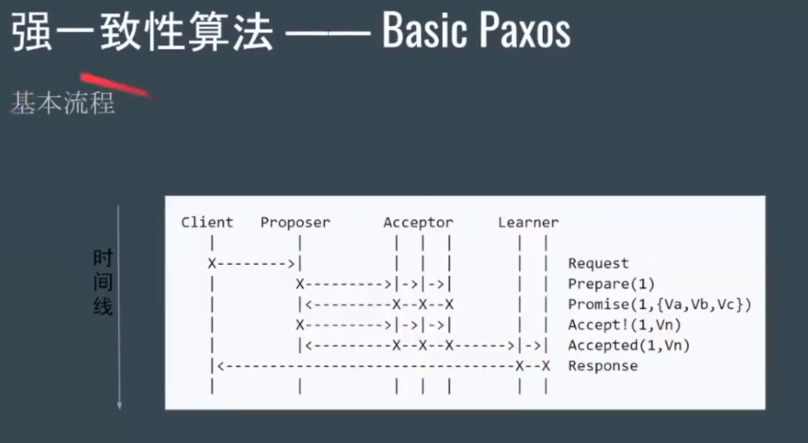
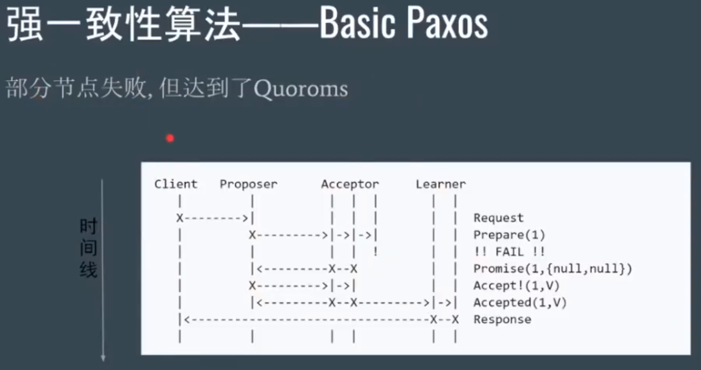
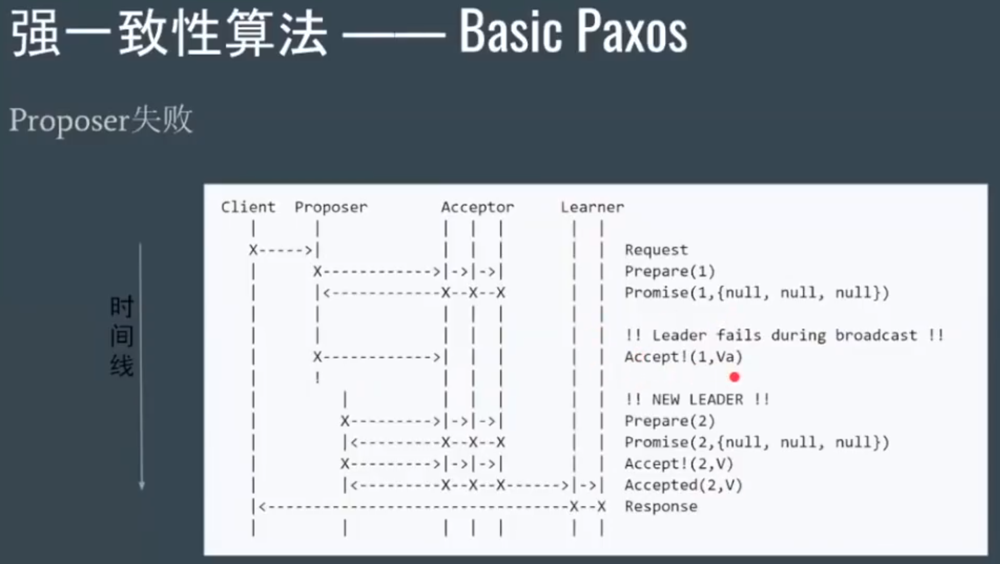
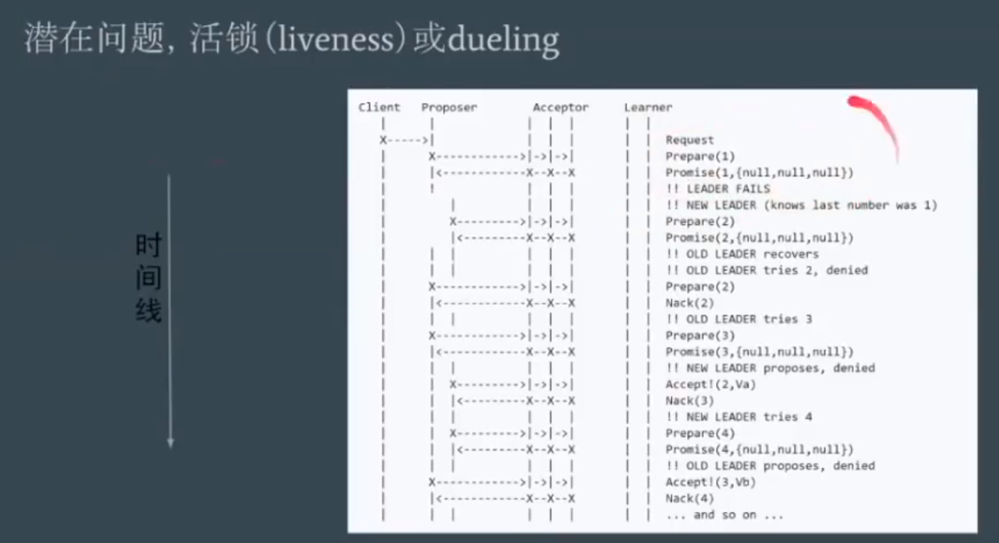
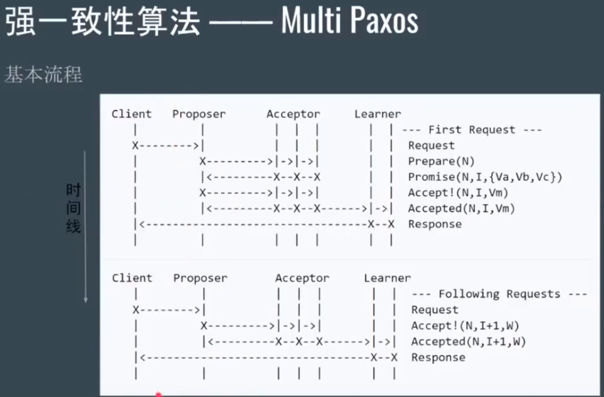
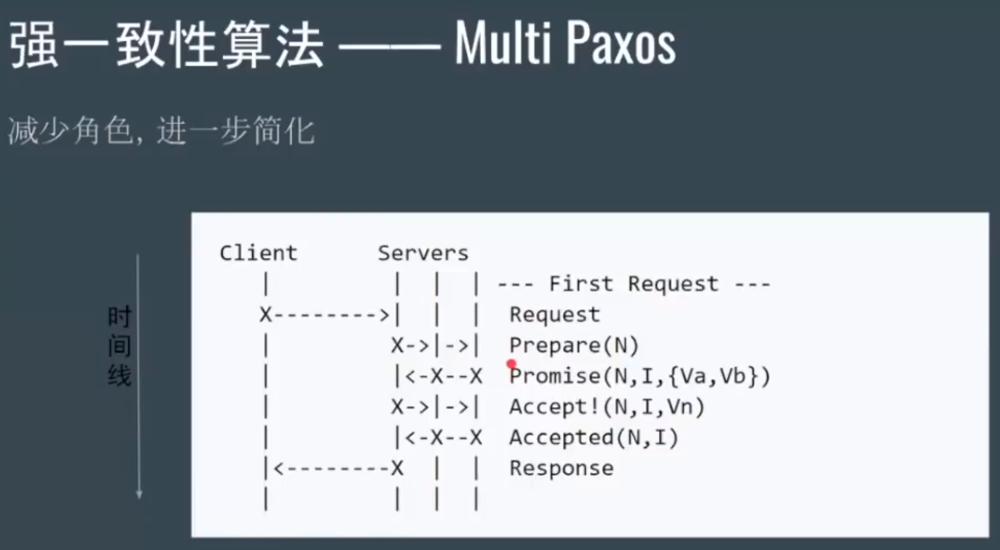
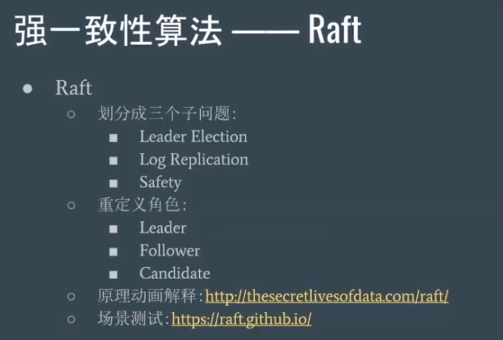
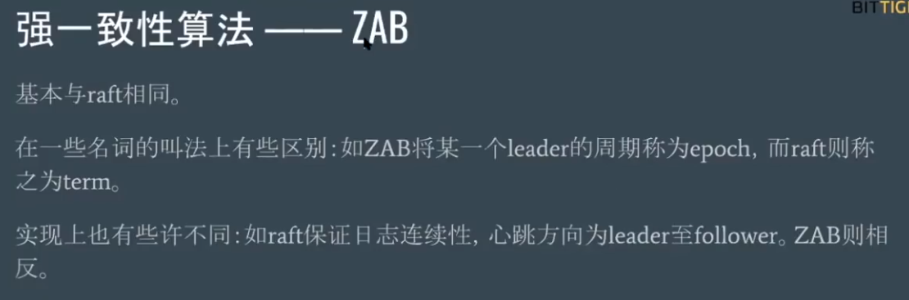

## 分布式一致性协议、事务

CAP/BASE

CAP：一个分布式系统中，Consistency（一致性）、 Availability（可用性）、Partition tolerance（分区容错性）这三个基本需求，最多只能同时满足其中的2个。P：分布式系统中一些节点出现网络异常而不与整个集群网络联通就叫分区。

BASE：对CAP中强一致性和高可用性权衡的结果。其核心思想是即使无法做到强一致性，但每个应用都可以根据自身业务特点，才用适当的方式来使系统达到最终一致性。BASE是Basically Available(基本可用)，Soft State（软状态）和Eventually Consistent（最终一致性）三个短语的缩写。

基本可用：出现了不可预知的故障，但还是能用，只是比正常系统可能响应慢一点或者部分功能少有损失。软状态是指允许系统中的数据存在中间状态，并认为该状态不影响系统的整体可用性，允许初始状态到中间状态再到最终数据一致性的时间延迟。最终一致性是指软状态不可能一直是软状态，必须有个时间期限，在期限过后，应当保证所有副本保持数据一致性，从而达到数据的最终一致性。

2PC/3PC

2PC: 1.协议者向所有参与者发送vote request，参与者收到请求后，如果准备好了即回复协调者vote commit，未准备好事务则回复vote abort；2.协调者收到所有参与者的回复，如果全为vote commit，则发送global commit，否则发送global abort，参与者收到global commit则提交事务，否则取消事务。

2PC协议中，协调者等待所有参与者的表决都是同步阻塞的，在实际的应用中，这可能会导致长阻塞问题，这个问题是通过超时判断机制来解决的。但如果用了超时机制，如果出现协调者和参与者都挂了的情况，有可能导致数据不一致。

3PC：

1. CanCommit：协调者向参与者们发送 canCommit 请求，询问是否可以执行事务提交操作，参与者如果认为自己可以顺利提交事务则返回yes，否则返回no；

2. PreCommit：

    - 但凡有任一参与者向协调者发送的是no，或者在等待超时后协调者都没法收到所有参与者的反馈，那就直接中断事务，协调者向所有参与者发送abort请求，参与者则无论是收到abort还是等待超时，都执行事务中断。

    - 如果协调者收到回复都是yes，则进行preCommit：即向参与者发送preCommit 请求，并进入prepared阶段。参与者若收到precommit则执行事务操作，并将undo、redo信息记录到日志。如果各参与者都成功执行了事务操作，那么反馈给协调者 ACK 响应，同时等待最终指令：docommit / abort。

3. doCommit：

    - 但凡协调者收到任意一个no，或者超时等待后无法接收所有参与者的反馈，都会中断事务。此时，协调者向所有参与者节点发送 abort 请求，参与者接收到 abort 请求后，利用 undo 日志执行事务回滚，并在完成事务回滚后释放占用的资源，并向协调者Coordinator 发送 ack 信息，协调者接收到所有参与者反馈的 ack 信息后，中断事务。

    - 如果协调者收到所有参与者的 ack ，则从preCommit进入doCommit阶段，并向所有参与者发送doCommit请求，参与者收到 doCommit 请求后，正式提交事务，并在完成事务提交后向 协调者发送 ACK 信息，并释放占用的资源，协调者收到所有参与者的ack请求则完成事务。

3PC虽然解决了协调者与参与者都挂了的情况下数据不一致的问题，但带来了新的问题：比如网络分区问题，在 preCommit 消息发送后突然两个机房断开，这时候 Coordinator 所在机房会 abort, 另外剩余参与者的机房则会 commit。

拜占庭容错与非拜占庭容错

**Paxos**

在具体的实现中，一个进程即可能是Proposer,也可能是Acceptor，也可能是Learner.

Basic Paxos问题：难实现，有两轮rpc，效率低，且容易出现活锁。

活锁解决办法，被抢的议员随机等待一段时间。

Multi Paxos：新概念 Leader：唯一的proposer，所有请求均需经过此leader

**Raft**

每个集群中，所有节点一开始都是follower，每个follower超过自己的election timeout（150~300ms的随机值）没接受到candidate的投票请求或者leader的心跳，就转变成candidate，candidate投自己一票后向其他节点发送投票请求，获取别的节点的应答，当超过半数的节点ack它的投票请求，它就转变成leader，系统的所有更改现在都通过leader。客户端新发送一个修改数据的请求，统一由leader接受，leader将这一更新操作发送给follower，follower向leader发送接受应答，leader接收到多于半数的ack，commit更新操作，并向follower发送commit请求，follower便更新并提交。

关于选举，leader会定时向follower发送心跳，需要数据的时候带上数据。follower有一个heartbeat timeout，每次接受到leader心跳时重置heartbeat timeout，超时未接到则转变成candidate进行选举。首先它给自己投一票，然后向其他follower发送投票请求，如果其他follower本轮没有投过，则会向这个candidate发送同意应答。如果candidate凑到了超过半数的票则自动变成leader，其他follower则开始重新开始自己的heartbeat timeout。

