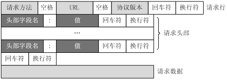
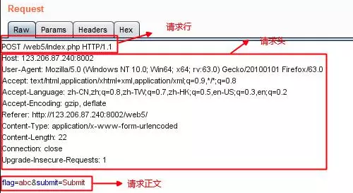
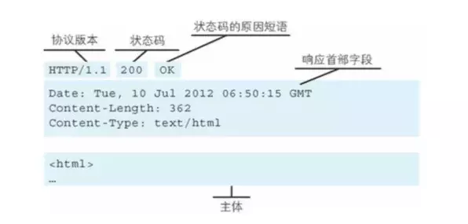
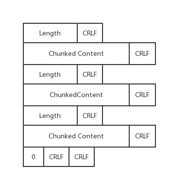
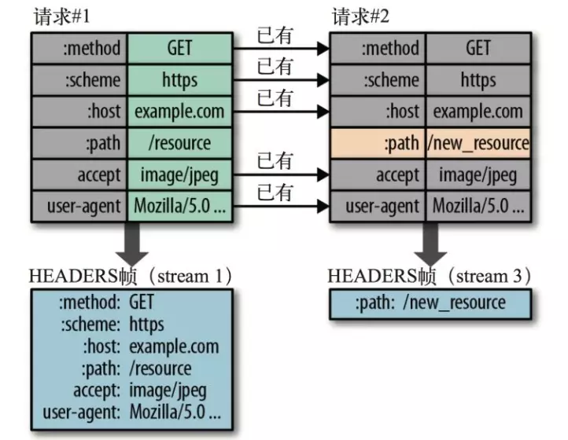
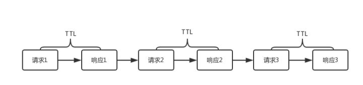
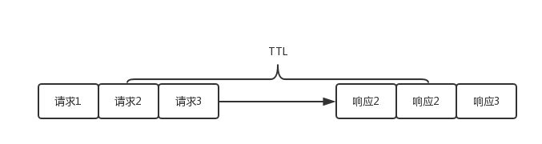

**URL格式**：

[http://www.aspxfans.com:8080/news/index.asp?boardID=5&ID=24618&page=1#name](https://link.jianshu.com/?t=http://www.aspxfans.com:8080/news/index.asp?boardID=5&ID=24618&page=1#name)

1.协议部分 http:    2. 域名部分 www.aspxfans.com  3. 端口部分 8080如果缺省将采用默认值

4.虚拟目录部分：从域名后的第一个“/”开始到最后一个“/”为止，非必须 news

5.文件名部分：从域名后的最后一个“/”开始到“？”为止，如果没有“?”,则是从域名后的最后一个“/”开始到“#”为止，是文件部分，如果没有“？”和“#”，那么从域名后的最后一个“/”开始到结束，都是文件名部分 index.asp

6.参数部分：从“？”开始到“#”为止之间的部分为参数部分，又称搜索部分、查询部分 “boardID=5&ID=24618&page=1”

7.锚部分：从“#”开始到最后，都是锚部分  name

**HTTP有哪些方法：**

- HTTP1.0定义了三种请求方法： GET, POST 和 HEAD方法

- HTTP1.1新增了五种请求方法：OPTIONS, PUT, DELETE, TRACE 和 CONNECT

- GET: 通常用于请求服务器发送某些资源

  HEAD: 请求资源的头部信息, 并且这些头部与 HTTP GET 方法请求时返回的一致. 该请求方法的一个使用场景是在下载一个大文件前先获取其大小再决定是否要下载, 以此可以节约带宽资源

  OPTIONS: 用于获取目的资源所支持的通信选项

  POST: 发送数据给服务器

  PUT: 用于新增资源或者使用请求中的有效负载替换目标资源的表现形式

  DELETE: 用于删除指定的资源

  PATCH: 用于对资源进行部分修改

  CONNECT: HTTP/1.1协议中预留给能够将连接改为管道方式的代理服务器

  TRACE: 回显服务器收到的请求，主要用于测试或诊断

**GET和POST有什么区别？**

数据传输方式不同：GET请求通过URL传输数据，而POST的数据通过请求体传输。

安全性不同：POST的数据因为在请求主体内，所以有一定的安全性保证，而GET的数据在URL中，通过历史记录，缓存很容易查到数据信息。

数据类型不同：GET只允许 ASCII 字符，而POST无限制

GET无害： 刷新、后退等浏览器操作GET请求是无害的，POST可能重复提交表单

特性不同：GET是安全（这里的安全是指只读特性，就是使用这个方法不会引起服务器状态变化）且幂等（幂等的概念是指同一个请求方法执行多次和仅执行一次的效果完全相同），而POST是非安全非幂等

**PUT和POST都是给服务器发送新增资源，有什么区别？**

PUT 和POST方法的区别是,PUT方法是幂等的：连续调用一次或者多次的效果相同（无副作用），而POST方法是非幂等的。

除此之外还有一个区别，通常情况下，PUT的URI指向是具体单一资源，而POST可以指向资源集合。

举个例子，我们在开发一个博客系统，当我们要创建一篇文章的时候往往用`POST https://www.jianshu.com/articles`，这个请求的语义是，在articles的资源集合下创建一篇新的文章，如果我们多次提交这个请求会创建多个文章，这是非幂等的。

而`PUT https://www.jianshu.com/articles/820357430`的语义是更新对应文章下的资源（比如修改作者名称等），这个URI指向的就是单一资源，而且是幂等的，比如你把『刘德华』修改成『蔡徐坤』，提交多少次都是修改成『蔡徐坤』

『POST表示创建资源，PUT表示更新资源』这种说法是错误的，两个都能创建资源，根本区别就在于幂等性

**HTTP request：**请求行: 请求方法字段、URL字段、HTTP协议版本字段；请求头部；空行；请求体: post put等请求携带的数据



如

```
GET /562f25980001b1b106000338.jpg HTTP/1.1
Host    img.mukewang.com
User-Agent  Mozilla/5.0 (Windows NT 10.0; WOW64) AppleWebKit/537.36 (KHTML, like Gecko) Chrome/51.0.2704.106 Safari/537.36
Accept  image/webp,image/*,*/*;q=0.8
Referer http://www.imooc.com/
Accept-Encoding gzip, deflate, sdch
Accept-Language zh-CN,zh;q=0.8
```

and



**HTTP response：** 响应行:  由协议版本，状态码和状态码的原因短语组成，例如`HTTP/1.1 200 OK`；响应头: 响应部首组成；响应体: 服务器响应的数据



**常见HTTP首部字段：**

a、通用首部字段（请求报文与响应报文都会使用的首部字段）
Date：创建报文时间
Connection：连接的管理
Cache-Control：缓存的控制
Transfer-Encoding：报文主体的传输编码方式
b、请求首部字段（请求报文会使用的首部字段）
Host：请求资源所在服务器
Accept：可处理的媒体类型
Accept-Charset：可接收的字符集
Accept-Encoding：可接受的内容编码
Accept-Language：可接受的自然语言
c、响应首部字段（响应报文会使用的首部字段）
Accept-Ranges：可接受的字节范围
Location：令客户端重新定向到的URI
Server：HTTP服务器的安装信息
d、实体首部字段（请求报文与响应报文的的实体部分使用的首部字段）
Allow：资源可支持的HTTP方法
Content-Type：实体主类的类型
Content-Encoding：实体主体适用的编码方式
Content-Language：实体主体的自然语言
Content-Length：实体主体的的字节数
Content-Range：实体主体的位置范围，一般用于发出部分请求时使用

**HTTP常见状态码：**

200：请求被正常处理
204：请求被受理但没有资源可以返回
206：客户端只是请求资源的一部分，服务器只对请求的部分资源执行GET方法，相应报文中通过Content-Range指定范围的资源。
301：永久性重定向
302：临时重定向
303：与302状态码有相似功能，只是它希望客户端在请求一个URI的时候，能通过GET方法重定向到另一个URI上
304：发送附带条件的请求时，条件不满足时返回，与重定向无关
307：临时重定向，与302类似，只是强制要求使用POST方法
400：请求报文语法有误，服务器无法识别
401：请求需要认证
403：请求的对应资源禁止被访问
404：服务器无法找到对应资源
500：服务器内部错误
503：服务器正忙

**HTTP中的keep-alive**：在HTTP/1.0中，每次http请求都要创建一个连接，而创建连接的过程需要消耗资源和时间。为了减少消耗缩短响应时间，后来在HTTP/1.1中引入了重用连接的机制。就是在http请求头中加入Connection: keep-alive来告诉对方这个请求响应完成后不要马上关闭。一般服务器都会配置一个KeepAlive Timeout参数和KeepAlive Requests参数限制单个连接持续时长和最多服务的请求次数。

优点：

- 较少的CPU和内存的使用（由于同时打开的连接的减少了）
- 允许请求和应答的HTTP管线化
- 降低拥塞控制 （TCP连接减少了）
- 减少了后续请求的延迟（无需再进行握手）
- 报告错误无需关闭TCP连接

**什么是分块传送？**

当浏览器向服务器请求一个资源时，这个资源是一个动态资源，服务器无法提前预知资源的大小，这个时候就可以使用分块传输。服务器先生成一个chunk，发送这个chunk，再生成一个chunk，再发送一个chunk，直到全部资源传送完成。分块传送需要在请求头增加一个特殊的键值对transfer-encoding: chunked，那么消息体的内容便是分块传送的。chunked传输格式如图所示，由一段一段的分块组合而成，每个块由一个长度行和一个分块体组成，最后一个分块长度为0表示结束。



**二进制分帧**

HTTP/2中一个消息分为多个二进制帧，是其数据通信的最小单位。HTTP/2 采用二进制格式传输数据，而非 HTTP 1.x 的文本格式，二进制协议解析起来更高效。

**首部压缩**

HTTP/1.x会在请求和响应中中重复地携带不常改变的、冗长的头部数据，给网络带来额外的负担。你可以理解为只发送差异数据，而不是全部发送，从而减少头部的信息量

- HTTP/2在客户端和服务器端使用“首部表”来跟踪和存储之前发送的k-v对，对于相同的数据，不再通过每次请求和响应发送
- 首部表在HTTP/2的连接存续期内始终存在，由客户端和服务器共同渐进地更新
- 每个新的首部k-v对要么被追加到当前表的末尾，要么替换表中之前的值



**服务端推送**

服务端可以在发送页面HTML时主动推送其它资源，而不用等到浏览器解析到相应位置，发起请求再响应。例如服务端可以主动把JS和CSS文件推送给客户端，而不需要客户端解析HTML时再发送这些请求。服务端可以主动推送，客户端也有权利选择是否接收。如果服务端推送的资源已经被浏览器缓存过，浏览器可以通过发送RST_STREAM帧来拒收。主动推送也遵守同源策略，服务器不会随便推送第三方资源给客户端。

**多路复用**

HTTP 1.x 中，如果想并发多个请求，必须使用多个 TCP 链接，且浏览器为了控制资源，还会对单个域名有 6-8个的TCP链接请求限制。

HTTP/2中 同域名下所有通信都在单个TCP连接上完成，单个连接可以承载任意数量的双向数据流，数据流以消息的形式发送，而消息又由一个或多个帧组成，多个帧之间可以乱序发送，因为原本对消息进行拆分时已经加上了序号，收到乱序的帧后根据序号重新组织回原来的消息。

**什么叫Pipeline管线化？**

HTTP1.0不支持管线化，同一个连接处理请求的顺序是逐个应答模式，处理一个请求就需要耗费一个TTL，也就是客户端到服务器的往返时间，处理N个请求就是N个TTL时长。当页面的请求非常多时，页面加载速度就会非常缓慢。



从HTTP1.1开始要求服务器支持管线化，可以同时将多个请求发送到服务器，然后逐个读取响应。这个管线化和Redis的管线化原理是一样的，响应的顺序必须和请求的顺序保持一致。



**如何理解HTTP协议的无状态性？**

HTTP协议的无状态性是指服务器的协议层无需为不同的请求之间建立任何相关关系，它特指的是协议层的无状态性。但是这并不代表建立在HTTP协议之上的应用程序就无法维持状态。应用层可以通过会话Session来跟踪用户请求之间的相关性，服务器会为每个会话对象绑定一个唯一的session_ID，浏览器可以将会话ID记录在本地缓存LocalStorage或者Cookie，在后续的请求都带上这个session_ID，服务器就可以为每个请求找到相应的session状态。

**HTTP/1.1相比HTTP/1.0优化**

- 默认持久连接节省通信量，只要客户端服务端任意一端没有明确提出断 - 管线化，客户端可以同时发出多个HTTP请求，而不用一个个等待响应
- 断点续传 （实际上就是利用HTTP消息头使用分块传输编码，将实体主体分块传输）

**HTTP/2对比HTTP/1.X的优化**

- 二进制分帧
- 首部压缩
- 流量控制
- 多路复用
- 服务器推送

**HTTP的缺点与HTTPS**
a、通信使用明文不加密，内容可能被窃听
b、不验证通信方身份，可能遭到伪装
c、无法验证报文完整性，可能被篡改
HTTPS就是HTTP加上加密处理（一般是SSL安全通信线路）+认证+完整性保护

**HTTPS如何保证安全**

概念：对称加密 & 非对称加密

对称加密即 通信的双方都使用同一个秘钥进行加解密，比如特务接头的暗号，就属于对称加密。缺点就是无法解决首次把秘钥发给对方的问题，很容易被hacker拦截秘钥。

非对称加密即 用私钥加密的数据，只有对应的公钥才能解密，用公钥加密的数据只有对应的私钥才能解密。因为通信双方的手里都有一套自己的密钥对（私钥+公钥）,通信之前双方会先把自己的公钥都先发给对方。然后对方再拿着这个公钥来加密数据响应给对方,等到到了对方那里,对方再用自己的私钥进行解密。缺点就是速度慢。

将两种方式结合。将对称加密的密钥使用非对称加密的公钥进行加密，然后发送出去，接收方使用私钥进行解密得到对称加密的密钥，然后双方可以使用对称加密来进行沟通。但同时需要一个安全的第三方认证证书CA来证明身份，防止中间人攻击。

然后用到数字签名，就是用CA自带的HASH算法对证书的内容进行HASH得到一个摘要，再用CA的私钥加密，最终组成数字签名。数字签名用于认证CA没有被篡改。

**TLS握手过程**