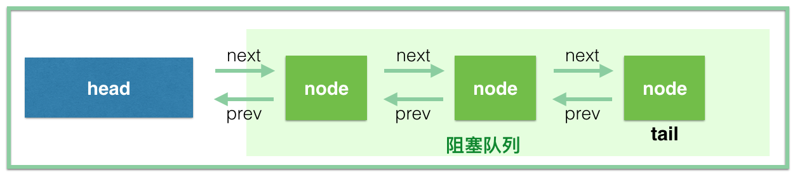

## Lock体系

synchronized与Lock区别：[synchronized 的局限性 与 Lock 的优点](https://blog.csdn.net/justloveyou_/article/details/54972105) [强大的Lock体系](https://www.wonderheng.top/2018/09/12/强大的Lock体系/)

| 类别     | synchronized                                                 | Lock                                                         |
| -------- | ------------------------------------------------------------ | ------------------------------------------------------------ |
| 存在层次 | Java的关键字，在jvm层面上，编译后有monitorenter，monitorexit | 是一个接口                                                   |
| 锁的释放 | 1、以获取锁的线程执行完同步代码，释放锁 2、线程执行发生异常，jvm会让线程释放锁 | 在finally中必须释放锁，不然容易造成线程死锁                  |
| 锁的获取 | 假设A线程获得锁，B线程等待。如果A线程阻塞，B线程会一直等待   | 分情况而定，Lock有多个锁获取的方式，具体下面会说道，大致就是可以尝试获得锁，线程可以不用一直等待 |
| 锁状态   | 无法判断                                                     | 可以判断                                                     |
| 锁类型   | 可重入 不可中断 非公平                                       | 可重入 可中断 可公平（两者皆可）                             |
| 性能     | 少量同步                                                     | 大量同步                                                     |

**Lock几个api的使用场景**: 

```java
public interface Lock {
    void lock(); //必须主动去释放锁，并且在发生异常时，不会自动释放锁
    void lockInterruptibly() throws InterruptedException;  // 可以响应中断
    boolean tryLock();//这个方法无论如何都会立即返回T/F（在拿不到锁时不会一直在那等待，lock()会等）
    boolean tryLock(long time, TimeUnit unit) throws InterruptedException;
    // 当通过这个方法去获取锁时，如果线程正在等待获取锁，则这个线程能够响应中断，即中断线程的等待状态
    void unlock();
    Condition newCondition();
}
```

**AQS**，面向锁的实现者，简化了锁的实现方式，屏蔽同步状态的管理、线程排队、线程等待与唤醒等底层操作。先认识一下CAS源码。

> 在 CAS 中有三个参数：内存值 V、旧的预期值 A、要更新的值 B ，当且仅当内存值 V 的值等于旧的预期值 A 时，才会将内存值V的值修改为 B ，否则什么都不干。问题：循环时间过长，ABA问题

[死磕 Java 并发—- 深入分析 CAS](http://www.iocoder.cn/JUC/sike/CAS/)           [Java CAS 原理剖析]( https://juejin.im/post/5a73cbbff265da4e807783f5)              [Unsafe与CAS](https://www.cnblogs.com/xrq730/p/4976007.html)

> - AbstractQueuedSynchronizer，即队列同步器，解决了实现锁所涉及的大量细节问题，例如获取同步状态、FIFO同步队列等，而且也不必处理在多个位置上发生的竞争问题。在基于AQS构建的同步器中，只能在<u>一个时刻</u>发生阻塞，从而降低上下文切换的开销，提高了吞吐量。同时在设计AQS时充分考虑了可伸缩行，因此J.U.C中所有基于AQS构建的同步器均可以获得这个优势。
> - AQS使用一个int类型的成员变量state来表示<u>同步状态</u>，当state>0时表示已经获取了锁，当state = 0时表示释放了锁。当然AQS可以确保对state的操作是<u>安全的</u>。
> - AQS通过内置的FIFO同步队列（就是CLH队列）来完成资源获取线程的排队工作，如果当前线程获取同步状态（锁）失败时，AQS则会将当前线程以及等待状态等信息构造成一个节点（Node）并将其加入同步队列，同时会阻塞当前线程，当同步状态释放时，则会把节点中的线程唤醒（公平地），使其再次尝试获取同步状态。
> - 要使用AQS，推荐使用静态内部类继承AQS，覆写AQS中的protected用来改变同步状态的方法，其他方法主要是实现排队与阻塞机制。状态更新使用 **getState()、setState()、compareAndSetState()**。
> -  [Java并发编程-看懂AQS的前世今生](https://www.cnblogs.com/iou123lg/p/9464385.html)
> -  [Java并发包基石-AQS详解](https://www.cnblogs.com/chengxiao/p/7141160.html)
> - [一行一行源码分析清楚AbstractQueuedSynchronizer](https://www.javadoop.com/post/AbstractQueuedSynchronizer)
> -  [J.U.C之AQS：CLH同步队列](http://cmsblogs.com/?p=2188) [J.U.C之AQS：同步状态的获取与释放](http://cmsblogs.com/?p=2197) [J.U.C之AQS：阻塞和唤醒线程](http://cmsblogs.com/?p=2205)
> - 应该如何理解管程？ - 钓雪的回答 - 知乎
>   https://www.zhihu.com/question/30641734/answer/105402533

CLH同步队列是一个FIFO双向队列，AQS依赖它来完成同步状态的管理。在CLH同步队列中，一个节点表示一个线程，它保存着线程的引用（thread）、状态（waitStatus）、前驱节点（prev）、后继节点（next）。CLH同步队列结构如下：



**ReentrantLock**：[ReentrantLock实现原理深入探究](https://www.cnblogs.com/xrq730/p/4979021.html)  [J.U.C之重入锁：ReentrantLock](http://cmsblogs.com/?p=2210)

> 要点：可重入的原理、公平锁的原理、非公平锁的原理
>
> 可重入是指对于已经获得锁的线程，可以多次反复进入，最多进IntegeR.MAX_VALUE次。实质还是排它锁。
>
> 默认非公平，只有获取锁时有公平与非公平这一说，释放锁不存在公平性和非公平性。Sync为ReentrantLock里面的一个内部类，它继承AQS（AbstractQueuedSynchronizer），它有两个子类：公平锁FairSync和非公平锁NonfairSync。ReentrantLock里面大部分的功能都是委托给Sync来实现的，同时Sync内部定义了lock()抽象方法由其子类去实现。
>
> 比较非公平锁和公平锁获取同步状态的过程，会发现两者唯一的区别就在于公平锁在获取同步状态时多了一个限制条件：hasQueuedPredecessors()。该方法主要做一件事情：主要是判断当前线程是否位于CLH同步队列中的第一个。如果是则返回true，否则返回false。
>
> 与synchronized比较：
>
> > 1. 与synchronized相比，ReentrantLock提供了更多，更加全面的功能，具备更强的扩展性。例如：时间锁等候，可中断锁等候，锁投票。
> > 2. ReentrantLock还提供了条件Condition，对线程的等待、唤醒操作更加详细和灵活，所以在多个条件变量和高度竞争锁的地方，ReentrantLock更加适合（以后会阐述Condition）。
> > 3. ReentrantLock提供了可轮询的锁请求。它会尝试着去获取锁，如果成功则继续，否则可以等到下次运行时处理，而synchronized则一旦进入锁请求要么成功要么阻塞，所以相比synchronized而言，ReentrantLock会不容易产生死锁些。
> > 4. ReentrantLock支持更加灵活的同步代码块，但是使用synchronized时，只能在同一个synchronized块结构中获取和释放。注：ReentrantLock的锁释放一定要在finally中处理，否则可能会产生严重的后果。
> > 5. ReentrantLock支持中断处理，且性能较synchronized会好些。

**ReentrantReadWriteLock**：[J.U.C之读写锁：ReentrantReadWriteLock](http://cmsblogs.com/?p=2213)

实现接口ReadWriteLock，该接口维护了一对相关的锁，一个用于只读操作，另一个用于写入操作。只要没有 writer，读取锁可以由多个 reader 线程同时保持。写入锁是独占的。在同一时间可以允许多个读线程同时访问，但是在写线程访问时，其他所有读线程和写线程都会被阻塞。

特性：

1. 公平性：支持公平性和非公平性。
2. 重入性：支持重入。读写锁最多支持65535个递归写入锁和65535个递归读取锁。
3. 锁降级：遵循获取写锁、获取读锁再释放写锁的次序，写锁能够降级成为读锁

ReadWriteLock定义了两个方法：readLock()返回用于读操作的锁，writeLock()返回用于写操作的锁。对应有两个内部类。沃日读写锁好几把难。

**Condition机制**：

[Java多线程Condition接口原理详解](https://blog.csdn.net/fuyuwei2015/article/details/72602182)   [AQS中的公平锁与非公平锁，Condtion](https://blog.csdn.net/a724888/article/details/60955965)  [详解Condition的await和signal](https://github.com/CarlMarcus/Java-concurrency/blob/master/12.详解Condition的await和signal等待通知机制/详解Condition的await和signal等待通知机制.md)

Condition接口提供了类似Object的监视器方法，与Lock配合可以实现等待/通知模式，但是这两者在使用方式以及功能特性上还是有差别的。Condition对象是由Lock对象（调用Lock对象的newCondition()方法）创建出来的，换句话说，Condition是依赖Lock对象的。


条件队列（等待队列）是一个FIFO队列，尾插法加入新线程引用 。上述节点引用更新的过程并没有使用CAS保证，原因在于调用await()方法的线程必定是获取了锁的线程，也就是说该过程是由锁来保证线程安全的。在Object的监视器模型上，一个对象拥有一个同步队列和等待队列，而并发包中的Lock（更确切地说是同步器）拥有一个同步队列和多个等待队列。与CLH对比：等待队列是一个**不带头结点的单向链表**，之前我们学习AQS时知道同步队列**是一个带头结点的双向链表**


Condition定义了等待await/通知signal两种类型的方法，当前线程调用这些方法时，需要提前获取到Condition对象关联的锁。await方法示意图如下图：


**当前线程调用condition.await()方法后，会使得当前线程释放lock然后加入到等待队列（Condition条件队列）中，直至被signal/signalAll后会使得当前线程从等待队列中移至到同步队列（CLH）中去，直到获得了lock后才会从await方法返回，或者在等待时被中断会做中断处理**。调用condition.await方法的线程必须是已经获得了lock，也就是当前线程是同步队列中的头结点。调用该方法后会使得当前线程所封装的Node尾插入到等待队列中。

> 1.是怎样将当前线程添加到等待队列中去的？2.释放锁的过程？3.怎样才能从await方法退出？
>
> 1.调用addConditionWaiter将当前线程添加到等待队列中。2.将当前节点插入到等待对列之后，会使当前线程释放lock，由fullyRelease方法实现。3.当前线程被中断或者调用condition.signal/condition.signalAll方法将当前节点移动到了同步队列

**调用condition的signal的前提条件是当前线程已经获取了lock，该方法会使得等待队列(Condition条件队列)中的头节点即等待时间最长的那个节点移入到同步队列 (CLH)，而移入到同步队列后才有机会使得等待线程被唤醒，即从await方法中的LockSupport.park(this)方法中返回，从而才有机会使得调用await方法的线程成功退出**。


综合看：


LockSupport：