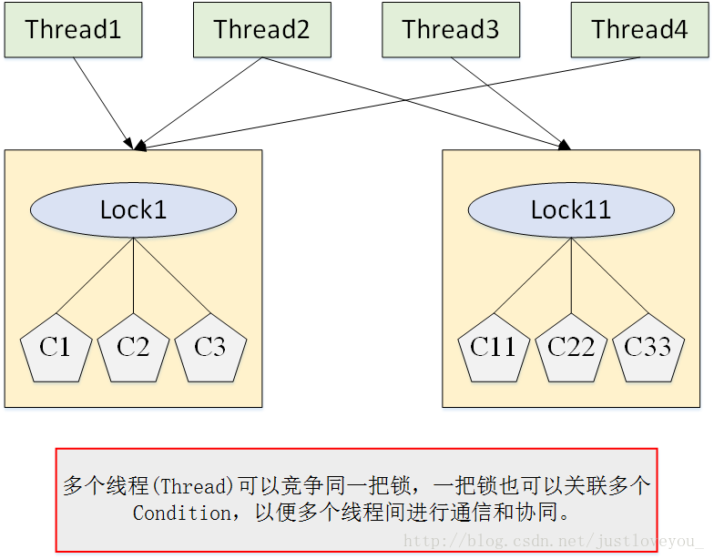
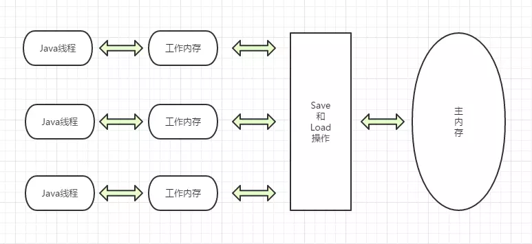

### 并发面试题集锦

1. **如何在Java中实现线程？**

> 继承Thread类，重写run；实现Runnable重写run，Thread包装一下；实现Callable接口，重写call方法、被FutureTask包装一下，然后被Thread包装；从线程池中创建
>

**线程几个状态**

> 创建，就绪，运行，等待，阻塞，超时等待，终止
>

**线程的的几个方法讲讲 sleep join yield interrupt**

> sleep不释放资源，进入超市等待状态，到时自动唤醒；
>
> yield放弃获取cpu时间片，但不释放资源；
>
> join使当前线程必须等待调用的线程执行完才能继续执行；
>
> interrupt()方法将会设置该线程的中断状态位，即设置为true，中断的结果线程是死亡、还是等待新的任务或是继续运行至下一步，就取决于这个程序本身，线程会不时地检测这个中断标示位，以判断线程是否应该被中断（中断标示值是否为true）。它并不像stop方法那样会中断一个正在运行的线程，而是表示它应该被中断，具体操作应该在线程逻辑内部去实现。
>

**Java中interrupted 和isInterrupted方法的区别？**

> interrupted和isInterrupted都会检测是否被设置了中断位，进而采取停止或抛出InterruptedException异常的措施，但是interrupted会在检测到标志位后将其置false，isInterrupted不会。
>

**wait和notiy和notifyall讲讲怎么用，原理是什么，为什么要放在object类**

> wait()、notify()和notifyAll()方法是Object类的方法，并且为final方法，无法被重写。调用某个对象的wait()方法能让当前线程阻塞，释放这个对象锁并移入这个对象的等待队列，调用notify或notifyall会把这个obj对象等待队列上的一个或多个线程移入同步队列去争抢obj对象锁，虽然哪个会继续抢到锁运行并不确定。由于要使用到锁，所以wait和notify要在synchronized代码块里使用，而且必须得是Object类方法，因为要利用Java对象可以作为锁的特性来完成线程间通信。和wait/notify差不多功能的还有condition机制。
>

**Java对象天生可以作为锁？**！！！！！！！！！！！

> 每一个Java对象都有对象头，对象头由MarkWord、KlassWord
>
> 锁在Java中是对象头中的数据结构中的数据，在JVM中每个对象中都拥有这样的数据。如果任何线程想要访问该对象的实例变量，那么线程必须拥有该对象的锁（也就是在指定的内存区域中进行一些数据的写入）

**你对线程优先级的理解是什么？Java线程的调度算法是什么？**

> Java 线程优先级使用 1 ~ 10 的整数表示，普通的默认为5，但都从父线程获得默认优先级，每个线程的优先级可以通过setPiority和getPriority查看修改。优先级高的线程有更高的几率得到执行，但实际和操作系统和虚拟机有关。
>
> JVM采用的是抢占式的时间片轮转调度吧，优先给优先级高的线程分配cpu时间片，时间片结束后才给优先级低的分配，但不会说优先级低的分不到时间片。优先级高的抢到时间片也可能因为自己阻塞并释放锁或者优先级更高的线程来了而提前放弃cpu时间片。

**什么是守护线程？**

> 用来在后台服务于用户线程；不需要上层逻辑介入。在Java进程里，Daemon用于后台支持任务，比如垃圾回收、释放未使用对象的内存、从缓存中删除不需要的条目，守护线程开启的线程也是守护线程。当线程只剩下守护线程的时候，JVM就会退出；如果还有其他的任意一个用户线程还在，JVM就不会退出。可以用isDaemon()来查看是否守护线程，不建议用守护线程实现任何业务逻辑。

**什么是竞态条件？什么是临界区资源？**

> 竞态条件指的是程序的执行**结果**依赖执行线程执行**顺序**，其执行过程会出现其它线程执行的顺序的不同而导致执行结果导致偏差。会产生竞态条件的代码段叫临界区，这里的可能产生冲突的数据和实例叫临界区资源。

**什么是线程安全？Vector是一个线程安全类吗？servlet是线程安全吗?**

> 当多个线程访问某个类或方法时，不管你通过怎样的调用方式或者说这些线程如何交替的执行，我们在主程序中不需要去做任何的同步，这个类的结果行为都是我们设想的正确行为，那么我们就可以说这个类或方法是线程安全的。
>
> Vector类里的方法都被synchronized修饰了，单独拿出来用肯定是线程安全的，但这些线程安全方法组合成的复合方法不能认为它一定线程安全。举个例子：
>
> ```
> if (!vector.contains(element)) 
> 	vector.add(element); 
> 	...
> ```
>
> 这是经典的 put-if-absent 情况，尽管 contains, add 方法都正确地同步了，但作为 vector 之外的使用环境，仍然存在 race condition（锁竞争）: 因为虽然条件判断contains与add都是原子性的操作 (atomic)，但在 if 条件判断为真后，那个用来访问vector.contains 方法的锁已经释放，在即将的 vector.add 方法调用 之间有间隙，在多线程环境中，完全有可能被其他线程获得 vector的 lock 并改变其状态, 此时当前线程的vector.add(element); 正在等待（只不过我们不知道而已）。只有当其他线程释放了 vector 的 lock 后，vector.add(element); 继续，但此时它已经基于一个错误的假设了。
>
> servlet线程安全视其内部的具体实现而定，servlet本身是无状态的，一定线程安全，但内部有可被修改的实例就不是线程安全了。具体看 https://blog.csdn.net/qq_24145735/article/details/52433096

**为什么局部变量是线程安全的？**

> 因为局部变量的作用域是方法内部，每个线程的Java虚拟栈实际上是由一个个栈帧组成的，而方法操作的是栈帧中的局部变量，虚拟机栈是每个线程私有的，这叫线程封闭，不会存在数据竞争，绝对线程安全。

**Java中如何停止一个线程？**

> 别用stop()方法，已废除。1.可以用一个多线程共享变量，一般用volatile boolean，多个线程通过判断这个变量的状态来决定是否退出循环体然后结束线程。2.使用interrupt和interruptted，在某一处触发interrupt，在interruptted里面进行退出的操作。

**怎么控制线程，尽可能减少上下文切换？**

> 上下文切换的原因有两种：
>
> 一种是让步式上下文切换，是线程主动放弃了cpu时间片，线程抢不到锁而阻塞时会放弃cpu时间片，所以与锁竞争严重程度成正比，可通过**减少锁竞争**来避免。
>
> 另一种是抢占式上下文切换，指线程因分配的时间片用尽而被迫放弃CPU或者被其他优先级更高的线程所抢占，一般是因为**线程数远大于cpu总核心数**引起，可通过调整线程数与cpu核心数差不多来避免。

**什么是线程饿死，什么是活锁？**

> 死锁是多个线程因**争夺资源而造成的一种互相死等的现象**（mutex.lock）。活锁则是请求独占资源失败后，干脆把已抢占的资源给释放了，这个资源被其他线程独占了，等到它独占刚刚请求的资源后，又发现不能获得自己刚释放的资源，比如线程T1独占A，T2独占B，但T1和T2都需要独占A和B才能正常运行，于是T1释放了A，T2释放了B，A被T2独占，B被T1独占，又要继续无限循环地释放和获取(mutex.trylock)。饥饿则是T1独占了A，T2也想独占A，只能等待，T1释放A后被T3独占，接着释放又被T4独占，T2只能永远等待，叫线程饥饿。

**Sleep()、suspend()和wait()之间有什么区别？**

> sleep和suspend是Thread类方法，sleep让线程等待一定时间后自动恢复运行，suspend和resume搭配使用，使线程进入等待状态，直到使用Thread.resume唤醒，典型地，suspend()和 resume() 被用在等待另一个线程产生的结果的情形。wait是Obejct类方法，和notify搭配使用，会让线程阻塞并释放锁，知道被notify唤醒。wait和notify由于要获取锁，必须被synchronized包裹。

**Java如何实现多线程之间的通讯和协作？**

> wait&notify || Lock&Condition
>
> Condition是在java 1.5中出现的，它用来替代传统的Object的wait()/notify()实现线程间的协作，它的使用依赖于 Lock。Condition、Lock 和 Thread 三者之间的关系如下图所示。相比使用Object的wait()/notify()，使用Condition的await()/signal()这种方式能够更加安全和高效地实现线程间协作。Condition是个接口，基本的方法就是await()和signal()方法。Condition依赖于Lock接口，生成一个Condition的基本代码是lock.newCondition() 。 必须要注意的是，Condition 的 await()/signal() 使用都必须在lock保护之内，也就是说，必须在lock.lock()和lock.unlock之间才可以使用。事实上，Conditon的await()/signal() 与 Object的wait()/notify() 有着天然的对应关系：
>
> - Conditon中的await()对应Object的wait()
> - Condition中的signal()对应Object的notify()
> - Condition中的signalAll()对应Object的notifyAll()
>
> 

**讲讲Java内存模型JMM**

> 
>
> Java内存模型就是这种，变量实例存储在主内存中，但是每个线程还有一个工作内存用于缓存操作到的实例
>
> > 并发编程中，导致原子性问题的原因是线程切换，导致可见性问题的原因是缓存，导致有序性问题的原因是编译器优化。
>
> 那解决可见性、有序性最直接的办法就是**禁用缓存和编译优化**，但是这样问题虽然解决了，我们程序的性能可就堪忧了。合理的方案应该是**按需禁用缓存以及编译优化**。通过volatile、synchronized、final关键字和六项Happens-Before 规则实现，Happens-Before 解决了volatile语义。Happens-Before 并不是说前面一个操作发生在后续操作的前面，它真正要表达的是：**前面一个操作的结果对后续操作是可见的**，不用管是否在同一个线程。
>
> Happens-Before 的六大规则：
>
> 1. 一个线程内，按照代码顺序，书写在前面的操作先行发生于书写在后面的操
> 2. 对volatile变量写操作happens-before于对volatile变量读操作
> 3. 如果 A Happens-Before B，且 B Happens-Before C，那么 A Happens-Before C
> 4. 对一个锁的解锁 Happens-Before 于后续对这个锁的加锁 （**管程中锁的规则**）
> 5. 主线程 A 启动子线程 B 后，子线程 B 能够看到主线程在启动子线程 B 前的操作
> 6. 如果在线程 A 中，调用线程 B 的 join() 并成功返回，那么线程 B 中的任意操作 Happens-Before 于该 join() 操作的返回，A线程中能看到B线程中的操作

**什么是管程？**

> 管程是编程语言提供的一种抽象数据结构，用于多线程互斥访问共享资源。即每一个时刻只能一个线程在一段管程内。Java里synchronized 关键字及 wait()、notify()、notifyAll() 这三个方法都是管程的组成部分。

**有三个线程T1 T2 T3，怎么确保它们按顺序执行？**

> T3.start，在T3线程实现开头加入T2.join，在T2线程实现开头加入T1.join

**如何让多个线程按序执行？**

> 设置volatile可见变量，synchronized线程抢到锁需判断可见变量值是不是自己的顺序，不是wait()，每一个线程执行完后可见变量自加并notifyall；或者在主线程中依次加join，或者依次顺序在线程内加join，如上。最后，第一种的notifyall和wait可以换成Condition机制的方法

**volatile关键字的原理**

> > cpu中有L1L2两级缓存，缓存中对同一实例的缓存的值可能不一样，这就需要缓存一致性协议。比如MESI,MESI是保持一致性的协议。它的方法是在**CPU缓存**中保存一个**标记位** ，这个标记位有四种状态:
> >
> > - **M: Modify，修改缓存**，当前CPU的缓存已经被修改了，即与内存中数据已经不一致了；
> > - **E: Exclusive，独占缓存**，当前CPU的缓存和内存中数据保持一致，而且其他处理器并没有可使用的缓存数据；
> > - **S: Share，共享缓存**，和内存保持一致的一份拷贝，多组缓存可以同时拥有针对同一内存地址的共享缓存段；
> > - **I: Invalid，失效缓存**，这个说明CPU中的缓存已经不能使用了。
> >
> > CPU的读取遵循下面几点：
> >
> > - 如果缓存状态是I，那么就从内存中读取，否则就从缓存中直接读取。
> > - 如果缓存处于M或E的CPU读取到其他CPU有读操作，就把自己的缓存写入到内存中，并将自己的状态设置为S。
> > - 只有缓存状态是M或E的时候，CPU才可以修改缓存中的数据，修改后，缓存状态变为M。
>
> **可见性**
>
> 有volatile修饰的共享变量进行写操作时会多出一行汇编指令，该句代码的意思是**对原值加零**，其中相加指令addl前有**lock**修饰。lock前缀的指令在多核处理器下会引发两件事情：
>
> 1. **将当前处理器缓存行的数据写回到系统内存**
> 2. **这个写回内存的操作会使在其他CPU里缓存了该内存地址的数据无效**
>
> 所以volatile变量的读操作在不同线程里都需要去内存中读取，且每次修改都会刷写到内存中。
>
> **有序性**
>
> 通过在Java编译器生成指令序列时，插入特定类型的内存屏障，对volatile的写操作前后插入内存屏障，对volatile的读操作后也插入内存屏障，保证只要volatile变量与普通变量之间的重排序可能会破坏volatile的内存语义（内存可见性），这种重排序就会被编译器重排序规则和处理器内存屏障插入策略禁止。一定要保证这个顺序：修改volatile变量—>刷写volatile变量回内存—>读volatile操作的缓存无效—>从内存读volatile变量

**synchronized如何使用，原理是什么**https://blog.csdn.net/zhangqiluGrubby/article/details/80500505

> JVM规范规定JVM基于进入和退出Monitor对象来实现方法同步和代码块同步，monitorenter指令是在编译后插入到同步代码块的开始位置，而monitorexit是插入到方法结束处和异常处， JVM要保证每个**monitorenter**必须有对应的**monitorexit**与之**配对**。Java虚拟机中，任何对象都通过某种逻辑于**一个 monitor** 关联，当且一个monitor 被持有后，它将处于锁定状态。锁存在Java对象头里。Java对象头由两部分组成，一部分**MarkWord(存HashCode、GC年龄、锁标志、线程持有的锁、偏向线程ID、偏向时间戳)**，第二部分就是**KlassWord(存指向类型数据的指针)**，如果数组对象的话还额外有ArrayLength长度字段，具体是31bit还剩64bit看JVM版本。Java 参考了 MESA 模型，语言内置的管程（synchronized）对 MESA 模型进行了精简。MESA 模型中，条件变量可以有多个，Java 语言内置的管程里只有一个条件变量。
>
> 在运行期间Mark Word里存储的数据会随着锁标志位的变化而变化。jdk1.6对synchronized锁作了优化，一共有四种状态：**无锁**状态，**偏向锁**状态，**轻量级锁**状态和**重量级锁**状态。锁可以升级但不能降级，意味着偏向锁升级成轻量级锁后不能降级成偏向锁。这种锁升级却不能降级的策略，目的是为了**提高获得锁和释放锁的效率**。
>
> 偏向锁：大多数情况下锁不仅不存在多线程竞争，而且总是由同一线程多次获得。偏向锁的目的是在某个线程获得锁之后，消除这个线程锁重入（CAS）的开销，看起来让这个线程得到了偏护。锁对象头会记录偏向线程id，以后该线程在进入和退出同步块时不需要花费CAS操作来加锁和解锁。
>
> 轻量级锁：线程在执行同步块之前，JVM会先在当前**线程的栈桢**中创建用于**存储锁记录**的空间，并将锁对象头中的**Mark Word复制到锁记录**中，官方称为Displaced Mark Word。然后线程尝试使用CAS将对象头中的Mark Word替换为**指向锁记录的指针**。如果成功，当前线程获得锁，如果失败，则自旋获取锁，当自旋获取锁仍然失败时，表示存在其他线程竞争锁(两条或两条以上的线程竞争同一个锁)，则轻量级锁会膨胀成重量级锁。轻量级解锁时，会使用原子的CAS操作来将Displaced Mark Word替换回到对象头，如果成功，则表示同步过程已完成。如果失败，表示有其他线程尝试过获取该锁，则要在释放锁的同时唤醒被挂起的线程。
>
> 自旋锁：对象锁状态持续较短，有频繁的加锁解锁，但wait/nofity需要用户态内核态切换，开销大，干脆请求不到就空循环一会儿，等待别人解锁
>
> 适应性自旋锁：虚拟机判断同一线程对同一锁上次自旋成功了，说明这个线程是自己人，这次让你多自旋一会儿

**Java 关键字volatile 与 synchronized 作用与区别？**

> volatile通过禁用缓存和指令重排优化，保证了可见性和有序性，synchronized通过MESA模型和管程机制，保证了原子性和可见性。可见性体现在：通过synchronized或者Lock能保证同一时刻只有一个线程获取锁然后执行同步代码，并且在释放锁之前会将对变量的修改刷新到主存中。原子性表现在：要么不执行，要么执行到底。

**讲讲CAS怎么实现的，有什么优点缺点，如何解决可能的问题**

> CAS就是比较并替换。核心思想：三个参数，一个当前内存值V、旧的预期值A、即将更新的值B，当且仅当预期值A和内存值V相同时，将内存值修改为B并返回true，否则什么都不做，并返回false，属于乐观锁，底层由Unsafe类和volatile修饰。缺点：并发度高的时候循环尝试更新，耗cpu；不能保证整个代码块的原子性；还有ABA问题。解决ABA：用版本号。

**volatile 变量和 atomic 变量有什么不同？**

> volatile变量保证了数据的可见性和有序性，但没保障原子性，Atomic变量、保证了原子性。

**关于单例模式，如何保证线程安全？**http://wuchong.me/blog/2014/08/28/how-to-correctly-write-singleton-pattern/

> 懒汉式：双重检验锁：私有竞态volatile声明，私有构造，双重检验null，sync一次.class对象
>
> 饿汉式：私有static final声明和创建
>
> 静态内部类：把饿汉式抽出来作为一个静态内部类
>
> 枚举：public enum EasySingleton{    INSTANCE;}，因为使用enum来定义一个枚举类型时，编译器会自动帮我们创建一个final类型的类继承Enum类，所以枚举类型不能被继承。类中属性和方法都是static类型的，因为static类型的属性会在类被加载之后被初始化，而jvm对类的加载和初始化过程是线程安全的，所以使用枚举类型实现单例模式是线程案全的。
>
> 普通类的反序列化是通过反射实现的，枚举类的反序列化不是通过反射实现的。普通的Java类的反序列化过程中，会通过反射调用类的默认构造函数来初始化对象。而枚举类不会发生由于反序列化导致的单例破坏问题。
>
> **枚举类型在序列化的时候Java仅仅是将枚举对象的name属性输出到结果中，反序列化的时候则是通过java.lang.Enum的valueOf方法来根据名字查找枚举对象**。

**什么是Java Timer类？如何创建一个有特定时间间隔的任务？**

**Java中的同步集合与并发集合有什么区别？**

**同步方法和同步块，哪个是更好的选择？**

**什么是线程池？ 为什么要使用它？**

**线程池的原理？有哪些线程池？怎么使用？**

**讲讲AQS**

**Synchronized 和 Lock 的区别**

**什么是可重入锁（ReentrantLock）和synchronized比较一下**

**讲讲读写锁**

**读写锁可以用于什么应用场景？**

**什么是ThreadLocal?  为什么它能避免死锁**

**有哪些并发工具类？怎么用？什么原理？**

**讲讲CopyOnWriteArrayList**

**讲讲BlockingQueue**

**讲讲Condition机制**

**讲讲Java的semaphore**

**HashMap为什么线程不安全？ConcurrentHashMap原理？**

**实现生产者消费者队列都有哪些方式**

**了解Fork/Join框架吗？说说**

**什么是Executors框架？**

**什么是Callable和Future?**

**什么是FutureTask?**