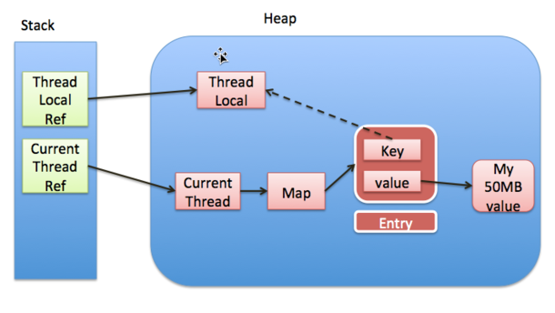

## 并发容器

**ThreadLocal：**

> 
>
> 内存泄漏：ThreadLocalMap中key为null，value还有数据，就没有办法访问这些key为null的Entry的value，但又不回收（Thread Ref -> Thread -> ThreaLocalMap -> Entry -> value引用链存在，永远无法回收）。本来对应这些value的线程销毁的时候，value是可以释放的，但如果当前线程再迟迟不结束的话，比如线程池里的线程，都不销毁，那就可能出现内存泄露。
>
> 如何解决内存泄漏：
>
> 1 在set方法的for循环中寻找和当前Key相同的可覆盖entry的过程中通过**replaceStaleEntry**方法解决脏entry的问题。如果当前table[i]为null的话，直接插入新entry后也会通过**cleanSomeSlots**来解决脏entry的问题；
>
> 2 在threadLocalMap扩容时，新建一个大小为原来数组长度的两倍的数组，然后遍历旧数组中的entry并将其插入到新的hash数组中，主要注意的是，**在扩容的过程中针对脏entry的话会令value为null，以便能够被垃圾回收器能够回收，解决隐藏的内存泄漏的问题**；
>
> 3 在getEntry方法中，如果在查找过程中遇到脏entry的话使用expungeStaleEntry方法进行处理；
>
> 4 remove方法中，通过往后环形查找到与指定key相同的entry后，先通过clear方法将key置为null后，使其转换为一个脏entry，然后调用expungeStaleEntry方法将其value置为null，以便垃圾回收时能够清理，同时将table[i]置为null。
>
>  [【死磕Java并发】—–深入分析ThreadLocal](http://cmsblogs.com/?p=2442)
>
> [对ThreadLocal实现原理的一点思考](https://www.jianshu.com/p/ee8c9dccc953)
>
> [并发容器之ThreadLocal](https://github.com/CarlMarcus/Java-concurrency/blob/master/17.%E5%B9%B6%E5%8F%91%E5%AE%B9%E5%99%A8%E4%B9%8BThreadLocal/%E5%B9%B6%E5%8F%91%E5%AE%B9%E5%99%A8%E4%B9%8BThreadLocal.md)
>
> [详解threadLocal内存泄漏问题](http://www.jianshu.com/p/dde92ec37bd1)