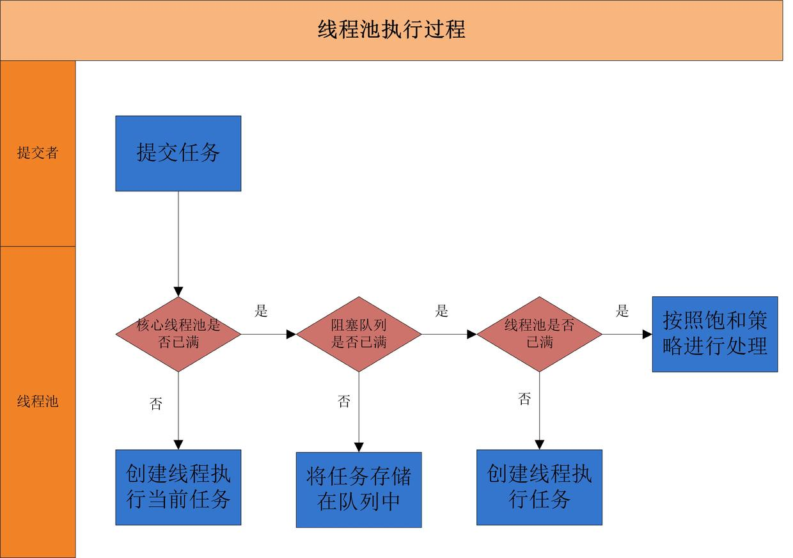
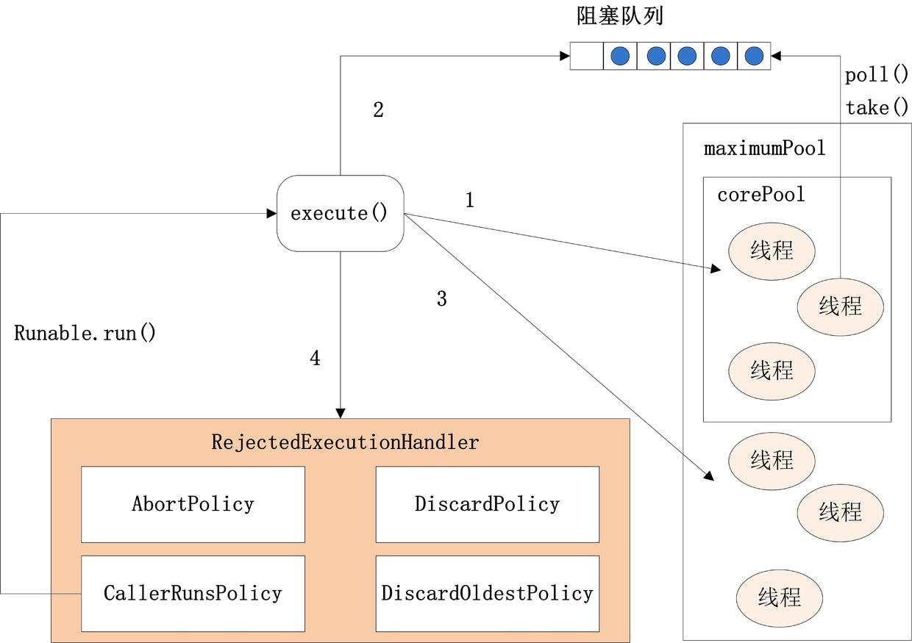

## 线程池Excutor

[Java并发编程：线程池的使用](https://www.cnblogs.com/dolphin0520/p/3932921.html)

[J.U.C之线程池：ThreadPoolExecutor](http://cmsblogs.com/?p=2448)

[J.U.C之线程池：ScheduledThreadPoolExecutor](http://cmsblogs.com/?p=2451)

[深入理解Java线程池：ThreadPoolExecutor](http://www.ideabuffer.cn/2017/04/04/深入理解Java线程池：ThreadPoolExecutor/)




1. 先判断线程池中**核心线程池**所有的线程是否都在执行任务。如果不是，则新创建一个线程执行刚提交的任务，否则，核心线程池中所有的线程都在执行任务，则进入第2步；
2. 判断当前**阻塞队列**是否已满，如果未满，则将提交的任务放置在阻塞队列中；否则，则进入第3步；
3. 判断**线程池中所有的线程**是否都在执行任务，如果没有，则创建一个新的线程来执行任务，否则，则交给饱和策略进行处理

ThreadPoolExecutor类是线程池中最核心的一个类，ThreadPoolExecutor类中提供了四个构造方法：

```java
public ThreadPoolExecutor(int corePoolSize,int maximumPoolSize,long keepAliveTime,TimeUnit unit, BlockingQueue<Runnable> workQueue);
 
public ThreadPoolExecutor(int corePoolSize,int maximumPoolSize,long keepAliveTime,TimeUnit unit, BlockingQueue<Runnable> workQueue,ThreadFactory threadFactory);
 
public ThreadPoolExecutor(int corePoolSize,int maximumPoolSize,long keepAliveTime,TimeUnit unit, BlockingQueue<Runnable> workQueue,RejectedExecutionHandler handler);
 
public ThreadPoolExecutor(int corePoolSize,int maximumPoolSize,long keepAliveTime,TimeUnit unit, BlockingQueue<Runnable> workQueue,ThreadFactory threadFactory,RejectedExecutionHandler handler);
```

corePoolSize：核心池的大小。在创建了线程池后，默认情况下，线程池中并**没有任何线程**，而是等待有任务到来才创建线程去执行任务，除非调用了**prestartAllCoreThreads()**或者**prestartCoreThread()**方法，从这2个方法的名字就可以看出，是预创建线程的意思，即在没有任务到来之前就创建**corePoolSize个线程或者一个线程**。默认情况下，在创建了线程池后，线程池中的线程数为0，当有任务来之后，就会创建一个线程去执行任务，当线程池中的线程数目达到corePoolSize后，就会把到达的任务放到**缓存队列workQueue**当中；

maximumPoolSize：线程池最大线程数；

keepAliveTime：表示线程没有任务执行时最多保持多久时间会终止。默认情况下，只有当线程池中的线程数大于corePoolSize时，keepAliveTime才会起作用，直到线程池中的线程数不大于corePoolSize；

workQueue：一个阻塞队列，用来存储等待执行的任务，选型：ArrayBlockingQueue和PriorityBlockingQueue使用较少，一般使用LinkedBlockingQueue和Synchronous。线程池的排队策略与BlockingQueue有关；

threadFactory：线程工厂，主要用来创建线程；

handler：表示当拒绝处理任务时的策略，有以下四种取值：

```
ThreadPoolExecutor.AbortPolicy:丢弃任务并抛出RejectedExecutionException异常。 
ThreadPoolExecutor.DiscardPolicy：也是丢弃任务，但是不抛出异常。 
ThreadPoolExecutor.DiscardOldestPolicy：丢弃队列最前面的任务，然后重新尝试执行任务（重复此过程）
ThreadPoolExecutor.CallerRunsPolicy：由调用线程处理该任务 
```

1. Executor是一个顶层接口，在它里面只声明了一个方法execute(Runnable)，返回值为void，参数为Runnable类型，从字面意思可以理解，就是用来执行传进去的任务的；
2. 然后ExecutorService接口继承了Executor接口，并声明了一些方法：submit、invokeAll、invokeAny以及shutDown等；
3. 抽象类AbstractExecutorService实现了ExecutorService接口，基本实现了ExecutorService中声明的所有方法；
4. 然后ThreadPoolExecutor继承了类AbstractExecutorService。

在ThreadPoolExecutor类中有几个非常重要的方法：

```java
`execute()``submit()``shutdown()``shutdownNow()`
```



excute()逻辑

1. 如果当前运行的线程少于corePoolSize，则会创建新的线程来执行新的任务；
2. 如果运行的线程个数等于或者大于corePoolSize，则会将提交的任务存放到阻塞队列workQueue中；
3. 如果当前workQueue队列已满的话，则会创建新的线程来执行任务；
4. 如果线程个数已经超过了maximumPoolSize，则会使用饱和策略RejectedExecutionHandler来进行处理。

线程池状态：

1. 当创建线程池后，初始时，线程池处于RUNNING状态；
2. 如果调用了shutdown()方法，则线程池处于SHUTDOWN状态，此时线程池不能够接受新的任务，它会等待所有任务执行完毕；
3. 如果调用了shutdownNow()方法，则线程池处于STOP状态，此时线程池不能接受新的任务，并且会去尝试终止正在执行的任务；
4. 当线程池处于SHUTDOWN或STOP状态，并且所有工作线程已经销毁，任务缓存队列已经清空或执行结束后，线程池被设置为TERMINATED状态；

任务性质不同的任务可以用不同规模的线程池分开处理。

1. CPU密集型任务配置尽可能少的线程数量，如配置**Ncpu+1**个线程的线程池。
2. IO密集型任务则由于需要等待IO操作，线程并不是一直在执行任务，则配置尽可能多的线程，如**2Ncpu**。
3. 混合型的任务，如果可以拆分，则将其拆分成一个CPU密集型任务和一个IO密集型任务，只要这两个任务执行的时间相差不是太大，那么分解后执行的吞吐率要高于串行执行的吞吐率，如果这两个任务执行时间相差太大，则没必要进行分解。我们可以通过`Runtime.getRuntime().availableProcessors()`方法获得当前设备的CPU个数。

